# Docker


## 基本概念

`Docker`是一个软件容器平台，基于`Go`语言开发。

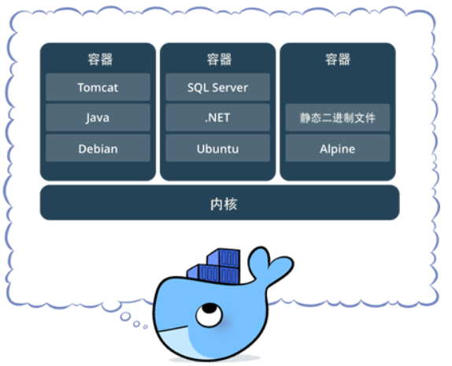

- **镜像 (Image)** 是一个只读的文件系统，可用来**创建 Docker容器**，一个镜像可以创建多个容器。
  -  在Linux中，内核启动后，会挂载 root 文件系统为其提供用户空间支持。而 Docker 镜像（Image），就是一个 root 文件系统。
  - 镜像不仅能提供容器运行时所需的程序、库、资源、配置等文件，还包含了一些为运行时准备的一些配置参数。
  - 镜像构建时，会一层层（layer）构建，前一层是后一层的基础。每一层构建完就不会再发生改变，后一层上的任何改变只发生在自己这一层  (比如，删除前一层文件的操作，实际不是真的删除前一层的文件，而是仅在当前层标记为该文件已删除) 。

- **容器 (Container) **是**镜像创建运行的实例**，能将软件打包成标准化单元。
  - **镜像**是静态不可变的，而**容器**是镜像运行时的实体（相当于**类与对象**的关系），每个容器是相互隔离的，可以被启动、开始、停止、删除。
  - Docker 利用容器独立运行一个或一组应用，即容器进程运行于独立的命名空间。
- **仓库 (Repository)** 是集中**存放镜像文件**的场所。
  - `Docker Registry`：是一个集中存储、分发镜像的服务，不同服务器可通过该服务拉取镜像。
  - `Docker Registry` 可包含多个仓库 (Repository) ，而每个仓库包含多个标签 (Tag)，每个 Tag对应一个镜像（Tag也可对应镜像的不同版本）

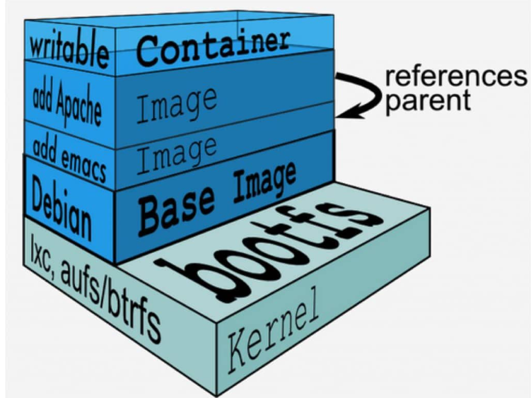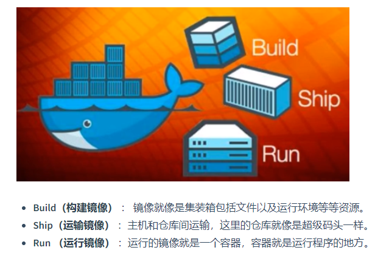

- **镜像层（layer）**：image是由 layer组成的，而单个 layer可能被多个 image共享。
  - layer 主要存放了镜像层的 diff_id、size、cache-id 和 parent 等内容
- **Docker manifest （描述文件）**：存在于 docker registry 中作为 docker 镜像的元数据文件。
  -  在 `docker pull`、`docker push`、`docker save` 和 `docker load` 过程中作为镜像结构和基础信息的**描述文件**

## 容器 & 虚拟机

- 虚拟机：先虚拟出一套硬件，在其上运行一个完整操作系统，在该系统上再运行所需应用进程
- 容器：包含的应用进程运行于宿主内核，容器本身没有内核和硬件，因此容器更为轻量

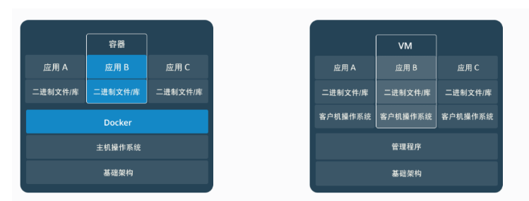


## 常用命令

1. 基本命令

```dockerfile
docker version        # 查看docker版本
docker images         # 同 docker image ls, 查看所有已下载镜像
docker container ls   # 查看所有容器
docker ps <-q:只查询id> <-a:将运行和非运行的容器全部列举> # 查看正在运行的容器
docker image prune    # 清理临时的、没有被使用的镜像文件。
docker image prune -a # 或--all，删除所有没有用的镜像，而不仅仅是临时文件；
```

2. 拉取镜像

```dockerfile
docker search tomcat:<版本号>   # 查看tomcat相关镜像
```

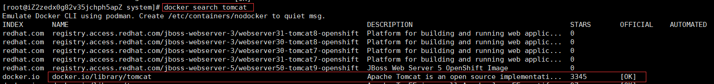

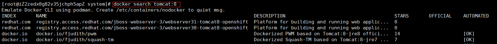

```dockerfile
docker pull tomcat<:版本号>     # 拉取镜像，会让选择从哪个仓库下载
```

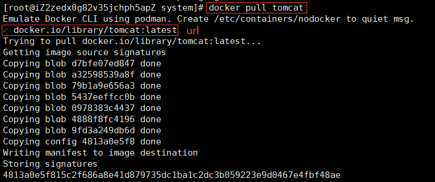

```dockerfile
docker images <镜像名> <-q> # 参数可选，-q只列出id
```

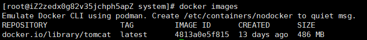

3. 删除镜像

```dockerfile
docker ps                           # 正在运行的容器，删除镜像前要确保没有被容器引用
docker stop <CONTAINER ID / tomcat> # 如果有，要先暂停这个容器
```

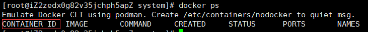

```dockerfile
docker images  # 会列出镜像的 IMAGE ID
docker rmi <IMAGE ID / REPOSITORY名(如tomcat)>  # 同docker image rm [image]，删除镜像
```

4. 运行容器

```dockerfile
docker pull tomcat              # 拉取最新版本
docker pull tomcat:8.0-jre8     # 拉取指定版本

docker run tomcat<:8.0-jre8>    # 如果tomcat有多个版本，需要添加版本号
```

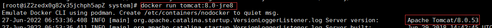

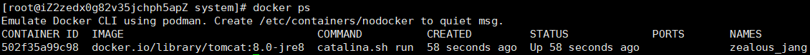

- 注：通过上面方式运行的 tomcat 是不能直接被外部访问的。因为容器具有隔离性，若是想直接通过 8080 端口访问容器内部的 tomcat，则需要对宿主机端口与容器内的端口进行映射

  ```dockerfile
  # 宿主机端口:容器内端口
  docker run -p 8081:8080 <-d:以后台方式运行> tomcat:8.0-jre8 <--name 名称>
  ```

```dockerfile
docker ps -q
docker stop    容器id/容器名      # 停止指定的容器
docker start   容器id/容器名      # 将已经停止运行的容器运行起来
docker restart 容器id/容器名      # 重启指定的容器
docker kill    容器id/容器名      # 杀死指定的容器
docker rm      容器id/容器名      # 删除容器 -f:强制删除正在运行的容器

docker logs <-f:显示实时日志> <-t:显示时间戳> 容器id/容器名 # 查看容器运行日志
```


## 搭建Docker Registry

1. 安装 Registry

```bash
docker pull registry
docker run --name kkReg --restart=always -d -p 5000:5000 registry 
# -p 主机端口(可随意指定):5000(registry指定端口)

docker ps -f name=kkReg   # -f:根据条件过滤
```

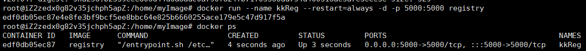

2. 上传镜像到 Registry中

   - 先查看所有的镜像

     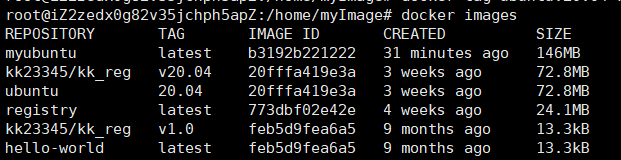

   - 使用自己的Registry给镜像打上标签

     ```bash
     docker tag ubuntu:20.04 localhost:5000/ubuntu:20.04
     ```

   - push到自己的Registry中

     ```bash
     docker push localhost:5000/ubuntu:20.04
     ```


3. 查看本地的仓库

```
 curl http://localhost:5000/v2/_catalog
```

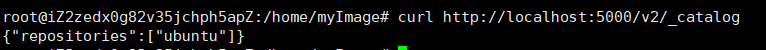

## pull/push on Docker hub

1. 在 Docker hub创建仓库

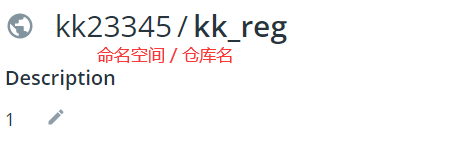

2. 在终端登录

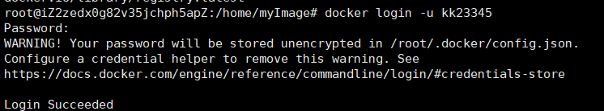

3. 为镜像打标签 (Tag)

```bash
docker tag ubuntu:20.04 kk23345/kk_reg:v20.04
# docker tag <本地镜像名:版本号> <docker hub用户名/仓库名:tag> 命名必须规范
```

4. `push`到 Docker hub

```bash
docker push kk23345/kk_reg:v20.04
```

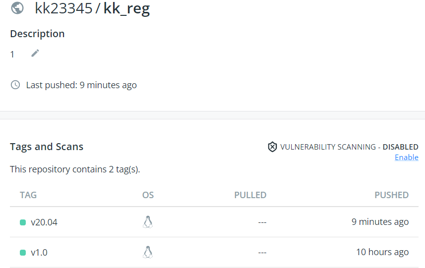

## Dockerfile制作镜像

1. 新建目录以及`Dockerfile`文件

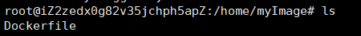

2. 在`Dockerfile`中添加以下内容

```bash
FROM ubuntu:20.04
MAINTAINER kk
# 更新源
RUN apt-get update
# 安装python
RUN apt-get install -y mysql   # openjdk-8-jdk
# 启动时运行这个命令
CMD ["/bin/bash"]
```

3. 切换到该目录下，并 `build`镜像

```bash
docker build -t myubuntu ./    # -t 为镜像命名
```

4. 查看`build`好的镜像

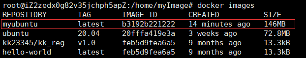


## Docker底层原理

### 


## 参考

- [Docker 基本概念解读](https://snailclimb.gitee.io/javaguide/#/./docs/tools/docker/docker-intro)
- [Docker从入门到上手干事](https://snailclimb.gitee.io/javaguide/#/./docs/tools/docker/docker-in-action?id=windows)
- [https://www.docker.org.cn/](https://www.docker.org.cn/)