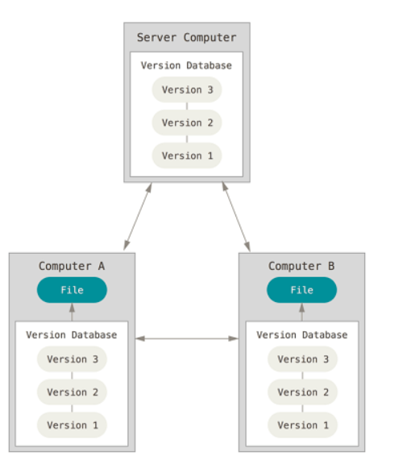
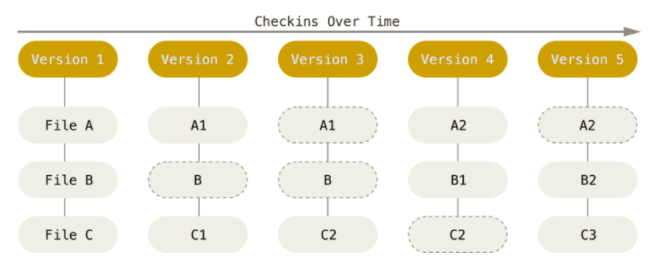
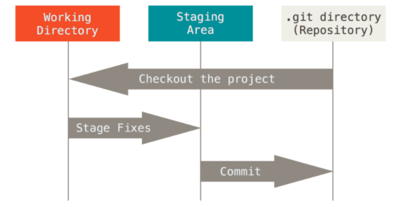

# Git

[【参考】JavaGuide](https://snailclimb.gitee.io/javaguide/#/./docs/tools/git/git-intro)

## 1.Git简介

Git是一种典型的**分布式版本控制系统**(Distributed Version Control System, DVCS)，这类系统，客户端并不只提取最新版本的文件快照，而是把代码仓库完整地镜像下来。分布式版本控制系统可以不用联网就可以工作，因为每个人的电脑上都是完整的版本库。



Git采用的是**直接记录快照**的方式保存数据。当每次提交更新时，Git主要对当时的全部文件制作一个快照并保存这个快照的索引。若文件没有修改，则不再重新存储该文件，而是只保留一个链接只想之前存储的文件。



Git有三种状态：

1. **已提交（committed）**：数据已经安全的保存在本地数据库中。
2. **已修改（modified）**：已修改表示修改了文件，但还没保存到数据库中。
3. **已暂存（staged）**：表示对一个已修改文件的当前版本做了标记，使之包含在下次提交的快照中。

Git 项目的三个工作区域：



基本的 Git 工作流程如下：

1. 在工作目录(Working Directory)中修改文件；
2. 暂存文件，将文件的快照放入暂存区域(Staging Area)；
3. 提交更新，找到暂存区域的文件，将快照永久性存储到 Git 仓库目录。

## 2. Git快速入门

[【参考/】手把手教你用git上传项目到GitHub](https://zhuanlan.zhihu.com/p/193140870)

[error: failed to push some refs to...](https://its404.com/article/dietime1943/79398771)

**上传本地项目到Github的基本步骤：**

1. 建立本地仓库

   ```bash
   # 进入本地文件夹，右键会弹出 Git Bash Here 选项进入shell窗口
   git init #将该目录变为Git可以管理的仓库
   ```

2. 修改好文件后，将文件添加到暂存区

   ```bash
   # 仍然在刚才的shell窗口
   git add .          #添加所有文件
   git add *.md       #通配符
   git add filename   #针对某个文件
   ```

   对文件的其他常用操作

   ```bash
   git rm filename        #从暂存区域移除文件，然后提交
   git mv oldname newname #对文件重命名，
   # 相当于mv oldname newname、git rm oldname、git add newname 这三条命令的集合
   ```

3. 提交更新到本地仓库

   ```bash
   git commit -m "代码提交信息(相当于注释)"
   ```

4. 关联github仓库

   ```bash
   git remote add origin 仓库的SSH地址
   ```

5. 将改动提交的github仓库

   ```bash
   git push origin master(分支名)
   ```

   

