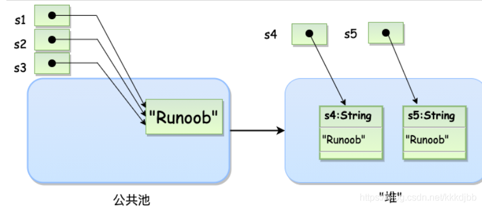
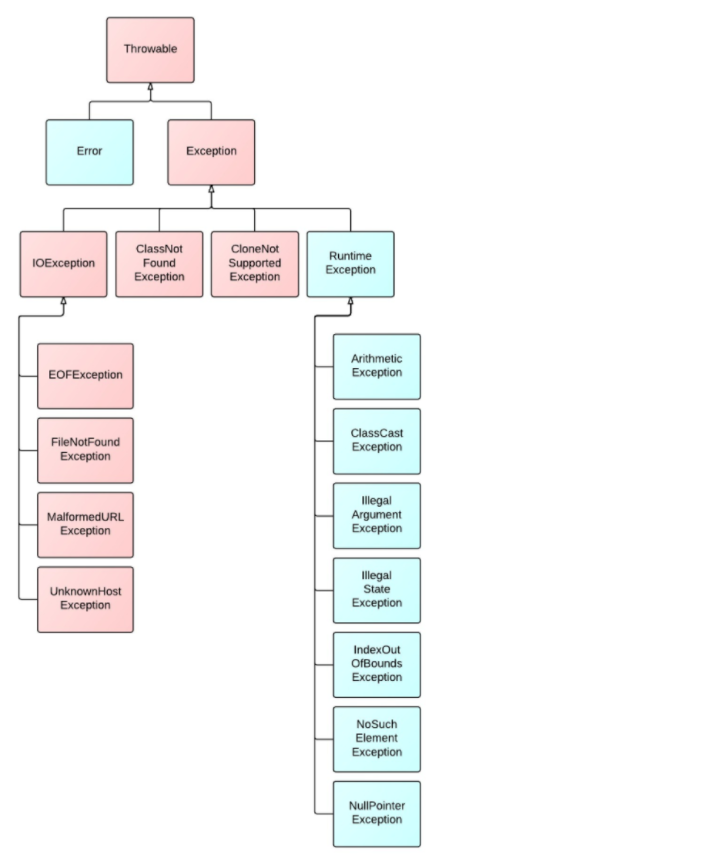

# Java基础

- [Java基础](#java基础)
  * [Java简介](#java简介)
    + [JVM、JRE、JDK](#jvm-jre-jdk)
    + [字节码](#字节码)
    + [编码方式](#编码方式)
  * [数据类型](#数据类型)
    + [基本数据类型](#基本数据类型)
    + [包装类型](#包装类型)
    + [包装类常用方法](#包装类常用方法)
  * [基本语法和运算](#基础语法和运算)
    + [标识符命名](#标识符命名)
    + [数组](#数组)
    + [运算符](#运算符)
    + [类型转换](#类型转换)
    + [值传递](#值传递)
    + [可变长参数](#可变长参数)
  * [关键字](#关键字)
    + [static](#static)
    + [final](#final)
    + [instanceof](#instanceof)
  * [面向对象](#面向对象)
    + [面向对象与面向过程](#面向对象与面向过程)
    + [构造函数](#构造函数)
    + [封装、继承、多态](#封装、继承、多态)
    + [访问权限](#访问权限)
    + [抽象类&接口](#抽象类&接口)
    + [内部类](#内部类)
  * [常用类](#常用类)
    + [Math](#math)
    + [Object](#object)
    + [Collections](#collections)
    + [Arrays](#arrays)
    + [时间](#时间)
    + [枚举Enum](#枚举enum)
  * [字符串](#字符串)
    + [String](#string)
    + [StringBuilder&StringBuffer](#StringBuilder&StringBuffer)
    + [格式化输出](#格式化输出)
    + [正则表达式](#正则表达式)
    + [Scanner](#scanner)
  * [异常](#异常)
    + [异常概念&层次结构](#异常概念&层次结构)
    + [异常处理](#异常处理)
      - [try-catch-finally](#try-catch-finally)
      - [throw / throws](#throw---throws)
      - [try-with-resources](#try-with-resources)
  * [泛型](#泛型)
    + [泛型思想](#泛型思想)
    + [泛型类/接口/方法](#泛型类/接口/方法)
    + [类型通配符](#类型通配符)
    + [类型擦除](#类型擦除)
  * [反射](#反射)
  * [注解](#注解)
  * [Java8新特性](#java8新特性)
    + [lamada表达式](#lamada表达式)
    + [Optional类](#optional类)
    + [Stream流](#stream流)
  * [参考](#参考)

## Java简介

### JVM、JRE、JDK

- **JVM**：Java虚拟机（JVM）针对不同操作系统有特定的实现，可在不同系统中运行相同的字节码文件(Class文件)，并得到相同的结果，保证了Java的**平台无关性**。
- **JRE**：Java运行时环境（Java Runtime Env），包括：JVM、Java系统类库等，只能运行编译好的Java程序。
- **JDK**：Java开发工具包（Java Development Kit），包括：JRE、编译器（Javac）、Java其他工具（jar、jdb、javadoc、javap(反汇编器)等）、

### 字节码

字节码（ByteCode）：是不同平台的JVM使用的**统一程序存储格式**，JVM只与由字节码组成的Class文件进行交互。

Java文件（.java）经 编译器（Javac）编译产生 Class文件（.class），Class文件 经 JVM加载并通过**解释器**逐行解释执行，这种方式执行速度相对较慢（后面引进了 JIT（just-in-time compilation） 编译器，而 JIT 属于运行时编译。当 JIT 编译器完成第一次编译后，其会将字节码对应的机器码保存下来，下次可以直接使用）。所以称 **Java 是编译与解释共存的语言** 。

### 编码方式

Java采用**Unicode**编码。**Unicode**（万国码、国际码、统一码）是计算机科学领域里的一项业界标准。对世界上大部分的文字系统进行了整理、编码，使得计算机可以用更为简单的方式来呈现和处理文字。常用的ASCII码是Unicode的子集。

广义的 Unicode 是一个标准，定义了一个字符集以及一系列的编码规则，即 Unicode 字符集和 UTF-8、UTF-16、UTF-32 等等编码规则。

## 数据类型

### 基本数据类型

- 字符型：char/16（默认值：'\u0000'）
- 整型：byte/8、short/16、int/32（默认值：0）、long/64（默认值：0L、0l）
- 浮点型：float/32（默认值：0.0f）、double/64（0.0d）
- 布尔型：boolean（默认值：false）。boolean 只有两个值：true、false，可以使用 1 bit 来存储，但是具体大小没有明确规定。JVM 会在编译时期将 boolean 类型的数据转换为 int，使用 1 来表示 true，0 表示 false。

### 包装类型

1. 自动装箱与拆箱

```java
Integer x = 2; // 装箱 调⽤了 Integer.valueOf(2)
int y = x;     // 拆箱 调⽤了 X.intValue()
```

2. 基本类型对应的包装类大部分都实现了常量池（缓存池）技术。

- Byte、Short、Integer、Long 对应的缓存数据都是 [-128，127]

- Character 对应的缓存数据是 [0，127]

- Boolean则直接返回 TRUE / FALSE

- 如果传入的基本数据类型大小超出缓存池范围，则会在堆区新建一个对象。如Integer：

  ```java
  public static Integer valueOf(int i) { //z
      if (i >= IntegerCache.low && i <= IntegerCache.high)//先判断是否在缓存池中，Java8中缓存池大小-128~127
          return IntegerCache.cache[i + (-IntegerCache.low)];
      return new Integer(i);
  }
  //因此：
  Integer x = new Integer(123);
  Integer y = new Integer(123);
  System.out.println(x == y); // false
  
  Integer z = Integer.valueOf(123);
  Integer k = Integer.valueOf(123);
  System.out.println(z == k); // true
  
  Integer m = Integer.valueOf(200);
  Integer n = Integer.valueOf(200);
  System.out.println(m == n); // false
  ```

- `IntegerCache`是`Integer`中的一个静态内部类，内部维护了一个`Integer`型数组`cache`作为缓存池。

  ```java
  private static class IntegerCache {
          static final int low = -128;
          static final int high;
          static final Integer cache[];
  
          static {
              // high value may be configured by property
              int h = 127;
              String integerCacheHighPropValue =
                  sun.misc.VM.getSavedProperty("java.lang.Integer.IntegerCache.high");
              if (integerCacheHighPropValue != null) {
                  try {
                      int i = parseInt(integerCacheHighPropValue);
                      i = Math.max(i, 127);
                      // Maximum array size is Integer.MAX_VALUE
                      h = Math.min(i, Integer.MAX_VALUE - (-low) -1);
                  } catch( NumberFormatException nfe) {
                      // If the property cannot be parsed into an int, ignore it.
                  }
              }
              high = h;
  
              cache = new Integer[(high - low) + 1];
              int j = low;
              for(int k = 0; k < cache.length; k++)
                  cache[k] = new Integer(j++);
  
              // range [-128, 127] must be interned (JLS7 5.1.7)
              assert IntegerCache.high >= 127;
          }
  
          private IntegerCache() {}
      }
  ```

3. 包装类常用方法

[Java Integer类详解](http://c.biancheng.net/view/890.html)

## 基本语法和运算

### 标识符命名

- 所有的标识符都应该以字母（A-Z 或者 a-z）,美元符 $ 、或者下划线 _ 开始
- 首字符之后可以是字母（A-Z 或者 a-z）,美元符 $ 、下划线（_）或数字的任何字符组合
- 关键字不能用作标识符,标识符是大小写敏感的
- 合法标识符举例：age、$salary、_value、__1_value；非法标识符举例：123abc、-salary、abc*

### 数组

```java
int[] a = new int[5];//可存储5个元素的一维数组
int[] b = {1,2,3,4};

int[][] c = new int[1][2];//多维数组
int[][] d = new int[3][];
d[0] = new int[3];//为每一维分配不同的空间

//遍历数组
for(int i = 0; i < a.length; i++){}
for(int elem : a){}
```

### 运算符

- 自增++、自减--：前缀自增自减(++a)会先执行自增自减运算在得到值，而后缀的会先得到值再进行自增自减运算

  ```java
  int	x = 1,
      y = 2,
      z = 3;
  System.out.println("" + (y += z--/++x)); //此时z=3,x=2, 所以y=3
  System.out.println(x + " " + z);//此时z=2，x=2
  ```

- “>>” ：按位右移运算符（ 正数高位补0，负数高位补1 ）

- “>>>” ：按位右移补零操作符（ 无论正负，高位均补0 ）

- &&：短路逻辑运算符。即当A&&B，若A为假，则B不再进行判断；同样的A||B，A为真则B不再判断。

### 类型转换

- **自动类型转换**：也称拓宽转换
  

- **强制类型转换**：语法`tar = （targetValue）value`，此时会发生截断。

  - 如小数赋值给整数`int a = (int) 1.234`，则小数部分会被舍去
  - 如果浮点值太大而不能适合目标整数类型，那么它的值将会因为对目标类型**值域取模**而减少。

- **隐式类型转换**：主要与字面量有关

  ```java
  //下面两行都不能隐式向下转型，二者都会直接报错
  float f = 1.1;		// 1.1属于double型字面量，而double精度更高
  short a = 1000000;	// 1000000属于int型字面量，而int精度更高
  //应改为
  float f = 1.1f; //或 (float)1.1
  short a = (short)1000000;
  
  //但应注意的是，使用 ++ 或 += 时，会自动隐式转换
  short b = 1;
  b += 1;  //相当于 (short) (b + 1);
  System.out.println(b);
  ```

- **表达式中类型的自动提升**：看如下代码，当分析表达式时，Java自动提升各个byte型或short型的操作数到int型

  ```java
  byte a = 40;
  byte b = 50;
  int d = a * b;
  //但是自动提升会使得下面的代码出问题
  byte b = 50;
  b = b * 2;      // 计算时，b被自动提升为int型，在赋值给b后会出现类型不匹配问题
  b = (byte)b * 2;// 因此需要这样写
  ```

  - 自动提升的约定：如果一个操作数是long型，整个表达式将被提升到long型；如果一个操作数是float型，整个表达式将被提升到float型；如果有一个操作数是double型，计算结果就是double型。

### 值传递

Java 的参数是以**值传递**的形式传⼊⽅法中，⽽不是引⽤传递。因此调用方法 fun(String a) 时，相当于将**对象a的地址**以**值的方式**传入方法中，所以**直接改变参数a，原对象的值也会改变**；但若在方法中使 a = new String(“xxx”)，此时再改变a，对原对象就无影响了。

### 可变长参数

可变长参数：从Java5开始，允许在调用方法时传入不定长度的参数。如：

```java
public void fun(String... args) {  // 可变长参数在编译后会被转换成一个数组
    for(String arg : args)
}
```

注：

- 可变参数只能作为函数的**最后一个参数**
- 如果遇到方法重载，会**优先匹配固定参数**的方法

## 关键字

### static

- **静态变量(类变量)**：`static int y`，**类的所有实例都共享静态变量**，可以直接通过类名来访问它。静态变量在内存中只存在⼀份，局部变量不能被声明为 static 变量。

- **静态常量**：如`Math`类中有`public static final double PI = 3.1215...;`，则可通过`Math.PI`直接调用。

- **静态方法**：静态变量和方法在**类加载的时候就存在了**，它不依赖于任何类的实例，所以静态⽅法必须有实现（即不能是抽象⽅法）。

  - 在**静态方法中只能访问所属类的静态字段和静态⽅法**，⽅法中不能有 this 和 super 关键字，因为这两个关键字与具体对象关联。
  - 而实例方法可以访问静态字段、静态⽅法、实例字段和实例⽅法

- **静态语句块**：`static {...}`，静态语句块在类初始化时运⾏⼀次。

- **静态内部类**

  - **静态内部类**的实例可以直接再`main`方法中创建，但不能访问外部类的非静态的变量和⽅法
  - **非静态内部类**依赖于外部类的实例，也就是说需要先创建外部类实例，才能⽤这个实例去创建非静态内部类。

- **初始化顺序**

  - 首先，初始化 **静态变量**和**静态语句块**（初始化顺序取决于它们在代码中的顺序）；

  - 然后，初始化 **实例变量**和**普通语句块**（初始化顺序取决于它们在代码中的顺序）；

  - 最后，初始化**构造函数**

  - 若有**继承**关系，则初始化顺序如下：

    ```java
    1. ⽗类（静态变量、静态语句块）
    2. ⼦类（静态变量、静态语句块）
    3. ⽗类（实例变量、普通语句块）
    4. ⽗类（构造函数）
    5. ⼦类（实例变量、普通语句块）
    6. ⼦类（构造函数）
    ```

### final

- 用于**数据类型**前：声明数据为常量，可以是**编译时常量**，也可以是在**运⾏时被初始化后不能被改变的常量**。
  - 对于**基本类型**， final 使**数值不变**： `final double PI = 3.141`，一般被final修饰的常量均大写。
  - 对于**引⽤类型**，final 使**引⽤(地址)不变**，即**不能指向其它对象**，但是**被引⽤的对象的属性本身是可以修改的**
- 用于**方法**前：声明**⽅法不能被⼦类重写**。
  - `private`方法隐式的指定为`final`类型，此时若父类与子类中`private`方法名称相同，则不能认为是复写了子类的方法，而是在子类中定义了一个新的方法。
- 用于**类**前：声明类不允许被继承。

### instanceof

`instanceof`：用于检查对象是否是一个特定类型（类或接口）的实例，返回`true/false`。

```java
String name = "str";
boolean res = name instanceof String;  //由于name是String类型，返回true
boolean res = child instanceof Parent; //由于child继承Parent，返回true
```

## 面向对象

### 面向对象与面向过程

- 面向过程：将问题分解成多个步骤，每个步骤用函数实现，最后再依次调用；
- 面向对象：将事物或问题的属性、行为等封装成对象，然后进行业务逻辑的实现。
  - 面向对象开发的程序一般更易维护、易复用、易扩展。

### 构造函数

构造函数：用来在创建对象时初始化对象（为成员变量赋初始值）

- ```java
  class A {
      private int m;
      public A() {} //默认，无参构造
      public A(int m) {this.m = m;} 
      
      public static void main(String[] args) {
          A a = new A();
          A a1 = new A(1); //使用new关键字来新建一个对象
      }
  }
  ```

- 构造函数名必须和类名相同；

- 构造函数没有返回值（不能用`void`修饰），可用访问权限修饰符修饰；

- 类可以有多个构造函数的**重载**版本（当定义了了有参构造函数，必须写出默认无参构造函数）。

### 封装、继承、多态

面向对象的三大特征：

- **封装**：将客观事物的**数据和操作方法**封装成抽象的类。在对象的内部，一些数据和方法可以是私有的，禁止外界访问，也可以提供`get/set`方法来操纵数据。封装就是隐藏一切可隐藏的东西， 只向外界提供最简单的编程接口。
- **继承**：将多个类的相同功能和属性抽象成一个类（父类），其他类（子类）可通过`extend`关键字继承**父类的所有属性和方法**（包括私有属性和方法，只是子类无法访问父类的方法和属性）。
  - 子类可以在父类的基础上，扩展自己的属性和方法，提高**代码的复用**以及开发效率；
  - Java只支持单继承，即子类只能继承一个父类。
- **多态**：不同对象调用同一方法，会产生不同的结果。
  - **静态多态**：函数**重载**，需要在**编译期**决定具体调用哪个方法
  - **动态多态**：是**运行期**的多态
    - 动态绑定：指程序**运行时**根据对象的类型进行绑定（绑定：将方法调用与方法体关联起来）；
    - 实现动态多态的三个必要条件：
      - 继承父类或实现接口
      - 子类要**重写**父类或接口的方法（`@override`）
      - 父类引用指向子类对象（`Parent p = new Child(); p.func();` 调用时，首先检查父类中是否有该方法，如果没有，则编译错误；如果有，再去调用子类的同名方法）
  - **重载**：同一个类中，方法名相同但参数列表不同的方法，称为重载方法
    - 重载后的方法
      - **必须改变参数列表**（参数的类型、顺序或个数）
      - 可以改变返回类型
      - 可以改变访问修饰符
  - **重写**：子类与父类中，方法的名称和参数列表都相同，子类可重新实现方法，称为重写方法（需要在方法名前添加注解`@override`，让编译器自动检查是否满足限制条件）
    - 重写后的方法
      - 访问权限必须大于等于父类方法（无法重写父类中的`private`方法）；
      - 返回类型必须是父类方法返回类型或为其子类型；
      - 抛出的异常类型必须是父类抛出异常类型或为其子类型。
- `this`：代表类本身，在类中可使用`this.elem`访问类成员变量、
- `super`：代表父类
  - `super(x, y)`调用父类的构造函数初始化变量值
  - `super.func()`调用父类的方法


### 访问权限

`Java`提供了四种访问权限：

- `private`：仅当前类能访问；
- `default`：同一包内可访问；
- `protected`：⽤于修饰成员，表示在继承体系中成员对于⼦类可⻅；
  - 不能修饰类（内部类除外），接口及接口的成员变量和成员方法不能声明为`protected`
  - 同一包中：被声明为 protected 的变量、方法和构造器能被同一个包中的任何其他类访问
  - 不同包中：**子类实例**可以访问父类的` protected `方法，但不能访问基类实例的`protected`方法
- `public`：公共权限，任何类都可访问。

### 抽象类&接口

- **抽象类**：使用`abstract`关键字修饰，抽象类不能被实例化，只能被继承。

  - 可在内部声明变量、普通方法、抽象方法以及构造方法，但不能通过抽象类访问

  ```java
  public abstract class A{
    	String name;  //成员变量默认为default，可在子类中修改
    	public A(){...}
    	public void commonMethod(){....}
    	public abstract String method(); //定义抽象方法，不用实现。
   }
  ```

  - 抽象类可以没有抽象方法，但有抽象方法的一定为抽象类；
  - 抽象类的子类必须给出抽象方法的具体实现，除非该子类也是抽象类。

- **接口**：使用`interface`声明一个接口，接口也会被编译成`.class`文件

  - 接口中的成员变量会被隐式的指定为`public static final`，访问权限不能被修改且必须有初始值

  - 从 Java 8 开始，接口也可以拥有默认(`default`)的方法实现

  - ```java
    [public] interface A [extends SuperInterface]{
        String name = "A"; //必须有初始值，被隐式的指定为public static final
    	//抽象方法,只有声明没有实现
    	public abstract String fun();
    	//String fun(); //隐式的指定为 public abstract
        
    	//默认方法
    	public default String fun1(){...}
    }
    
    //一个类可以实现多个接口，必须要实现接口中的所有抽象方法
    public class B implements A,C,D...{...}
    ```

- 比较

  - 接口主要用于对类的行为进行约束，而抽象类主要用于代码复用


### 内部类

Java允许在一个类的内部定义另一个类(接口、枚举或注解)，这种类称为内部类(`inner class`)或嵌套类(`nested class`)。

使用内部类可以对只在一处使用的类进行分组，提高封装性，增强代码可读性和可维护性。

- 成员内部类：相当于类的一个成员，在内部类中不能定义`static`变量和方法，但可以使用`final`和`abstract`以及各种访问修饰符。

  ```java
  public class OuterClass{
  	private int x;
  	[访问修饰符] class InnerClass{
  		public void test(){
  			x = 10;//可以访问外层类的成员
  		}
  	}
  	public void creatInner(){
  		InnerClass in = new InnerClass(); //可以直接在方法中创建内部类实例
  	}
  	public static void main(String[] args){
  		//在main函数中创建内部类
  		OuterClass.InnerClass in = new OuterClass().new InnerClass();
  	}
  }
  ```

- 局部内部类：在方法中定义的类，相当于方法的局部变量，不能使用`static`以及所有访问修饰符，但可以使用`final`和`abstract`

  - 可以访问外层类成员，但若要访问所在方法的参数和局部变量，需要用`final`修饰参数和变量
  - `static`方法中的内部类可以访问外层类的`static`成员，但不能访问实例成员

- 匿名内部类：用于某个类只需要使用一次，此时可以将类的定义和创建一起完成

  ```java
  public static void main(String[] args){
  	Object a = new Object(){//对象也可以是一个接口
  		@override
  		public void method(){...}
  	}
  }
  ```

- 静态内部类：它与成员内部类有较大的区别

  - 静态内部类可以定义静态成员，成员内部类不行
  - 静态内部类只能访问外层类的静态成员，成员内部类可以访问外层类的实例和静态成员
  - 创建静态内部类实例不需要创建外层类的实例`OuterClass.InnerClass in = new OuterClass.Innerclass()`

  ```java
  public class OuterClass{
  	//变量和方法
  	static class InnerClass{
  	//变量和方法
  	}
  }
  ```

## 常用类

### Math

[Java Math类的常用方法](http://c.biancheng.net/view/866.html)

[Java生成随机数（random()和Random类）](http://c.biancheng.net/view/867.html)

### Object

`Object`类是所有类的父类，即Java所有的类都默认继承了`Object`。通用方法如下：

- ```java
  public final native Class<?> getClass();  // 返回对象运行时的实例类
  //System.out.println(new A().getClass()); // 输出：class com.ljk.A
  ```

- ```java
  public String toString() { // 返回对象的字符串表示形式
      return getClass().getName() + "@" + Integer.toHexString(hashCode());
  }
  //System.out.println(new A().toString()); // 输出：com.ljk.A@28fd3dc1
  ```

- ```java
  //判断两个对象引用是否指向同一个对象，比较两个对象的内存地址是否相等
  //即对象是否等价
  public boolean equals(Object obj) { 
      return (this == obj); 
  }
  
  public native int hashCode(); // 返回对象的hash值，根据对象内存地址换算出hash值
  ```

  - `equals`方法必须满足以下性质：

    - 自反性：即`x.equals(x) == true`
    - 对称性：即`x.equals(y) == y.equals(x)`
    - 传递性：即`x.equals(y), y.equals(z)`都返回`true`时，`x.equals(z) == true`
    - 一致性：即x和y对象信息没有修改时，多次调用`x.equals(y)`的结果应一致
    - x不为`null`时，`x.equals(null)`必须返回false
  
  - 等价的两个对象散列值⼀定相同，但散列值相同的两个对象不⼀定等价
  
    - 因为计算哈希值具有随机性，两个值不同的对象可能计算出相同的哈希值
    - 所以在重写`equals() `⽅法时应当总是重写` hashCode() `⽅法，保证等价的两个对象哈希值也相等
  
  - `String`类（Integer...等大部分类）重写了`equals()`方法和` hashCode() `⽅法
  
    - ```java
      @override
      public boolean equals(Object anObject) {
          // 两个对象引用(地址)相等，返回true
          if (this == anObject) { 
              return true;
          }
          // 或者，两个字符串内容完全一致，也返回true
          if (anObject instanceof String) {
              String anotherString = (String)anObject;
              int n = value.length;
              if (n == anotherString.value.length) {
                  char v1[] = value;
                  char v2[] = anotherString.value;
                  int i = 0;
                  while (n-- != 0) {
                      if (v1[i] != v2[i])
                          return false;
                      i++;
                  }
                  return true;
              }
          }
          return false;
      }
      @override
      public int hashCode() {...}
      ```
      
    - `==` & `equals()`：`==`只比较  地址（引用类型）或  值（基本类型，注：1 == 1.0返回true，值相等）是否相等，而重写的`equals()`还会判断 引用类型的内容 是否一致。
  
      ```java
      String st3 = new String("12321");
      String st4 = new String("12321");
      System.out.println(st3.equals(st4)); // true
      System.out.println(st3 == st4);      // false
      // 即st3和st4的引用不相等，但内容一致
      ```
  
- ```java
  //访问权限是protected，一个类不显式去重写clone()，其它类就不能直接去调用该类实例的clone()方法
  protected native Object clone() throws CloneNotSupportedException;
  ```
  
  - 一个类要想调用`clone()`方法，必须实现`Cloneable`接口，否则会抛出`CloneNotSupportedException`异常
  - 浅拷贝：拷⻉对象和原始对象的指向同⼀个对象，不会为拷贝的对象重新分配内存。`clone()`方法是浅拷贝。
  - 深拷贝：拷⻉对象和原始对象的指向不同对象，会为拷贝的对象重新分配内存。
  
- 与**线程间的协作**有关的方法整理在了 [Java并发](./Java并发)

  ```java
  public final native void notify()
  public final native void notifyAll()
  public final native void wait(long timeout) throws InterruptedException
  public final void wait(long timeout, int nanos) throws InterruptedException
  public final void wait() throws InterruptedException
  ```


### Collections

[Java Collections类操作集合详解](http://c.biancheng.net/view/6884.html)

### Arrays

[Java Arrays工具类](http://c.biancheng.net/view/5885.html)

### 时间

[Java时间日期的处理：Java Date类、Calendar类详解](http://c.biancheng.net/view/876.html)

### 枚举Enum

```java
public abstract class Enum<E extends Enum<E>>
        implements Comparable<E>, Serializable 
```

```java
public enum Direction [extends Enum] { //每个枚举都隐式的继承了Enum类
	EAST, SOUTH, WEST, NORTH;
    //枚举类型的实例是常量，用大写表示。声明用 ，隔开，
    //最后的分号可以去掉，但是如果枚举中声明了方法则不能去掉
}

Direction left = Direction.WEST;

//遍历所有枚举常量
for(Dtrection d : Direction.values()){ //static E[] values()：返回按声明顺序存储枚举常量的数组
	sout(d.name() + " " + d.ordinal)
	/*
	final String name()：返回枚举常量名称
	final int ordinal()：返回常量的顺序，从0开始
	String toString()：返回枚举常量名称，可以覆写
	*/
}

//在switch语句中的应用
Direction left = Direction.WEST;
switch(left) {
	case WEST: {...;break;}
	...
}
```

**在枚举中添加属性和方法**

```java
public enum Direction [extends Enum]{
	EAST("东"), SOUTH("南"), WEST("西"), NORTH("北");
	private String name;
	private Direction(String name){
		this.name = name;
	}
	//普通方法
	//getter/setter方法
}
```

## 字符串

### String

```java
public final class String
    implements java.io.Serializable, Comparable<String>, CharSequence {
    //Java8采用char数组作为存储结构，Java9之后改用byte数组
    private final char value[]; 
}
```

- ```java
  //创建字符串的方式
  String s1 = "Runoob";           // String 直接创建，会直接放入字符串常量池中
  String s2 = "Runoob";           // String 直接创建
  String s3 = s1;                 // 相同引用
  String s4 = new String("Runoob"); // String 对象创建
  String s5 = new String("Runoob"); // String 对象创建
  ```

  

  - `“Runoob” `属于字符串字⾯量，**编译时期**会在 常量池( `Constract Pool` ) 中创建⼀个字符串引用，指向该字⾯量。
    - 注：`JVM`中将常量池称为**运行时常量池**（`Runtime Constract Pool`），是方法区（`Method Area`）的一部分。并且，可以在**运行期间**将新的常量放入池中，如调用`String`类的`intern()`方法。
  - 使⽤ `new` 的⽅式会在 堆（`heap`）中创建⼀个字符串对象；同时，如果常量池中没有该字面量，也会在常量池中也新建一个指向该字面量的对象。

- `String`字符串不可变

  - `String`类用`final`修饰，不能被继承；
  - `value[]`数组声明为`final`，即数组引用初始化后就不能指向其他对象（虽然数组内容可以改变，但由于使用`private`修饰并且`String`类没有提供访问该数组的方法，所以`String`字符串的值是不可变的）。
  - `String`类中每一个看起来会修改String值的方法，实际上都是创建了一个全新的String对象。
    - 如 + 操作，实际上是创建了 `StringBuilder` 对象进行 `append` 操作，然后将拼接后的 `StringBuilder` 对象用 `toString` 方法处理成 `String` 对象。
  - 不可变的优点
    - 保证字符串的`hash`值不变，只需计算一次；
    - 如果⼀个`String`对象已经被创建了，那么就会从常量池中取得引⽤。只有 String 是不可变的，才可能使⽤常量池；
    - 可保证参数不可变，更安全；
    - 线程安全。

[String有没有长度限制](https://hollischuang.gitee.io/tobetopjavaer/#/basics/java-basic/length-of-string)

### StringBuilder&StringBuffer

`StringBuilder`和`StringBuffer`都是可变字符串，使用方法基本类似

- ```java
  public final class StringBuilder extends AbstractStringBuilder
      implements java.io.Serializable, CharSequence
  
  public final class StringBuffer extends AbstractStringBuilder
      implements java.io.Serializable, CharSequence
  ```

- `StringBuilder`：线程不安全，执行速度快

- `StringBuffer`：线程安全（使用`synchronized`进行同步），执行速度较慢

- 二者的方法类似，在单线程情况下优先选择`StringBuilder`

  ```java
  //构造函数
  public StringBuilder();              public StringBuffer();
  public StringBuilder(String str);    public StringBuilder(String str);
  
  str.toString();                           //返回一个与缓冲区内容相同得字符串
  str.append(String _str/ char c);          //追加一个字符串或字符
  str.insert(int i, String _str/ char c);   //在第i个位置插入一个字符串或字符
  str.reverse();                            //反转字符串
  str.delete(int beginIndex, int endIndex); //删除字符串[begin,end)
  ```

### 格式化输出

[Java格式化输出的四种方法](https://blog.csdn.net/qq_44111805/article/details/112850550)

### 正则表达式

[Java正则表达式详解](http://c.biancheng.net/view/5812.html)

[正则表达式生成器](https://www.sojson.com/regex/generate)

### Scanner

```java
import java.util.Scanner
public class ScannerDemo {
	 public static void main(String[] args) {
		Scanner sc = new Scanner(System.in); //从键盘接收数据
		//next方式接收
		while(sc.hasNext()) {
			String str = sc.next(); 
		}
		//nextLine方式接收
		while(sc.hasNextLine()) {
			String str = sc.nextLine();
		}
		//接受int或float等数据类型
		while(sc.hasNextInt()) {
			int i = sc.nextInt(); //其余数据类型相似
		}
		sc.close(); //不要忘记关闭
	}
}
```

`next()`和`nextLine()`区别：

- `next()`
  - 一定要读取到有效字符后才可以结束输入
  - 对输入有效字符之前遇到的空格，next() 方法会自动将其去掉。
  - 只有输入有效字符后才将其后面输入的空格作为分隔符或者结束符。
  - next() 不能得到带有空格的字符串。
- `nextLine()`
  - 以Enter为结束符，也就是说 `nextLine()`方法返回的是输入回车之前的所有字符。


## 异常

### 异常概念&层次结构

- 异常：指程序在运行期间可能出现的错误事件，但并不是所有的错误都是异常。与异常相关的两大类: `Exception`类 和 `Error`类 都继承了  `Throwable`类(所有异常的父类) 。

  - `Error`：指`JVM`无法处理的错误。此类异常发生时，`JVM`会选择终止线程并打印错误信息。(注：`Error`也可捕获，但通常不建议这样做)
  - `Exception`：指程序本身可以处理的异常。又可分为两类：
    - 受检异常（Checked Exception）：此类异常如果没有被处理（`catch` / `throw` / `throws`）的话，就无法通过编译。
      - 受检异常包括：除`RuntimeException`及其子类外，其他的`Exception`类及其子类。
    - 非受检异常（Uncheked Exception）：此类异常不被处理也可通过编译，需要自己判断是否捕获和处理。
      - 非受检异常包括：`RuntimeException`及其子类。

- 异常层次结构如下：(红色为受检异常，蓝色为非受检异常)

  

  

### 异常处理

#### try-catch-finally 

```java
public class Test {
	public static void main(String[] args) {
		//System.out.println(1/0);
		try { //监控区域
            
			System.out.println(1/0);
            
		} catch (ArithmeticException e) { //捕获异常
            
            //处理异常
			e.printStaceTrace(); //打印错误的栈信息
			System.out.println("分母不能为0");
            
		} finally { //处理善后工作，如IO、资源关闭等
            
			System.out.println("结束");
            
		} //finally区域可以不要，但如果没有catch块就必须添加finally块
		
		//catch可以有多个，但应该先写层次低的异常
		try {
			
		} catch (Error e) {
			
		} catch (Exception e) {
			
		} catch (Throwable e) {

		}
	}
}
```

- 注：当 try 语句和 finally 语句中都有 return 语句时，try 语句块中的 return 语句会被忽略。

  这是因为 try 语句中的 return 返回值会先被暂存在一个本地变量中，当执行到 finally 语句中的 return 之后，这个本地变量的值就变为了 finally 语句中的 return 返回值。

- `finally`块中的代码不是一定会被执行。如下：

  ```java
  try {
      System.out.println("Try to do something");
      throw new RuntimeException("RuntimeException");
  } catch (Exception e) {
      e.printStaceTrace();
      // 终止当前正在运行的Java虚拟机
      System.exit(1);
  } finally {
      System.out.println("Finally");
  }
  ```

  

#### throw / throws

- `throw`：在方法中使用；`throws`：在方法名之后使用。都会抛出异常。

  ```java
  public class Test {
  	public static void main(String[] args) {
  		try {
  			new Test().test(1,0);
  		} catch (ArithmeticException e) {
  			e.printStaceTrace(); 
  		}
  	}
  	//假设此方法中处理不了这个异常，可以在方法上抛出异常
  	public void test(int a, int b) throws ArithmeticException {
  		if(b == 0) {
  			throw new ArithmeticException();
  		} /*catch (ArithmeticException e) {
              //可以选择在该方法中捕获，或者通过throws向上级抛出，让其它方法捕获处理
          } */
  	}
  }
  
  ```

#### try-with-resources

Java 7中引入，无需再在`finally`块中释放或关闭`try`块中使用的资源，更易于资源管理，代码也更简单清晰。（注：适用于任何实现了`java.lang.AutoCloneable`或`java.io.Closeable`的类，如各种IO流）

- 使用`try-catch-finally`

  ```java
  BufferedWriter writer = null;
  try {
      writer = new BufferedWriter(new FileWriter(fileName));
      //...
  } catch (IOException e) {
      //...
  } finally {
      try { //关闭资源
          if (writer != null)
              writer.close();
      } catch (IOException e) {
         // handle the exception
      }
  }
  ```

- 使用`try-with-resources`

  ```java
  try(BufferedWriter writer = new BufferedWriter(new FileWriter(fileName)); 
      //可在括号中声明多个资源，用分号隔开。并且，越早声明的资源越晚被关闭。
     ) {
      writer.write(str); 
      //...
  } catch(IOException e) {
      //...
  } finally {
      
  }
  ```

  可以看到，无需再手动关闭资源，代码更加简单和清晰。

- `try-with-resources`原理：在`try`语句括号中打开的资源仅在此处和现在需要。`try`块中完成工作后，将立即调用`.close()`方法。即使在try块中抛出异常，无论如何都会关闭这些资源。（注：`catch` 和`finally` 块中的语句在资源关闭后才会运行）

- `try-with-resources`的异常处理机制：

  - `try`块中没有发生异常：先调用 `.close()`方法，关闭时如果发生异常，会在`catch `块捕捉并处理异常。
  - `try`块中发生异常：自动调用 `.close()`方法，如果 `.close()`也发生异常，catch 块只会捕捉`try`块抛出的异常，`.close()`方法产生的异常会在catch 中被**压制**，但是你可以在`catch`块中，用 `Throwable.getSuppressed()`方法来获取到压制异常的数组。


## 泛型

### 泛型思想

- **泛型**：本质是参数化类型，即为类、接口或方法指定一个类型参数 (注意类型是对象，不能是基本类型如int、double等)，这意味着编写的代码可以对多种不同类型的对象重用。

- 泛型提供了 **编译时** **类型安全检测机制**，可防止插入错误的对象。因此泛型可以使程序更易读，也更安全。考虑如下代码：

  ```java
  List list = new ArrayList(); //list可以
  list.add("123"); list.add(123);
  for(int i = 0; i < list.size(); i++)
      String a = list.get(i);  //引发ClassCastException 异常
  ```

  这是由于把对象“丢进”集合时，集合丢失了对象的状态信息，集合只知道它盛装的是 `Object`，因此取出集合元素后通常还需要进行强制类型转换。这种强制类型转换既增加了编程的复杂度，也可能引发 ClassCastException 异常。

  但使用泛型后，问题就被完美解决：

  ```java
  List<String> list = new ArrayList<>();
  list.add(123); //会报错
  ```

  使用泛型进行初始化可以很容易的得到`list`中存储的是`String`对象并且只能存储`String`对象，提高了代码的易读性和安全性。

### 泛型类/接口/方法

按照约定，类型参数名使用单个大写字母表示，常用的有：E(表示元素)、K(表示键)、N(表示数字)、T(表示类型)、V(表示值)。

- 泛型类

  ```java
  public class Generic<T> {
      private T elem;
      public Generic(T elem) {
          this.elem = elem;
      }
      //注：getElem并不是一个泛型方法
      public T getElem() {
          return elem;
      }
  }
  //实例化
  Generic<String> s = new Generic<>("123");
  Generic<Integer> s = new Generic<>(123);
  ```

- 泛型接口

  ```java
  //定义泛型接口
  public interface Generic<T> {
      public T func();
  }
  //实现泛型接口
    // 1.不指定泛型类型，声明类时也要添加泛型
  public class G1<T> implements Generic<T> {
      @override
      public T func() {...}
  }
    // 2.指定泛型类型
  public class G1 implements Generic<String> {
      @override
      public String func() {...}
  }
  ```

- 泛型方法：调用方法时指明泛型具体类型，在泛型类或其他类中均可声明。

  ```java
  public <T> T genericFun(T[] arr) {
      return array[rand.nextInt(arr.length - 1)];
  }
  ```

  注：`public`后的 `<T>` 声明此方法是泛型方法，不可省去

### 类型通配符

- **E** - Element (在集合中使用，因为集合中存放的是元素)
- **T** - Type（Java 类）
- **K** - Key（键）
- **V** - Value（值）
- **N** - Number（数值类型）
- **？**- 表示不确定的 java 类型

有界类型参数：当需要限制泛型类型时（类型是某个类的子类），可使用`extends`关键字。如：

```java
//泛型类
public class Generic<T extends Number> { ... }

//泛型方法，声明时必须也添加界限：<T extends Number>
public static <T extends Number> T genericFun(Generic<? extends Number> o) {...}
```

`<? super T>`：？表示T类型的父类。

### 类型擦除

当实例化泛型类型时，编译器使用一种叫**类型擦除**（`type erasure`）的技术转换这些类型。在**编译时**，编译器将**清除类和方法中所有与类型参数有关的信息**，并且在对象进入和离开方法的边界处添加类型检查和类型转换的方法。（即Java中的泛型，只在编译阶段有效，泛型信息不会进入到运行时阶段）

类型擦除可让使用泛型的Java应用程序与之前不使用泛型类型的Java类库和应用程序兼容。


## 反射

- `Class`对象：当编译一个新类时，会产生一个同名的`.class` 文件，该文件内容保存着`Class`对象（包含了与类有关的信息）。

- 反射：在运行期，可通过反射动态地获取并调用类的所有属性和方法。可通过下面的方法在运行期间获得`Class`对象：

  - `Class.forName("类的全限定名")`：无需获得对象实例就可得到类的信息
  - `Object`类中的`getClass()`方法：需拥有类的对象，再执行行`对象.getClass()`
  - `类名.class`：此方法还可以用于接口、数组以及基本数据类型(如int.class)

- `java.lang.reflect`类库：通过上面的方法得到`Class`后，可通过下面的类的方法操纵类的属性和方法。

  ```java
  Class<?> obj = Class.forName("com.kk.ClassName");
  ```

  - `Field`：获取当前对象的成员变量的类型以及重新设值的方法。 [Java Field类](http://www.51gjie.com/java/791.html)
  - `Method`：获得方法信息以及执行方法
  - `Constructor`：获得构造方法信息
    - 可通过`Constructor`类中的`newInstance()`方法创建实例

- 反射的优缺点：

  - 优点：
    - 能够运行时动态获取或创建类的实例，提高系统的灵活性和扩展性；
    - 为各种框架提供开箱即用的功能提供了便利。
  - 缺点：
    - 反射会消耗一定的系统资源，如果不需要动态地创建一个对象，那么就不需要用反射；
    - 反射调用方法时可以忽略权限检查，获取这个类的私有方法和属性，因此可能会破坏类的封装性而导致安全问题。

## 注解

注解（`Annontation`）：是附加在代码中的一些元信息，用于一些工具在编译、运行时进行解析和使用，起到说明、配置的功能。

[Java(注解和反射)](https://blog.csdn.net/kkkdjbb/article/details/115160170)

## Java8新特性

### lamada表达式

### Optional类

### Stream流

## 参考

- [https://snailclimb.gitee.io/javaguide/#/](https://snailclimb.gitee.io/javaguide/#/)
- [https://github.com/CyC2018/CS-Notes/blob/master/notes/Java%20%E5%9F%BA%E7%A1%80.md](https://github.com/CyC2018/CS-Notes/blob/master/notes/Java%20%E5%9F%BA%E7%A1%80.md)
- [https://hollischuang.gitee.io/tobetopjavaer/#/menu](https://hollischuang.gitee.io/tobetopjavaer/#/menu)

