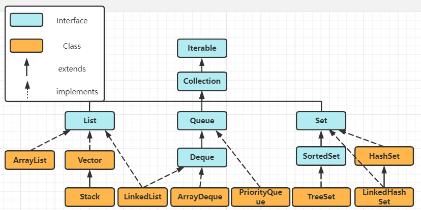
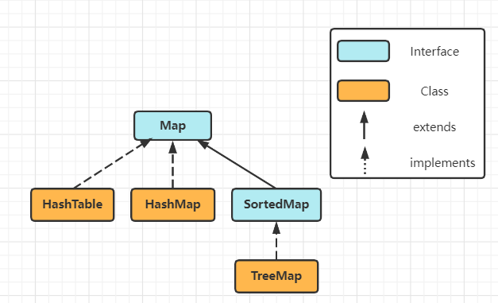

# Java容器

- [Java容器](#java--)
  * [基本框架](#----)
  * [Collection-List接口](#collection-list--)
    + [ArrayList](#arraylist)
    + [LinkedList](#linkedlist)
    + [Vector](#vector)
  * [Collection-Queue接口](#collection-queue--)
    + [PriorityQueue](#priorityqueue)
    + [ArrayDeque](#arraydeque)
  * [Collection-Set接口](#collection-set--)
    + [HashSet](#hashset)
    + [TreeSet](#treeset)
    + [LinkedHashSet](#linkedhashset)
  * [Map接口](#map--)
    + [HashMap](#hashmap)
    + [TreeMap](#treemap)
    + [HashTable](#hashtable)


## 基本框架

> Collection：存放单一元素，存储一组不唯一、无序的对象



> Map：存放键值对



上面列举了常用的接口以及实现类，详细框架参考[Java 集合框架](https://www.runoob.com/java/java-collections.html)

Collection：接口中定义了大部分的集合操作方法；

- List：存储的元素有序且可重复；
- Queue：类似List，拥有队列(FIFO)的性质；
  - Deque：双端队列，队首队尾均可以插入删除元素；
- Set：存储的元素无序且唯一；
  - SortedSet：实现元素有序存储。

Map：存储的元素是key/value键值对，使用key进行索引；key无序且唯一，value无序且可重复。

## Collection-List接口

### ArrayList

```java
public class ArrayList<E> extends AbstractList<E>
        implements List<E>, RandomAccess, Cloneable, java.io.Serializable
```

ArrayList：基于动态数组Object[] (容量可变)实现，支持随机访问(实现了RandomAccess接口)；查找效率高，线程不安全。

### LinkedList

```java
public class LinkedList<E>
    extends AbstractSequentialList<E>
    implements List<E>, Deque<E>, Cloneable, java.io.Serializable
```

LinkedList：基于双向链表 (JDK1.6之前为双向循环链表) 实现，只能顺序访问元素；插入删除元素的效率高，线程不安全。

### Vector

```java
public class Vector<E>
    extends AbstractList<E>
    implements List<E>, RandomAccess, Cloneable, java.io.Serializable
```

Vector：类似ArrayList，但是线程安全的。(方法使用了synchronized关键字)，如：

```java
public synchronized int size() {
    return elementCount;
}
```

## Collection-Queue接口

### PriorityQueue

```c++
//An unbounded priority based on a priority heap......
//Priority queue represented as a balanced binary heap......
public class PriorityQueue<E> extends AbstractQueue<E>
    implements java.io.Serializable {
```

PriorityQueue：优先队列是基于堆实现的，并且是一个平衡二叉堆，底层仍使用Object[] 数组存储元素。线程不安全。

### ArrayDeque

```java
public class ArrayDeque<E> extends AbstractCollection<E>
                           implements Deque<E>, Cloneable, Serializable
```

ArrayDeque：使用 Object[]数组 以及 指向队列头尾的双指针 实现，允许在队列的头部和尾部进行插入删除操作。线程不安全。

## Collection-Set接口

### HashSet

```c++
/*This class implements the Set interface, backed by a hash table(actually a HashMap instance)*/
public class HashSet<E>
    extends AbstractSet<E>
    implements Set<E>, Cloneable, java.io.Serializable
```

HashSet：存储的元素无序且唯一，底层基于HashMap实现，支持快速查找(O(1))。线程不安全。

### TreeSet

```c++
public class TreeSet<E> extends AbstractSet<E>
    implements NavigableSet<E>, Cloneable, java.io.Serializable
```

TreeSet：存储的元素有序且唯一，底层基于红黑树(自平衡的二叉排序树)实现，查找效率(O(logN))不如HashSet。线程不安全。

### LinkedHashSet

```java
/*This implementation differs from HashSet in that it maintains a doubly-linked list running through all of its entries.*/
public class LinkedHashSet<E>
    extends HashSet<E>
    implements Set<E>, Cloneable, java.io.Serializable {
```

LinkedHashSet：继承HashSet，查找效率和HashSet相同，但内部使用双向链表来维护元素的插入顺序。线程不安全。

## Map接口

### HashMap

```java
public class HashMap<K,V> extends AbstractMap<K,V>
    implements Map<K,V>, Cloneable, Serializable 
```


### TreeMap

```java

```


### HashTable

```java

```


<tt>[Java常用集合&方法](../数据结构与算法/java常用容器&方法.md)</tt>

