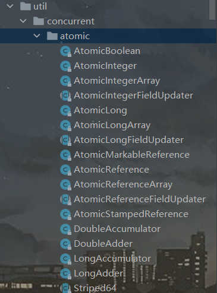
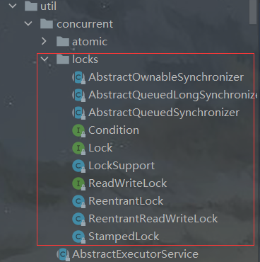

# Java并发

## 基本线程机制

### 线程

- 线程：是进程中的一个单一顺序控制流，一个进程可以包含多个并发执行的线程。
- 多线程：并发编程可以将程序划分为多个分离的、独立运行的任务。通过使用多线程机制，可以将这些子任务交由**执行线程**来驱动。

### 实现线程的三种方式

- 实现`Runnable`接口：无返回值

  ```java
  //1.定义任务：实现Runnable接口并重写run方法
  public class MyRunnable implements Runnable {
  	 @Override
  	 public void run() {
  	 	//通常run方法内总会有循环
  	 }
  }
  //2.驱动任务：将任务实例提交给Thread构造器，并调用start方法
  public class DriveTask{
  	public static void main(String[] args) {
  		Thread thread = new Thread(new MyRunnable());
  		thread.start();
           //new Thread(new MyRunnable()).start();
  	}
  }
  ```

  - `start()`方法：为该线程的执行进行必须的初始化操作，然后调用`run()`方法。

    注：`start()`方法执行完毕后会迅速返回，继续执行`main`主线程中的其他语句。

  - `run()`方法：在新线程中启动该任务，并与其他线程并发执行。

- 实现`Callable`接口：可以有返回值，通过FutureTask封装

  ```java
  //1.定义任务：实现Callable接口并重写call方法
  public class MyCallable implements Callable<String>{
  	 @Override
  	 public String call() throws Exception {
  	 	//...
  	 }
  }
  //2.驱动任务：将任务实例提交给Thread构造器，并调用start方法
  public class DriveTask{
  	public static void main(String[] args) {
          /* FutureTask包装器:
  		 * public FutureTask(Callable<V> callable)
  		 * public FutureTask(Runnable runnable, V result)
  		 */
          FutureTask<String> t = new FutureTask<String>(new MyCallable());
          Thread thread = new Thread(t);
          thread.start();
          String result = t.get();
  
          //当有多个任务执行时(线程池) 
          ExecutorService exec = Executors.newCachedThreadPool();
          ArrayList<Future<String>> res = new ArrayList<Future<String>>();
          for(...)
              res.add(exec.submit(new MyCallable())); //submit方法会产生Future对象
          for(Future<String> f : res)
              f.get();
  	}
  }
  ```

- 继承`Thread`类

  ```java
  public class MyThread extends Thread {
  	@Override
  	public void run() {
  		// ...
  	}
  }
  public static void main(String[] args) {
  	new MyThread().start();
  }
  
  ```
  
- 实现接口要比直接继承`Thread`类要好些

  - Java 只⽀持单继承，但是可以实现多个接⼝；
  - 继承整个 `Thread` 类开销过⼤。

### 线程池

执行器（`Executor`，位于`java.util.concurrent`JUC包中）：允许管理多个异步任务的执行，而无需显式管理线程的生命周期。

```java
// ExecutorService是具有服务生命周期的Executor
ExecutorService
        exec1 = Executors.newCachedThreadPool(),     //可为所有任务创建一个线程
        exec2 = Executors.newFixedThreadPool(5),     //包含有限个可以执行任务的线程
        exec3 = Executors.newSingleThreadExecutor(); //相当于数量为1的FixedThreadPool。当有多个任务被提交，那么这些任务将排队直到轮到自己执行，所有的任务使用相同的线程
for (int i = 0; i < 5; i++) {
    exec1.execute(new MyThread());  //调用run()方法
    exec1.submit(new MyCallable()); //调用call()方法，会产生Future对象
}
exec1.shutdown(); //关闭服务
```

### 线程优先级

`Priority` (线程优先级)

- 将线程的重要性传递给调度器，即使CPU处理线程集的顺序是不确定的，但调度器更**倾向于让优先级高的线程先执行**。

- 优先级不会导致死锁，因为优先级较低的线程只是**执行的频率较低**，并不意味着它不会执行。

- Java有10个优先级即1~10，不过与多数操作系统不能映射的很好，为了使程序可移植，规定只使用`MAX_PRIORITY(10)`、`NORM_PRIORITY(5)`、`MIN_PRIORITY`(1)。

  ```java
   @Override
    public void run() {
         Thread.currentThread().setPriority(Thread.MAX_PRIORITY);
         /*
         Thread.currentThread()：表示当前线程
         Thread.currentThread().setPriority()：修改线程优先级
         Thread.currentThread().getPriority()：得到当前线程优先级
         */
    }
  ```

### 休眠 sleep()

`sleep(long millis)` (休眠)：使任务终止执行给定的时间。该方法会抛出`InterruptedException`，需要在run方法中捕获，因为异常不能跨线程传播回主线程`main()`。

```java
public void run() {
    try{
        Thread.sleep(3000); //3000ms
    }catch(InterruptedException e){
        ...
    }
}
```

### 让步 yield()

`yield()` (让步)：静态方法`Thread.yield()`，调用此方法会给线程调度器暗示：“当前线程已经执行完生命周期中最重要的部分，此时正是切换给其他任务执行的大好时机”。当然，这只是一个暗示或者说建议，没有任何机制保证它将会被采纳，并且也是建议具有相同优先级的其它线程可以运⾏。

### 守护线程

`Daemon` (守护线程)：也称后台线程，指程序在运行时在后台提供一种通用服务的线程

- 不属于程序中不可或缺的一部分

- 所有非后台线程都终止，则此时会杀死进程中的所有后台程序；即只要有任何非后台线程还在运行，程序就不会终止。

  ```java
  Thread daemon = new Thread(new MyRunnable());
  daemon.setDaemon(true); //必须在线程启动前，调用setDaemon方法
  daemon.start();
  System.out.println(daemon.isDaemon());
  ```

## 共享受限资源

### 解决共享资源竞争

- **共享资源**：一般是以对象形式存在的内存片段，也可能是文件、I/O端口等；当多个线程试图同时使用同一个资源时，就可能出现访问冲突。

- 为了解决在并发模式下线程冲突的问题，会采用**序列化访问共享资源**的方案，即在可能存在冲突的代码前加上**锁语句**（锁语句会产生互相排斥的效果，这种机制常称为**互斥量(mutex)**），使得在这段时间内只有一个任务可以运行这段代码。

  - `synchronized`（Java关键字，JVM实现）：当任务执行到被`synchronized`关键字保护的代码片段时，会 检查锁是否可用 -> 获取锁 -> 执行代码 -> 释放锁。

    - 使用并发时，将共享资源设为`private`是非常重要的，否则，`synchronized`无法防止其他任务直接访问共享资源，从而产生冲突；

    - 所有**对象**都自动含有单一的锁（也称为监视器）。若调用某个对象的`synchronized`**方法**，会给该对象加锁，此时该对象的其他同步方法只能等前一个同步方法执行完毕并释放了对象锁才能执行。

    - **同步代码块**：作用于同一个对象。该代码段也被称为**临界区**。

      ```java
      public void fun1() {
          synchronized(this) { //给实例对象加锁
      		......
          }
      }
      ```

    - **同步方法**：作用于同一个对象。缺点：将一个大的方法声明为`synchronized`会影响效率。因为只读的代码不需要锁，只有修改的代码才需要。

      ```java
      public synchronized void fun() {
       	......
      }
      ```

    - **同步类**：作用于整个类。当两个线程调⽤同⼀个类不同对象的同步代码块时，也会进⾏同步(即发生阻塞)。

      ```java
      public void fun2() {
          synchronized(SynchronizedTest.class) { //给类加锁
      		......
          }
      }
      ```

    - **同步静态方法**：作用于整个类

      ```java
      public synchronized static void fun() {
      	......
      }
      ```

  - `ReentrantLock`（JUC包中的显式互斥机制，JDK实现）：`Lock`对象必须被显示的创建、锁定和释放。

    ```java
    private Lock lock = new ReentrantLock();
    public T func() {
    	lock.lock(); //加锁锁
    	try {
    		//...
            return val; //注：return语句必须再try子句中出现，确保unlock不会过早发生，从而将数据暴露给其他任务
    	} finally {
    		lock.unlock(); //确保释放锁，从⽽避免发⽣死锁。
    	}
    }
    
    ```

  - `synchronized`和`ReentrantLock`比较

    - **实现**：`synchronized` 是 JVM 实现的，⽽ `ReentrantLock` 是 JDK 实现的。
    - 性能：新版本 Java 对 `synchronized` 进⾏了很多优化，例如⾃旋锁等，synchronized 与 `ReentrantLock` ⼤致相同。
    - **等待可中断**：当持有锁的线程⻓期不释放锁的时候，正在等待的线程可以选择放弃等待，改为处理其他事情。
      - `ReentrantLock`可中断，⽽ `synchronized`不⾏。
    - **公平锁**：公平锁是指多个线程在等待同⼀个锁时，必须按照申请锁的时间顺序来依次获得锁。
      - `synchronized` 中的锁是⾮公平的；`ReentrantLock` 默认情况下也是⾮公平的，但是也可以是公平的。
    - **绑定多个条件**：⼀个 `ReentrantLock` 可以同时绑定多个 `Condition` 对象。
    - **二者如何选择**： 除⾮需要使⽤ `ReentrantLock` 的⾼级功能来解决特殊问题，否则优先使⽤ `synchronized`。
      - 这是因为 `synchronized`是JVM 实现的⼀种锁机制，JVM 原⽣地⽀持它，⽽ `ReentrantLock` 不是所有的 JDK 版本都⽀持。
      - 并且使⽤ `synchronized`不⽤担⼼没有释放锁⽽导致死锁问题，因为 JVM 会确保锁的释放。

### 原子性和原子类

- **原子操作**是不能被线程调度机制中断的操作。一旦操作开始，它就一定可以在切换到其他线程之前操作完毕。

- 什么才是原子操作？
  通常来说，对域中的值做**赋值**和**返回操作**都是原子性的。原子性可以应用于除`long`和`double`之外的所有基本类型之上的简单操作（如读取和写入，注：**自增自减**和**+=**不是原子性的）。
  
- `volatile`关键字
  - JVM将long和double的64位变量的读写操作当作两个分离的32位操作来执行，因此可能会出现在进行读写操作时发生上下文切换。为了解决这种问题，可以在定义64位变量时使用`volatile`，就会获得**简单操作的原子性**。
  - 提供了应用中的**可视性**。如果一个域为`volatile`的，那么对这个域的写操作会被立即写入到主存中(即使使用本地缓存也会如此)，从而所有的读取(发生在主存中)操作都可以看到这个修改。但是，非volatile域上的原子操作不会刷新到主存中去，其他读取操作也看不到这个新值。
    - 一个任务内部的任何读写操作对于这个任务来说都是可视的，如果只需要在任务内部保持可视性，则不必将域声明为volatile。
  - 如果多个任务同时访问某个域，那么这个域就应该被声明为`volatile`或被`synchronized`同步(当然同步也会导致主存刷新)。
  - 当一个域**依赖它之前的值**（如递增递减、+=），或受到其他域的限制，`volatile`就无法工作，并且它们是非线程安全的。
  - 专家级的程序员可以利用原子操作的性质来编写无锁(即不使用同步)代码，但通常尝试用原子操作来替换同步会带来很大的麻烦。所以使用synchronized是最安全也是首选的方式。
  
- **原子类**（`Atomic`）

  

### ThreadLocal

- 防止共享资源冲突的第二种方式：**根除对变量的共享**。

- `java.lang.ThreadLocal`类实现了**创建和管理线程本地存储**变量。
  
  - 线程本地存储：是一种自动化机制，可为**使用相同变量**的每个**不同线程**创建**不同的存储**，即每个线程`Thread`拥有一份自己的**变量副本**，多个线程互不干扰。可通过`get() / set()`方法更改线程的数据。
  
- `ThreadLocal`底层分析：

  ```java
  public class ThreadLocal<T> { //泛型类
  }
  ```

  ```java
  //set方法
  public void set(T value) {
      Thread t = Thread.currentThread(); //获得当前线程
      ThreadLocalMap map = getMap(t);    //获得当前线程的map对象
      /* Thread类 中定义了该成员变量
       * ThreadLocal.ThreadLocalMap threadLocals = null;
       *
       * ThreadLocal类提供了获得map的方法
       * ThreadLocalMap getMap(Thread t) {
       *     return t.threadLocals;
  	 *}
  	 *
       * ThreadLocalMap是 ThreadLocal的静态内部类, 用来维护线程本地变量
       * static class ThreadLocalMap {
       		//键值对使用的是弱引用，当没有强引用指向 ThreadLocal 实例时，它可被回收，从而避免内存泄露
       		static class Entry extends WeakReference<ThreadLocal<?>> {
              	Object value;
              	Entry(ThreadLocal<?> k, Object v) {
                  	super(k);
                  	value = v;
              	}
          	}
       * }
  	 */
      if (map != null)
          map.set(this, value); // 将value的副本存入map中
      	/* ThreadLocalMap的set方法
      	 * private void set(ThreadLocal<?> key, Object value)
      	 */
      else
          createMap(t, value);
      	/* ThreadLocal类
      	 * void createMap(Thread t, T firstValue) {
          		t.threadLocals = new ThreadLocalMap(this, firstValue);
      	 * }
      	 */
  }
  
  ```

  ```java
  //get方法
  public T get() {
      Thread t = Thread.currentThread();
      ThreadLocalMap map = getMap(t); //获得当前线程的map对象
      if (map != null) { //map不为空
          ThreadLocalMap.Entry e = map.getEntry(this); //获得当前ThreadLocal对象的键值对
          if (e != null) {
              @SuppressWarnings("unchecked")
              T result = (T)e.value; //返回value
              return result;
          }
      }
      return setInitialValue(); //map为空返回设定的初始值，为null
      /*private T setInitialValue() {
          T value = initialValue();
          
          Thread t = Thread.currentThread();
          ThreadLocalMap map = getMap(t);
          if (map != null)
              map.set(this, value);
          else
              createMap(t, value);
              
          return value; //返回调用initialValue()方法后的初值，由下面的方法得该初值为null
          /* protected T initialValue() {
          	return null;
     	    }
      }*/
      
      //当然，也可以再创建ThreadLocal对象时，重写initialValue方法，重新赋初值
      /*ThreadLocal<Integer> local = new ThreadLocal<>(){
          @overtirde
          protected Integer initialValue() {
          	return 0;
     	    }
      }*/
  }
  ```

  综上，可以发现每个线程都维护一个`ThreadLocalMap`来存储`ThreadLocal-value`键值对，`set / get`方法仅对该线程的map中的键值对进行操作，从而保证线程安全。

  注：

  - 每个线程都维护这样一个map会占用大量内存，如果这些映射一直存在，很容易导致内存不足，因此`key`(即`ThreadLocal`)为 弱引用(`WeakReference`)，这样当内存不够时GC会自动回收这些`key`。
  - 内存泄漏问题：由于`value`为强引用，所以如果`ThreadLocal`没有被外部强引用，GC时`key`会被清理而`value`不会。这会出现`key`为null的情况，使得对应的`value`无法被回收，导致内存泄漏。（不过`ThreadLocal`已经考虑了这种情况，在`get / set / remove`方法被调用时，会清理掉`key`为null的记录）

## 任务终结

### 线程状态

`java.lang.Thread`类中定义了线程的6种状态：

```java
public enum State {
        //新建。线程被创建但并未启动，此时已经初始化并且分配到了系统资源，等待调度器来将线程变为可运行或阻塞状态。
        NEW,

        //可运行。只等调度器分配时间片就可运行，这与阻塞状态不同
        RUNNABLE,

        //阻塞。线程等待某个资源（如锁、IO）从而进入阻塞状态，此时调度器不会为该线程分配时间片，直到线程进入可运行状态（如释放了锁、IO完成）
        BLOCKED,

        //无限期等待。等待其他线程显式唤醒当前线程。
        /* 进入方法                          退出方法
         * Object.wait();//无参数            Object.notify() / notifyAll()
         * Thread.join();//无参数            被调用的线程执行完毕
         * */
        WAITING,

        //限期等待。一定时间之后会被系统自动唤醒 或 被其他线程唤醒
        /* 进入方法                          退出方法
         * Thread.sleep(long millis);       时间结束 (时间单位均为毫秒)
         * Object.wait(long timeout);       时间结束 / Object.notify() / notifyAll()
         * Thread.join(long millis);        时间结束 / 被调用的线程执行完毕
         * */
        TIMED_WAITING,

        //终止。线程自然终止 或 因其他终止条件(异常)发生使线程意外终止
        TERMINATED;
    }
```

### 中断

- `Thread.interrupt()`：可中断的一个线程，并设置线程的中断状态为`true`（不能中断IO阻塞和`synchronized`锁阻塞）。

- `InterruptedException`：当调用`Thread.interrupt()`或`Thread.sleep(millis)`方法时，如果一个线程正处于`BLOCKED`、`WAITING`、`TIMED_WAITING`这三个状态 或 试图执行一个阻塞操作，将会抛出`InterruptedException`异常，从而提前终止该线程（进入`catch`子句，异常被捕获后，线程的中断状态会立即被置为`false`，即catch子句中线程的中断状态始终为`false`）。

- `Thread.interrupted()`：检测当前线程是否被中断，若被中断返回true。

  ```java
  @override
  public void run() {
      while(!Thread.interrupted()) { //线程没被中断，继续执行循环
          ......
      }
      //线程被中断，退出循环，结束线程。
      //这种方式不用抛出异常
  }
  ```

- 线程池中断

## 线程间的协作

### join() 

- `join()`：一个线程a可在其他线程b之上调用`a.join()`方法。
  - 效果：线程a将被挂起，直到线程b终止（即`b.isAlive()`为`false`）才能恢复执行；
  - `a.join(millis)`：带超时参数，如果b在要求时间内没终止，`join()`方法总能返回来恢复a执行。

### 使用Object类

`Object`类含有协调线程的方法：

- wait()：使该线程被挂起，进入无限期等待状态，直到因其他线程的运行而使某个条件满足时，其他线程会调用 `notify() / notifyAll()` 方法来唤醒该线程。
  - 线程调用`wait()`方法后会释放对象锁，而`Thread.sleep(millis)`则不会让出资源；
  - `wait() / notify() / notifyAll()`这些方法只能在同步方法或代码块中使用（即必须事先获得对象锁），否则会抛出`IllegalMonitorStateException`。而`Thread.sleep(millis)`不会释放锁，所以可以在非同步方法或代码块中使用。

### 使用JUC类库

`java.util.concurrent`类库中提供了显式的`Lock`类和`Condition`类来实现线程间的通信：

- `Condition`类：是使用互斥并允许任务挂起的基本类。

  - 可通过在`Condition`对象上调用`await()`方法来挂起一个线程，当外部条件满足时，可调用`signal() / signalAll()`方法来通知并唤醒在该`Condition`对象上挂起的线程

  ```java
  public class JUCTest {
      private Lock lock = new ReentrantLock();
      private Condition condition = lock.newCondition();
      public void f1() {
          lock.lock();
          try {
              //条件满足
              condition.signalAll();
          } finally {
              lock.unlock();
          }
      }
      public void f2() {
          lock.lock();
          try {
              //等待条件
              condition.await();
          } catch (InterruptedException e) {
              e.printStackTrace();
          } finally {
              lock.unlock();
          }
      }
  }
  ```

## 死锁

由于`synchronized`、`Lock`以及其他加锁机制会使线程进入阻塞状态，如果多个线程之间陷入了相互等待的循环时，该状况称为**死锁**，此时所有线程都不能向前执行。

## JUC

### JUC简介

Java SE 5的`java.util.concurrent`(JUC)类库引入了大量的新类，被设计用来解决并发问题，使用这些组件会使程序更加简单且健壮。

### AQS原理

- `AQS`：全称`AbstractQueuedSynchronizer 抽象队列同步器`，是JUC类库的核心，位于`j.u.c.locks`包下。

  

- ```java
  /**
   * Provides a framework for implementing blocking locks and related
   * synchronizers (semaphores, events, etc) that rely on
   * first-in-first-out (FIFO) wait queues.
   */
  public abstract class AbstractQueuedSynchronizer
      extends AbstractOwnableSynchronizer
      implements java.io.Serializable 
  ```

  注释说明基于`AQS`可以实现许多有用且高效的同步器，如`ReentrantLock`、`Semaphore`等。

- `AQS`原理分析

  https://www.cnblogs.com/waterystone/p/4920797.html

  https://www.cnblogs.com/chengxiao/archive/2017/07/24/7141160.html

### CountDownLatch


### ACyclicBarrier


### Semaphore


### 其他组件


## 性能调优


## 高效并发

[JVM-高效并发](./JVM-高效并发.md)

