# 王道-操作系统

## **一、** **操作系统概述**

（一）  操作系统的概念、特征、功能和提供的服务

```
操作系统：管理各种计算机硬件，为应用程序提供基础，并充当计算机硬件与用户之间的中介。
概念：操作系统(Operating System, OS）是指 控制和管理整个计算机系统的硬件与软件资源，合理地组织、调度计算机的工作与资源的分配，进而为用户和其他软件提供方便接口与环境的[程序集合]。操作系统是计算机系统中最基本的 系统软件。

特征：
- 并发：两个或多个事件在同一时间间隔内发生(微观仍是分时交替执行，有单处理机调度)；而并行是在同一时刻能完成两种即以上的工作。
- 共享：指系统中的资源可供内存中多个并发执行的进程共同使用。可分为：
        互斥共享方式：一段时间内只允许一个进程访问该资源
        同时访问方式：一段时间内允许多个进程"同时"访问该资源(在微观         上，"同时"指进程交替地对该资源进行访问，即分时共享)
- 虚拟：指把一个物理上的实体变为若干逻辑上的对应物,(虚拟处理器、虚拟内存和虚拟外部设备等)
       虚拟技术：时分复用技术，如处理器的分时共享; 空分复用技术，如虚拟存储器。
- 异步：多道程序环境允许多个程序并发执行，但由于资源有限，进程的执行并不是一贯到底的，而是走走停停的，它以不可预知的速度向前推进，这就是进程的异步性。

操作系统功能和提供的服务：
```


（二）  操作系统的发展与分类

```
批处理阶段
分时操作系统
实时操作系统
网络操作系统和分布式计算机系统
个人计算机操作系统
```

（三）  操作系统的运行环境 （内核态与用户态、中断、异常、系统调用）P27


```
系统调用：指用户在程序中调用操作系统所提供的一些子功能。 P30	
```


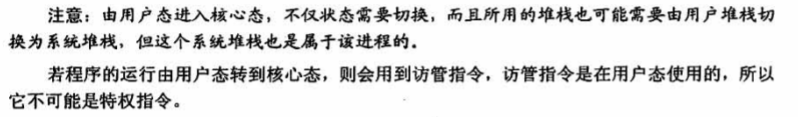

（四）操作系统体系结构  P37

```
大内核
微内核
```


## **二、**  进程管理

#### （一）进程与线程

进程概念、进程的状态与转换、进程控制、进程组织

```
程序：顺序性、封闭性、可再现性。
	封闭性：程序一旦开始执行，结果只取决于程序本身；
	可再现性：程序重复执行时，必将获得相同的结果。
多道程序并发执行：增加了系统的处理能力，提高了系统资源利用率，但也带来如下问题：
	失去了程序的封闭性
	程序(静态)和机器执行程序(即计算，动态)的活动不再一一对应
	并发程序间的相互制约、资源共享与抢夺
```

> 进程概念：是进程实体的运行过程，是系统进行资源分配和调度的一个独立单位


```
程序和数据集合是进程存在的物质基础，即进程的实体(映像)；而PCB包含了进程的描述信息和控制信息，反映了进程的动态特性。
PCB包含的信息：进程标识名或标识数(每个进程有且仅有一个并且唯一)；位置信息；状态信息；进程优先级；进程现场保护区；资源清单；队列指针或链接字(将处于同一状态的进程链接成一个队列)；......
```

> 进程特征：


> 进程的状态与转换  （细分：书本P53）

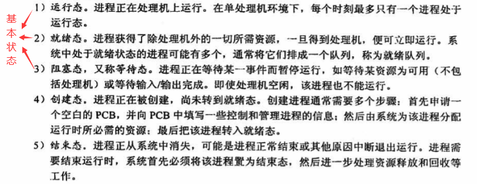


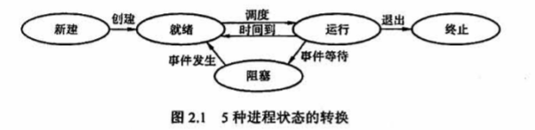

> 进程控制

```
原语：由若干条机器指令构成的并用以完成特定功能的一段程序。特点是在执行期间不允许中断，是一个不可分割的基本单位。
```

> > ​	进程创建：(树形结构—父子进程优点：资源分配严格；进程控制灵活；进程层次清晰，关系明确  书本P55)


> > 进程终止(撤销)


> > 进程阻塞和唤醒

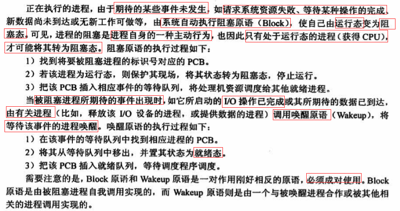

> >进程切换


> > 进程挂起与激活  书本P55


> 进程组织：进程是一个独立的运行单位，是操作系统进行资源分配和调度的基本单位。由进程控制块(PCB)、程序段、数据块三部分组成


```
进程队列的组织：为了便于对进程进行调度和管理   书本P58
1.连接方式(队列)：不同状态的进程位于不同队列中
	优点：PCB数目不受限制，可动态申请和释放，管理方便
	缺点：动态分配PCB所占内存的算法比较复杂，额外指针会占用一定空间并花费操作时间
2.索引方式(线性表)：(书本与PDF不同) 
	优点：简单，无需复杂的申请释放操作以及额外指针
	缺点：管理不够方便，查找需要变量整个PCB表
```


> 进程通信：进程间的信息交换（共享存储、消息传递管道通信）

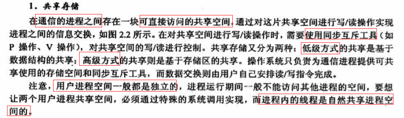

> 线程概念与多线程模型


```
线程："轻量级进程"，是进程内一个可调度的实体，是处理机调度的基本单位，一个进程可拥有多      个线程。
进程和线程的关系：
1.线程是进程的一个组成部分。进程在刚创建时通常只有一个线程，可由其再创建其他线程
2.进程的多个线程都是在进程的地址空间执行
3.资源是分配给进程的，由所有线程共享全部资源
4.处理机调度的基本单位是线程，线程之间竞争处理机，真正运行在处理机上的线程
5.线程在执行过程中需要同步
```


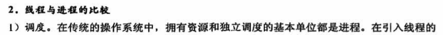


```
进程、线程、作业之间的联系与区别： 书本P61
一个作业可以划分为若干个进程来完成，而每个进程又都有其实体(程序+数据集合)。
进程和程序间的区别：

```

#### （二）处理机(进程)调度

```
处理机调度：从就绪队列中按一定的算法选择一个进程并将处理机分配给它运行，以实现进程并发的执行。是多道程序操作系统的基础，是操作系统设计的核心问题。
```


```
调度的时机、切换与过程  P65
进程调度方式：
```


> 典型调度算法

> > 先来先服务(FCFS)：可用于作业调度和进程调度


> > 短作业（短进程、短线程）优先 (SJF)

```
短作业优先(SJF): 从后备队列选一个或若干估计运行时间最短的作业，调入内存运行
短进程优先(SPF): 从就绪队列选一个估计运行时间最短的进程，将处理机分配给它
优点：平均等待时间、平均周转时间最少
缺点：对长作业不利；未考虑作业的紧迫程度，不能保证紧迫性作业被及时处理；只是估计，用户可能有意无意改变作业的估计运行时间，并不一定真正做到SJF
```

> > 时间片轮转：主要用于分时系统


> > 优先级调度算法：可用于作业调度和进程调度


> > 最高响应比优先：主要用于作业调度。


> > 多级反馈队列调度算法：是时间片轮转和优先级调度算法的综合与发展


#### （三）进程同步与互斥

> 进程同步的基本概念


> 实现临界区互斥的基本方法：

> >软件实现方法：在进入区设置一些标志标明是否有进程在临界区中

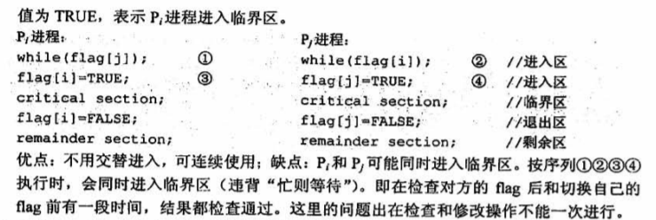

> >硬件实现方法：P90


> 信号量：P / V操作   P91        	书本P68	       P93—信号量实现前驱图(重要)


> 管程  P94	


> 经典同步问题

> >生产者-消费者问题  P96


> >读者-写者问题  P98


> >哲学家进餐问题 P100


> > 吸烟者问题 P101


> > 高级通信原语 书本P75


#### （四）死锁

> 死锁的概念、死锁处理策略(书本P85)

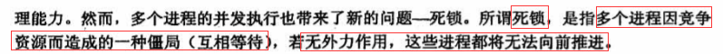


> 死锁预防：破环死锁产生的四个必要条件之一


> 死锁避免

> >系统安全状态  P137

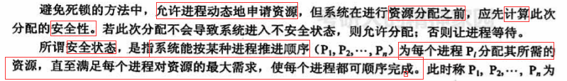


> >银行家算法   P137  书本P87


```
优点：资源利用率提高；避免了死锁   书本P88
缺点：对资源分配过于保守；计算太多
```

> 死锁检测和解除    书本P91


## **三、** **内存管理**

#### （一）内存管理基础

> 内存管理概念


> 程序装入与链接、逻辑地址与物理地址空间、内存保护    P161


> *交换与覆盖  P164


> 连续分配管理方式


> 非连续分配管理方式


> > 分页管理方式(分区大小固定)

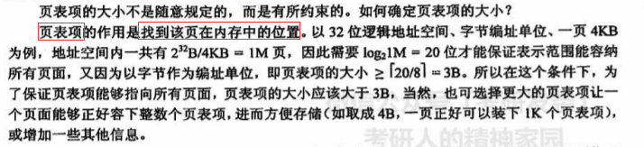

```
二级页表 P171
```


> > 分段管理方式(分区大小不固定)


> > 段页式管理方式


#### （二）  虚拟内存管理


> 虚拟内存基本概念


> 请求分页管理方式

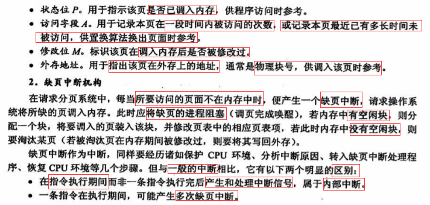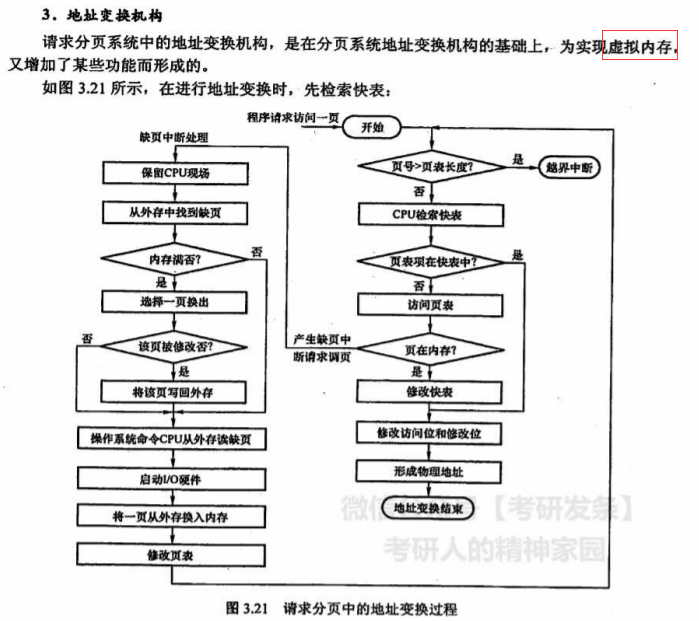

> 页面置换算法


> > 最佳置换算法（OPT）


> > 先进先出置换算法（FIFO）


> > 最近最少使用置换算法（LRU）


> > 时钟置换算法（CLOCK） P199


> 页面分配策略  P201


> 工作集、抖动


## **四、** **文件管理**

#### （一）  文件系统基础

> 文件概念  P229

```
文件：是一个具有符号名的一组相关联元素的有序序列。
文件是以计算机硬盘为载体的存储在计算机上的信息集合，文件可以是文本文档、图片、程序等。在系统运行时，计算机以进程为基本单位进行资源的调度和分配;而在用户进行的输入，输出中，则以文件为基本单位。
```

> 文件的逻辑结构

> > 无结构文件(流式文件)


> > 有结构文件(记录式文件)   P142

> > > 顺序文件


> >> 索引文件


> > > 索引顺序文件


> > >Hash文件(散列文件)


> 文件存取方法：顺序存取方法、直接存取法、按键存取法   P145


> 目录结构：文件控制块和索引节点，单级、两级和树形目录结构，图形目录结构 P233


> 文件共享

> >基于索引节点的共享方式(硬链接)


> >基于符号链接的共享方式(软链接)


> 文件保护：访问类型、访问控制  P238	


#### （二）  文件系统实现

> 文件系统层次结构  P248	

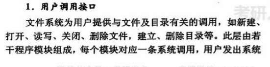

> 目录实现


> 文件实现——文件分配方式  P249

> > 连续分配


> > 链接分配


> > 索引分配


> 文件实现——文件存储空间管理  P252


> > 空闲表法


> > 空闲链表法


> > 位示图法


> > 成组链接法(UNIX)


#### （三）  磁盘组织与管理

> 磁盘的结构


> 磁盘调度算法


> > 先来先服务（FCFS）


> > 最短寻道时间优先（SSTF）


> > 电梯算法（SCAN）


> > 循环扫描（C-SCAN）P270


> 磁盘的管理 P272

 

## **五、** 输入输出（I/O）管理

#### （一）  I/O管理概述


> I/O控制方式  P285

> > 程序直接控制方式


> > 中断驱动方式


> > DMA方式


> > 通道控制方式


> I/O软件层次结构 P287


#### （二）  I/O核心子系统


> I/O调度概念


> 出错处理


> 高速缓存与缓冲区


> > 缓冲区  P298


> 设备分配与回收   P300


> 假脱机技术（SPOOLing）

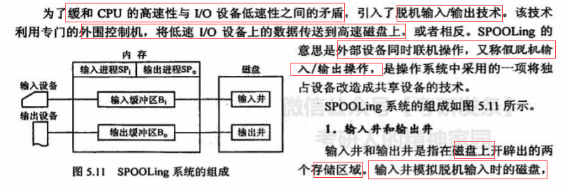


