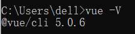
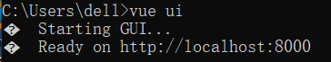

# Vue


## Hello World

1. 安装`vue`

   ```bash
   # 最新稳定版
   $ npm install vue@next
   
   $ npm install -g @vue/cli
   
   $ npm config set registry https://registry.npm.taobao.org
   ```
   
   
   
2. 使用 vue-cli 创建

   ```bash
   $ vue create hello_world   # 选择默认
   ```

   

   ```bash
   $ cd hello_world
   $ npm run serve            # 启动
   ```
   
   

3. 使用 vue3 的 ui 界面创建

   ```bash
   $ vue ui     # 访问如下url来创建项目
   ```

   

## 部署项目

[https://blog.csdn.net/qq_43589143/article/details/123017842](https://blog.csdn.net/qq_43589143/article/details/123017842)
