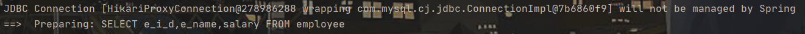
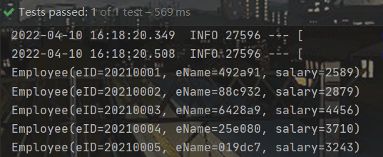

# MyBatis-Plus


## 入门案例

- 创建工程并手动导入相关依赖

  ```xml
  <!--mybatis-plus启动类-->
  <dependency>
      <groupId>com.baomidou</groupId>
      <artifactId>mybatis-plus-boot-starter</artifactId>
      <version>3.5.1</version>
  </dependency>
  <!--mysql驱动-->
  <dependency>
      <groupId>mysql</groupId>
      <artifactId>mysql-connector-java</artifactId>
      <scope>runtime</scope>
  </dependency>
  <!--lombok插件，简化实体类开发-->
  <dependency>
      <groupId>org.projectlombok</groupId>
      <artifactId>lombok</artifactId>
      <optional>true</optional>
  </dependency>
  ```

- 配置`application.yml`（主要配置数据源信息，以及`MyBatis-Plus`日志）

  ```yml
  spring:
    datasource:
      #数据源类型
      type: com.zaxxer.hikari.HikariDataSource
      #数据库连接信息
      driver-class-name: com.mysql.cj.jdbc.Driver
      url: jdbc:mysql://localhost:3306/company?serverTimezone=GMT%2B8&characterEncoding=utf-8&useSSL=false
      username: root
      password: root
      
  #MyBatis-Plus日志
  mybatis-plus:
    configuration:
      log-impl: org.apache.ibatis.logging.stdout.StdOutImpl
  ```

- 使用`lombok`简化开发一个实体类

  ```java
  @NoArgsConstructor  //无参构造
  @AllArgsConstructor //有参构造
  //@Getter
  //@Setter
  //@ToString
  //@EqualsAndHashCode
  @Data //该注解不会生成有参构造，如果需要有参构造必须将两个注解都添加上
  public class Employee {
      private int eID;
      private String eName;
      private int salary;
  }
  ```

- 创建`Mapper`接口，并在启动类中配置`mapper`包的扫描

  ```java
  @Repository
  public interface EmployeeMapper extends BaseMapper<Employee> {
  
  }
  
  //启动类
  @SpringBootApplication
  @MapperScan("com.kk.mapper") //扫描mapper包
  public class QuickstartApplication {
  	public static void main(String[] args) {
  		SpringApplication.run(QuickstartApplication.class, args);
  	}
  }
  ```

  `BaseMapper<T>` 接口中提供了各种单表的crud方法，如：

  ```java
  public interface BaseMapper<T> extends Mapper<T> {
      int insert(T entity);
  
      int deleteById(Serializable id);
  
      int deleteById(T entity);
  
      int deleteByMap(@Param("cm") Map<String, Object> columnMap);
      
      ......
  }
  ```

- 测试 (注：无需在xml配置文件中自己编写sql语句)

  ```java
  @SpringBootTest
  public class CRUDTests {
      @Autowired
      private EmployeeMapper employeeMapper;
  
      @Test
      public void TestCRUD() {
          //selectList可以传入一个条件构造器Wrapper
          //也可直接传入null，相当于sql语句中没有where
          List<Employee> list = employeeMapper.selectList(null);
          list.forEach(System.out::println);
      }
  }
  ```

  注：测试的时候发现对于实体类属性的命名是很重要的，比如 `eID ` 在生成的 `sql` 语句中的形式为 `e_i_d`(即根据大写来添加下划线)，因此表的字段名称就必须命名为 `e_i_d`，否则就会报错。这一点由日志信息很容易发现：

  

  


## BaseMapper

`BaseMapper<T>` 接口中实现了基本的 `CRUD` 操作，如下：

- 增

  ```java
  int insert(T entity); //返回值为受影响的行数
  ```

  测试：

  ```java
  
  ```

  

- 删

  ```java
  int deleteById(Serializable id);
  
  int deleteById(T entity);
  
  //根据map里的条件删除
  int deleteByMap(@Param("cm") Map<String, Object> columnMap);
  
  //根据条件构造器Wrapper
  int delete(@Param("ew") Wrapper<T> queryWrapper);
  
  //根据多个id批量删除
  int deleteBatchIds(@Param("coll") Collection<?> idList);
  ```

  测试：

  ```java
  
  ```

  

- 改

  ```java
  int updateById(@Param("et") T entity);
  
  int update(@Param("et") T entity, @Param("ew") Wrapper<T> updateWrapper);
  ```

  测试：

  ```java
  
  ```

  

- 查

  ```java
  //根据主键id查询
  T selectById(Serializable id);
  
  //根据多个id批量查询
  List<T> selectBatchIds(@Param("coll") Collection<? extends Serializable> idList);
  
  //根据map中的条件查询记录
  List<T> selectByMap(@Param("cm") Map<String, Object> columnMap);
  
  //根据条件构造器查找一条记录，多条数据会抛出异常
  default T selectOne(@Param("ew") Wrapper<T> queryWrapper) {......}
  
  //判断符合条件的记录是否存在
  default boolean exists(Wrapper<T> queryWrapper) {......}
  
  //查询符合条件的记录总数
  Long selectCount(@Param("ew") Wrapper<T> queryWrapper);
  
  //根据Wrapper条件查询全部记录，以实体类封装
  List<T> selectList(@Param("ew") Wrapper<T> queryWrapper);
  
  //根据Wrapper条件查询全部记录，以map封装
  List<Map<String, Object>> selectMaps(@Param("ew") Wrapper<T> queryWrapper);
  
  //
  List<Object> selectObjs(@Param("ew") Wrapper<T> queryWrapper);
  
  //查询全部记录，并可以分页
  <P extends IPage<T>> P selectPage(P page, @Param("ew") Wrapper<T> queryWrapper);
  
  <P extends IPage<Map<String, Object>>> P selectMapsPage(P page, @Param("ew") Wrapper<T> queryWrapper);
  ```

  
