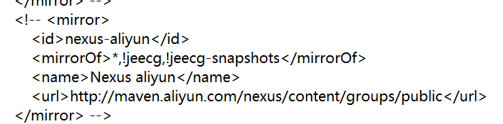
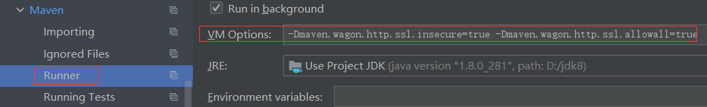

# Maven无法导包

[参考](https://blog.csdn.net/HeyWeCome/article/details/104543411)

1. 在本地Maven的安装目录里找到配置文件`settings.xml`(在 ./config目录下)，修改镜像源：

   a. 先将原镜像注释掉

   

   b. 根据[官方文档](https://developer.aliyun.com/mvn/guide)添加新的镜像

   ```xml
   <mirror>
     <id>aliyunmaven</id>
     <mirrorOf>*</mirrorOf>
     <name>阿里云公共仓库</name>
     <url>https://maven.aliyun.com/repository/public</url>
   </mirror>
   ```

2. 由于新的url使用https，需要配置maven来绕过安全检查后，才能正常下载包。在下图中的`VM OPTION栏中添加如下代码：

   

   ```cmd
   -Dmaven.wagon.http.ssl.insecure=true -Dmaven.wagon.http.ssl.allowall=true
   
   ```

3. 添加好后，就可以正常下载。但我还遇到了比较坑的问题，发现`parent`中的包依然爆红，其他依赖却没有这个问题。

   ```xml
   <parent>
       <groupId>org.springframework.boot</groupId>
       <artifactId>spring-boot-starter-parent</artifactId>
       <version>2.6.3</version>
       <relativePath/> <!-- lookup parent from repository -->
   </parent>
   ```

   思考后才发现没有在依赖`dependencies`中填写该依赖，在官网找到如下坐标

   ```xml
   <dependency>
       <groupId>org.springframework.boot</groupId>
       <artifactId>spring-boot-starter-parent</artifactId>
       <version>2.6.3</version>
       <type>pom</type>
   </dependency>
   ```

   导入后，发现上面的`parent`中的包也不爆红了，问题解决。

