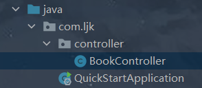
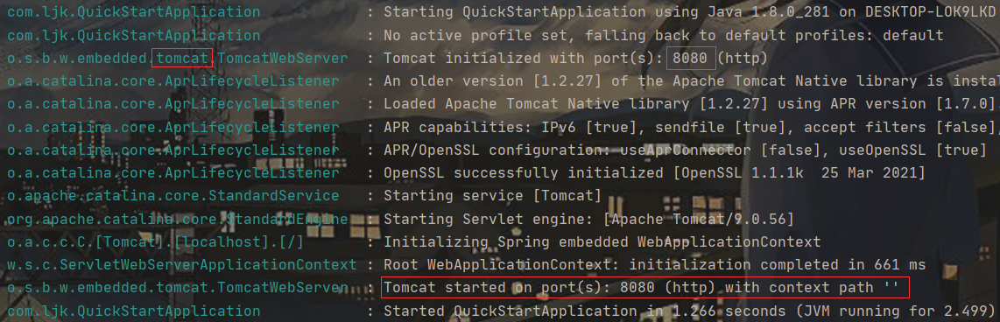
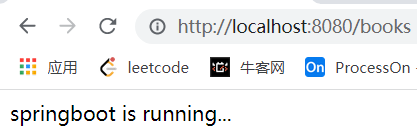
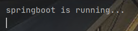

# SpringBoot快速入门

## 简介

`SpringBoot` ：简化了Spring繁杂的配置(如xml)，使得搭建以及开发Spring程序更加快速和高效。它有如下优点：

1. Spring Boot 项目所需的开发或工程时间明显减少，通常会提高整体生产力。
2. Spring Boot 不需要编写大量样板代码、XML 配置和注释。
3. Spring 引导应用程序可以很容易地与 Spring 生态系统集成，如 Spring JDBC、Spring ORM、Spring Data、Spring Security 等。
4. Spring Boot 遵循“固执己见的默认配置”，以减少开发工作（默认配置可以修改）。
5. Spring Boot 应用程序提供嵌入式 HTTP 服务器，如 Tomcat 和 Jetty，可以轻松地开发和测试 web 应用程序。
6. Spring Boot 提供了多种插件，可以使用内置工具(如 Maven 和 Gradle)开发和测试 Spring Boot 应用程序。

## 第一个SprintBoot程序

1. 创建一个新模块

   

   

   

   然后一直点NEXT完成模块的创建(这里创建工程靠的是访问国外的`Spring`主站，所以使用idea时必须联网才可以)。项目框架如下：

   

2. 编写一个基于`RESTful`风格的`SpringMVC`控制器(`Controller`)

[Rest架构风格](./Rest架构风格)



```java
//这里的注解是基于REST的典型注解
@RestController
@RequestMapping("/books")
public class BookController {
    @GetMapping
    public String getById(){
        System.out.println("springboot is running...");
        return "springboot is running...";
    }
}
```

3. 在`QuickStartApplication`类中运行`main`函数即可

   ```java
   @SpringBootApplication
   public class QuickStartApplication {
   	public static void main(String[] args) {
   		SpringApplication.run(QuickStartApplication.class, args);
   	}
   }
   ```

   

   发现`SpringBoot`默认配置的服务器是tomcat，根据端口号、上下文路径以及`RequestMapping`，访问`http://localhost:8080/books`，会出现以下运行结果：

   

4. 注：在使用`maven`导包时，出现了无法下载`SpringBoot`相关依赖的问题，解决方法：[Maven无法导包](./Maven无法导包)


