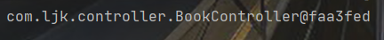

# SpringBoot快速入门

- [SpringBoot快速入门](#springboot----)
  * [简介](#简介)
  * [第一个SprintBoot程序](#第一个SprintBoot程序)
  * [SpringBoot的简化操作](#springboot的简化操作)
    + [parent](#parent)
    + [starter](#starter)
    + [引导类](#引导类)
    + [内嵌tomcat](#内嵌tomcat)

## 简介

`SpringBoot` ：简化了Spring繁杂的配置(如xml)，使得搭建以及开发Spring程序更加快速和高效。它有如下优点：

1. Spring Boot 项目所需的开发或工程时间明显减少，通常会提高整体生产力。
2. Spring Boot 不需要编写大量样板代码、XML 配置和注释。
3. Spring 引导应用程序可以很容易地与 Spring 生态系统集成，如 Spring JDBC、Spring ORM、Spring Data、Spring Security 等。
4. Spring Boot 遵循“固执己见的默认配置”，以减少开发工作（默认配置可以修改）。
5. Spring Boot 应用程序提供嵌入式 HTTP 服务器，如 Tomcat 和 Jetty，可以轻松地开发和测试 web 应用程序。
6. Spring Boot 提供了多种插件，可以使用内置工具(如 Maven 和 Gradle)开发和测试 Spring Boot 应用程序。

## 第一个SprintBoot程序

1. 创建一个新模块

   

   

   

   然后一直点NEXT完成模块的创建(这里创建工程靠的是访问国外的`Spring`主站，所以使用idea时必须联网才可以)。项目框架如下：

   

2. 编写一个基于`RESTful`风格的`SpringMVC`控制器(`Controller`)

[Rest架构风格](./Rest架构风格)


```java
//这里的注解是基于REST的典型注解
@RestController
@RequestMapping("/books")
public class BookController {
    @GetMapping
    public String getById(){
        System.out.println("springboot is running...");
        return "springboot is running...";
    }
}
```

3. 在`QuickStartApplication`类中运行`main`函数即可

   ```java
   @SpringBootApplication
   public class QuickStartApplication {
   	public static void main(String[] args) {
   		SpringApplication.run(QuickStartApplication.class, args);
   	}
   }
   ```

   

   发现`SpringBoot`默认配置的服务器是tomcat，根据端口号、上下文路径以及`RequestMapping`，访问`http://localhost:8080/books`，会出现以下运行结果：

   

4. 注：在使用`maven`导包时，出现了无法下载`SpringBoot`相关依赖的问题，解决方法：[Maven无法导包](./Maven无法导包)

## SpringBoot的简化操作

从入门程序可以发现，`SpringBoot`大大简化了**依赖配置**，并且不需要**编写配置文件**以及**配置服务器**，这是SpringBoot程序的核心功能及优点：

- **起步依赖**（简化依赖配置）：依赖配置的书写简化就是靠这个起步依赖达成的。
- **自动配置**（简化常用工程相关配置）：配置过于繁琐，使用自动配置就可以做相应的简化，但是内部还是很复杂的。 
- **辅助功能**（内置服务器，……）

### parent

`parent`：整合了所有技术版本的常见使用方案，而不用担心各个依赖间的版本冲突问题。`parent`有许多版本，相应的内部技术的版本也会有所区别，帮助开发者统一的进行各种技术的版本管理。

注意：`parent`只是帮助开发者进行**版本的统一管理**，并不会导入依赖坐标。

```xml
<!--pom.xml中继承了parent模块-->
<parent>
    <groupId>org.springframework.boot</groupId>
    <artifactId>spring-boot-starter-parent</artifactId>
    <version>2.6.3</version>
    <relativePath/> <!-- lookup parent from repository -->
</parent>
<!--点开spring-boot-starter-parent源码，得知其中又继承了一个坐标：
	spring-boot-dependencies-->
<parent>
    <groupId>org.springframework.boot</groupId>
    <artifactId>spring-boot-dependencies</artifactId>
    <version>2.6.3</version>
</parent>
<!--该坐标中定义了两组信息：-->
	<!--1.各个技术依赖的版本属性-->
<properties>
    ......
    <db2-jdbc.version>11.5.7.0</db2-jdbc.version>
    <javax-json.version>1.1.4</javax-json.version>
    ......
</properties>
	<!--2.管理各个依赖的坐标(注：只是管理，并不是实际使用)，版本号引用上面属性中的-->
<dependencyManagement>
    <dependencies>
        ......
        <dependency>
        	<groupId>javax.xml.bind</groupId>
        	<artifactId>jaxb-api</artifactId>
        	<version>${javax-jaxb.version}</version>
        </dependency>
        ......
    </dependencies>
</dependencyManagement>
```

上面提到`pom.xml`中继承了`parent`模块，在maven中只能继承一次，所以上面的继承方式也可以改为导入的方式：

```xml
<dependencyManagement>
	<dependencies>
		<dependency>
			<groupId>org.springframework.boot</groupId>
			<artifactId>spring-boot-dependencies</artifactId>
			<version>${spring-boot.version}</version>
			<type>pom</type>
			<scope>import</scope>
		</dependency>
	</dependencies>
</dependencyManagement>
```

### starter

`parent`进行各个依赖版本的统一管理，而`starter`则是将一些固定技术搭配(如spring-web)的**依赖坐标的组合方式**整合到一起，帮助开发者减少依赖配置。

如下面的`spring-boot-starter-web`中，就整合了`web`开发时的依赖组合，而开发者只需要导入这一个坐标即可。

```xml
<dependency>
    <groupId>org.springframework.boot</groupId>
    <artifactId>spring-boot-starter-web</artifactId>
</dependency>
<!--spring-boot-starter-web中定义了需要的依赖坐标-->
<dependency>
    <groupId>org.springframework.boot</groupId>
    <artifactId>spring-boot-starter-tomcat</artifactId>
    <version>2.6.3</version>
    <scope>compile</scope>
</dependency>
<dependency>
    <groupId>org.springframework</groupId>
    <artifactId>spring-web</artifactId>
    <version>5.3.15</version>
    <scope>compile</scope>
</dependency>
```

总结：

- `starter`是一个坐标中定了若干个坐标，减少依赖配置。
- `parent`是定义了几百个依赖版本号，由`SpringBoot`统一管理，减少依赖冲突的。

### 引导类

`XXXApplication`类是工程创建时自带的类，运行该类中的`main`方法就可以运行整个工程。

```java
//作为引导类的典型注解
@SpringBootApplication
public class QuickStartApplication {

	public static void main(String[] args) {
		//run方法返回了一个Spring容器对象（IoC容器）并保存起来
		ConfigurableApplicationContext run = SpringApplication.run(QuickStartApplication.class, args);
		//通过该容器对象run，可以操作其他bean(引导类所在包内的所有bean)
		BookController bean = run.getBean(BookController.class);
		System.out.println(bean);
	}
	
}
```



### 内嵌tomcat

内嵌的web服务器定义在`spring-boot-starter-web`这个`starter`中

```xml
<dependency>
    <groupId>org.springframework.boot</groupId>
    <artifactId>spring-boot-starter-tomcat</artifactId>
    <version>2.6.3</version>
    <scope>compile</scope>
</dependency>
<!--可以发现这仍是一个starter，打开后可以找到tomcat-embed-core(tomcat内嵌核心，将tomcat功能引入工程)-->
<dependency>
    <groupId>org.apache.tomcat.embed</groupId>
        <artifactId>tomcat-embed-core</artifactId>
        <version>9.0.52</version>
        <scope>compile</scope>
    <exclusions>
        <exclusion>
            <artifactId>tomcat-annotations-api</artifactId>
            <groupId>org.apache.tomcat</groupId>
        </exclusion>
    </exclusions>
</dependency>

```

**内嵌服务器的运行原理**：`Tomcat`服务器一款使用java语言开发的软件，它运行起来也可以看作是一个**对象**，所以也可以交给**Spring容器**进行管理。

**更改内嵌服务器**：可以使用`exclusion`排除某个依赖，再导入其他服务器的依赖坐标

```xml
<dependency>
    <groupId>org.springframework.boot</groupId>
    <artifactId>spring-boot-starter-web</artifactId>
    <exclusions>
    	<exclusion>
    		<groupId>org.springframework.boot</groupId>
    		<artifactId>spring-boot-starter-tomcat</artifactId>
    	</exclusion>
    </exclusions>
</dependency>
<!--jetty服务器-->
<dependency>
	<groupId>org.springframework.boot</groupId>
	<artifactId>spring-boot-starter-jetty</artifactId>
</dependency>
```

SpringBoot提供了3款内置的服务器：

- tomcat(默认)：apache出品，应用面广，负载了若干较重的组件
- jetty：更轻量级，负载性能远不及tomcat 
- undertow：负载性能勉强跑赢tomcat
