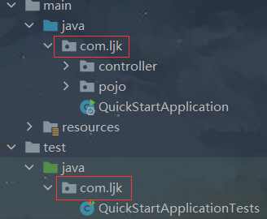
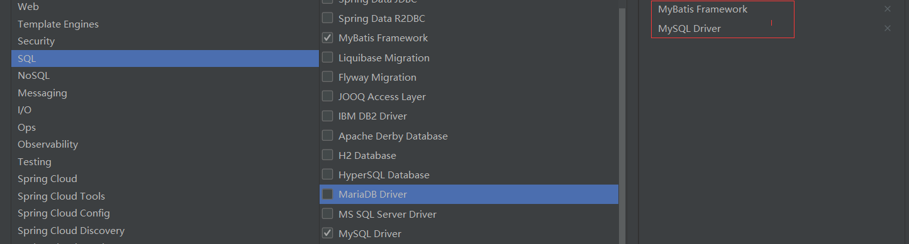
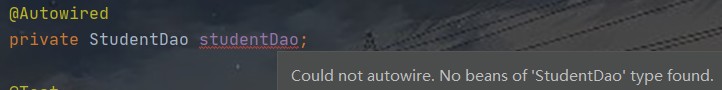

# SpringBoot整合其他技术

## 整合JUnit

在创建工程时，`SpringBoot`已经导入了`JUnit`相关的依赖，并且创建了测试类，开发者只需要在测试类中注入要测试的对象即可。

- `JUnit`的`starter`

  ```xml
  <dependency>
      <groupId>org.springframework.boot</groupId>
      <artifactId>spring-boot-starter-test</artifactId>
      <scope>test</scope>
  </dependency>
  ```

- 测试类`XXXApplicationTests`

  ```java
  /* @SpringBootTest 相当于之前的：
   *    //加载spring整合junit专用的类运行器
   *    @RunWith(SpringJUnit4ClassRunner.class)
   *    //指定对应的配置类或配置文件
   *    @ContextConfiguration(classes = SpringConfig.class)
   * */
  @SpringBootTest //加载的配置类就是XXXApplication，当然也可以手动指定配置类：
  //@SpringBootTest(classes = QuickStartApplication.class)
  class QuickStartApplicationTests {
  	@Autowired
  	private User user;
  	@Test
  	void contextLoads() {
  		System.out.println(user);
  	}
  }
  ```

  注：从工程结构可以发现`引导类`和`测试类`在同一包下，此时使用`@SpringBootTest`注解不需要指定引导类。如果`测试类`如果不存在于`引导类`所在的**包或子包**中，就需要通过`classes`属性指定`引导类`。

  

  注：为什么`引导类`会被`JUnit`看作`配置类`并加载？

  ```java
  //引导类的典型注解 
  @SpringBootApplication
  //打开该注解会发现源文件(SpringBootApplication.java)中仍有许多注解和代码：
  //而里面的
  	@SpringBootConfiguration //该注解表示该类是SpringBoot的配置
  	@EnableAutoConfiguration //该注解表示能自动配置
  ```

## 整合MyBatis

1. 新建模块（可以同时选择多个技术，在最右边可以预览所选的技术），这里需要选择`MyBatis框架`和`MySQL驱动`

   

   在`pom.xml`中可以看到对应的依赖

   ```xml
   <dependency>
       <groupId>org.mybatis.spring.boot</groupId>
       <artifactId>mybatis-spring-boot-starter</artifactId>
       <version>2.2.2</version>
   </dependency>
   <dependency>
       <groupId>mysql</groupId>
       <artifactId>mysql-connector-java</artifactId>
       <scope>runtime</scope>
   </dependency>
   ```

2. 在`application.yml`中配置数据源信息

   ```yaml
   spring:
     datasource:
       driver-class-name: com.mysql.jdbc.Driver
       url: jdbc:mysql://localhost:3306/plansys
       username: root
       password: root
   ```

3. 创建实体类

   ```java
   @Component
   public class Student {
       private String stu_id;
       private String stu_name;
       private String stu_gender;
       private String stu_grader;
       //get、set、toString
   }
   ```

4. 持久层(Dao)编写

   ```java
   //package com.ljk.dao;
   @Mapper
   public interface StudentDao {
       @Select("select * from student where stu_id = ${id}")
       public Student getStudentById(String id);
   }
   ```

5. 测试

   ```java
   @SpringBootTest
   class MybatisApplicationTests {
   	@Autowired
   	private StudentDao studentDao;
   	@Test
   	void contextLoads() {
   		System.out.println(studentDao.getById("2019302901"));
   	}
   }
   ```

   **ERROR：Could not autowire. No beans of 'StudentDao' type found.**

   问题说明：无论是在`测试类`还是在`引导类`中使用`@AutoWired`注入时总会标红，但可以正常运行。使用`@Resource`注解则不会出现问题。

   

   

## 整合MyBatis-Plus


## 整合Druid

[SpringBoot整合Druid](https://blog.csdn.net/weixin_44001568/article/details/106913781)
