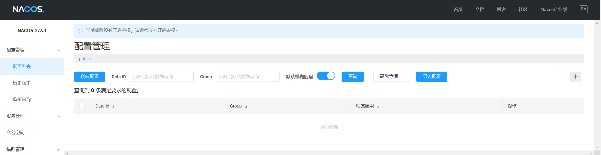
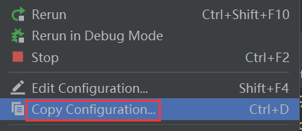
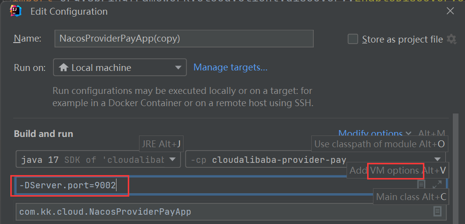
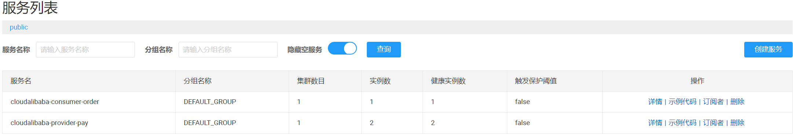

# SpringCloud Alibaba

[官网](https://github.com/alibaba/spring-cloud-alibaba)  /  [文档](https://sca.aliyun.com/docs/2023/overview/what-is-sca/?spm=5176.29160081.0.0.74801a15JVP7k6)

## Nacos

### 一、概述

[官网](https://nacos.io/zh-cn/docs/quick-start.html) / [SpringCloud Nacos](https://sca.aliyun.com/docs/2023/user-guide/nacos/quick-start/)

**Nacos (Dynamic Naming and Configuration Service)**：一个易于构建云原生应用的动态服务发现、配置管理和服务管理平台

- 安装：切换到 bin 目录执行如下命令（standalone代表着单机模式运行，非集群模式）

  ```bash
  startup.cmd -m standalone      # windows
  bash startup.sh -m standalone  # Linux
  ```

- 访问 http://localhost:8848/nacos/index.html ，用户名/密码 默认为 nacos/nacos

  


### 二、Nacos Discovery

**新建服务提供者模块** `cloudalibaba-provider-pay`

- 引入相关依赖

  ```xml
  <dependencies>
      <!--nacos-discovery-->
      <dependency>
          <groupId>com.alibaba.cloud</groupId>
          <artifactId>spring-cloud-starter-alibaba-nacos-discovery</artifactId>
      </dependency>
      <!-- 引入自己定义的api通用包 -->
      <dependency>
          <groupId>com.kk.cloud</groupId>
          <artifactId>cloud-common</artifactId>
          <version>${cloud.common.version}</version>
      </dependency>
      <!--SpringBoot通用依赖模块-->
      <dependency>
          <groupId>org.springframework.boot</groupId>
          <artifactId>spring-boot-starter-web</artifactId>
      </dependency>
      <dependency>
          <groupId>org.springframework.boot</groupId>
          <artifactId>spring-boot-starter-actuator</artifactId>
      </dependency>
      <!--hutool-->
      <dependency>
          <groupId>cn.hutool</groupId>
          <artifactId>hutool-all</artifactId>
      </dependency>
      <!--lombok-->
      <dependency>
          <groupId>org.projectlombok</groupId>
          <artifactId>lombok</artifactId>
          <version>1.18.28</version>
          <scope>provided</scope>
      </dependency>
      <!--test-->
      <dependency>
          <groupId>org.springframework.boot</groupId>
          <artifactId>spring-boot-starter-test</artifactId>
          <scope>test</scope>
      </dependency>
  </dependencies>
  ```

- 修改配置文件

  ```yml
  spring:
    application:
      name: cloudalibaba-provider-pay
    cloud:
      nacos:
        discovery:
          server-addr: localhost:8848 #  配置Nacos地址
  ```

- 在主启动类上添加服务发现注解 `@EnableDiscoveryClient`

- 新建测试接口

  ```java
  @RestController
  public class PayAlibabaController
  {
      @Value("${server.port}")
      private String serverPort;
  
      @GetMapping(value = "/pay/nacos/{id}")
      public String getPayInfo(@PathVariable("id") Integer id)
      {
          return "nacos registry, serverPort: "+ serverPort+"\t id"+id;
      }
  }
  ```

**新建服务消费者模块** `cloudalibaba-consumer-order`

- 引入相关依赖

  ```xml
  <dependencies>
      <!--nacos-discovery-->
      <dependency>
          <groupId>com.alibaba.cloud</groupId>
          <artifactId>spring-cloud-starter-alibaba-nacos-discovery</artifactId>
      </dependency>
      <!--loadbalancer-->
      <dependency>
          <groupId>org.springframework.cloud</groupId>
          <artifactId>spring-cloud-starter-loadbalancer</artifactId>
      </dependency>
      <!--web + actuator-->
      <dependency>
          <groupId>org.springframework.boot</groupId>
          <artifactId>spring-boot-starter-web</artifactId>
      </dependency>
      <dependency>
          <groupId>org.springframework.boot</groupId>
          <artifactId>spring-boot-starter-actuator</artifactId>
      </dependency>
      <!--lombok-->
      <dependency>
          <groupId>org.projectlombok</groupId>
          <artifactId>lombok</artifactId>
          <optional>true</optional>
      </dependency>
  </dependencies>
  ```

- 修改配置文件

  ```yml
  spring:
    application:
      name: cloudalibaba-consumer-order
    cloud:
      nacos:
        discovery:
          server-addr: localhost:8848 # 配置Nacos地址
  
  # 消费者将要去访问的微服务名称
  service-url:
    nacos-user-service: http://cloudalibaba-provider-pay
  ```

- 在主启动类上添加服务发现注解 `@EnableDiscoveryClient`

- 新增配置类 `RestTemplateConfig`

  ```java
  @Configuration
  public class RestTemplateConfig
  {
      @Bean
      @LoadBalanced // 负载均衡
      public RestTemplate restTemplate()
      {
          return new RestTemplate();
      }
  }
  ```

- 新建测试接口

  ```java
  @RestController
  public class OrderNacosController
  {
      @Resource
      private RestTemplate restTemplate;
  
      @Value("${service-url.nacos-user-service}")
      private String serverURL;
  
      @GetMapping("/consumer/pay/nacos/{id}")
      public String paymentInfo(@PathVariable("id") Integer id)
      {
          String result = restTemplate.getForObject(serverURL + "/pay/nacos/" + id, String.class);
          return "Consumer: " + result;
      }
  }
  ```

**负载均衡测试**

- 使用虚拟端口映射，copy 一份服务提供者，此时 nacos 里共有三个微服务

  

  

  

- 测试：连续调用 localhost:83/consumer/pay/nacos/{id} 接口，会发现服务提供者端口号的交替变化

  


### 三、Nacos Config


