# SpringCloud

## Cousul

### 一、安装

[Install | Consul | HashiCorp Developer](https://developer.hashicorp.com/consul/install?product_intent=consul#windows)

```bash
# 以开发模式启动
consul agent -dev # 访问consul首页 http://localhost:8500
```

### 二、服务注册与发现

[Quick Start :: Spring Cloud Consul](https://docs.spring.io/spring-cloud-consul/reference/quickstart.html)

- 引入依赖

  ```xml
  <!--SpringCloud consul discovery -->
  <dependency>
      <groupId>org.springframework.cloud</groupId>
      <artifactId>spring-cloud-starter-consul-discovery</artifactId>
      <exclusions>
          <exclusion>
              <groupId>commons-logging</groupId>
              <artifactId>commons-logging</artifactId>
          </exclusion>
      </exclusions>
  </dependency>
  ```

- 修改配置文件

  ```yaml
  spring: 
  	application:
      	name: cloud-provider-pay-service
      cloud:
          consul:
            host: localhost
            port: 8500
            discovery:
              service-name: ${spring.application.name}
  ```

- 修改启动类，开启服务发现

  ```java
  @EnableDiscoveryClient // 在启动类上添加注解
  ```

- 若Controller需要调用其他微服务API，修改URL地址和RestTemplateConfig配置类

  ```java
  public static final String URL = "http://cloud-provider-pay-service"; //Consul中的服务名称
  
  @Configuration
  public class RestTemplateConfig {
      @Bean
      @LoadBalanced // 添加允许负载均衡注解，因为引入微服务后，默认同时间会有多条API调用
      public RestTemplate restTemplate()
      {
          return new RestTemplate();
      }
  }
  ```

### 三、服务配置与刷新

**3.1 服务配置**

- 引入依赖

  ```xml
  <!--SpringCloud consul config-->
  <dependency>
      <groupId>org.springframework.cloud</groupId>
      <artifactId>spring-cloud-starter-consul-config</artifactId>
  </dependency>
  <dependency>
      <groupId>org.springframework.cloud</groupId>
      <artifactId>spring-cloud-starter-bootstrap</artifactId>
  </dependency>
  ```

- 新建bootstrap.yml配置文件，并修改application.yml文件

  ```yaml
  # bootstrap.yml
  spring:
    application:
      name: cloud-payment-service
    cloud:
      consul:
        host: localhost
        port: 8500
        discovery:
          service-name: ${spring.application.name}
        config:
          profile-separator: '-'  # default value is ","，we update '-'
          format: YAML # 与data数据类型一致
  
  
  # application.yml
  spring:
    profiles:
      active: dev # 多环境配置加载内容dev/prod,不写就是默认default配置
  ```

- Consul服务器上填写相关key/value键值对 ([配置规则](https://docs.spring.io/spring-cloud-consul/reference/config.html))

  - 新建config、cloud-provider-pay (微服务名称，默认配置)、cloud-provider-pay-dev (开发环境配置)、cloud-provider-pay-prod (生产环境配置) 文件夹：

  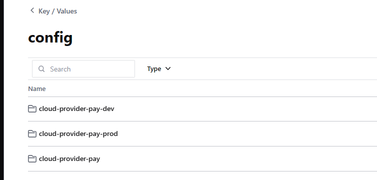

  - 在三个文件夹下分别创建data (key, 键的名称不可修改)，及相应的value

    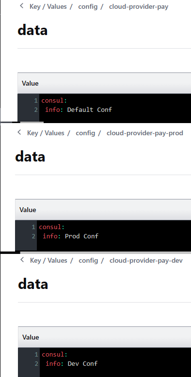

  - 测试

    ```java
    @RestController
    @Slf4j
    @RequestMapping("/test/consul/config")
    public class ConsulConfigTestController {
    
        @Value("${server.port}")
        String port;
    
        @GetMapping("/info")
        public ResultData<String> getConfigInfoFromConsul(@Value("${consul.info}") String info) {
            return ResultData.success("port: " + port + " -> "
                    + "consul.info: " + info);
        }
    }
    ```

    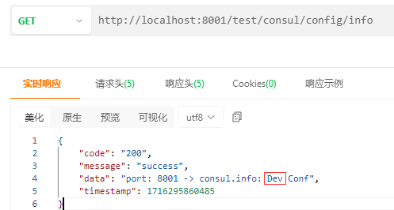

    (注：获得的是dev信息，与application.yml中的profiles.active值一直)


**3.2 动态刷新**：即在Consul服务器上修改data的内容后，保证可以及时刷新到各个微服务模块。

- 在主启动类上添加动态刷新注解

  ```java
  @RefreshScope // Consul动态刷新
  ```

- 修改默认刷新时间

  ```yaml
  consul:
  	config:
  		watch:
  			wait-time: 1 # 默认55s刷新一次数据
  ```


### 四、持久化配置

**以上的步骤，consul重启后，会丢失调之前配置的信息，因此需要配置Consul的持久化存储。**

- **windows**下配置：在consul安装目录下新建 data 文件夹和 consul_start.bat 脚本文件 (以管理员身份运行后，直接访问 http://localhost:8500/ )

  ```bash
  # consul_start.bat
  @echo.服务启动......  
  @echo off  
  @sc create Consul binpath= "D:\software\consul\consul.exe agent -server -ui -bind=127.0.0.1 -client=0.0.0.0 -bootstrap-expect  1  -data-dir D:\software\consul\data   "
  @net start Consul
  @sc config Consul start= AUTO  
  @echo.Consul start is OK......success
  @pause
  ```


## LoadBalancer

[Spring Cloud LoadBalancer :: Spring Cloud Commons](https://docs.spring.io/spring-cloud-commons/reference/spring-cloud-commons/loadbalancer.html)

### 一、客户端负载 vs 服务器端负载

- **Nginx**：用于服务器负载均衡，客户端所有请求都会交给 nginx，然后由 nginx 实现转发请求。
- **Loadbalancer**：用于本地负载均衡，在调用微服务接口时候，会在 Consul 上获取注册信息服务列表之后缓存到 JVM 本地，从而在本地实现 RPC 远程服务调用技术。

### 二、工作原理

- 从 Consul Server 中查询并拉取相关微服务列表；
- 按照指定的**负载均衡策略**从拉取到的服务注册列表中由客户端自己选择一个地址。

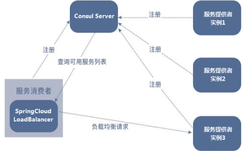

### 三、案例

- 创建两个一样的微服务模块作为服务提供者

  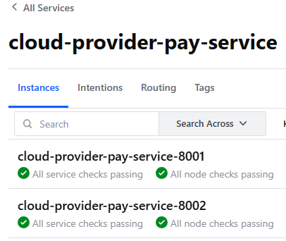

- 服务消费者模块配置：

  - 引入 LoadBalancer 依赖

    ```xml
    <!--loadbalancer-->
    <dependency>
        <groupId>org.springframework.cloud</groupId>
        <artifactId>spring-cloud-starter-loadbalancer</artifactId>
    </dependency>
    ```

  - 添加测试接口，会发现 LoadBalancer 以**轮询策略**调用服务提供者的接口

    ```java
    private static final String 
        PaymentSrv_URL = "http://cloud-provider-pay-service";//Consul中的服务名称
    
    @GetMapping("/pay/get/consul/config/info")
    public ResultData getConsulConfigInfo(){
        return restTemplate.getForObject(
            PaymentSrv_URL + "/test/consul/config/info", ResultData.class);
    }
    ```

    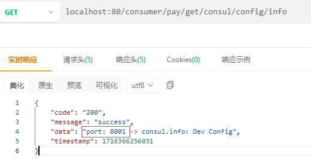

    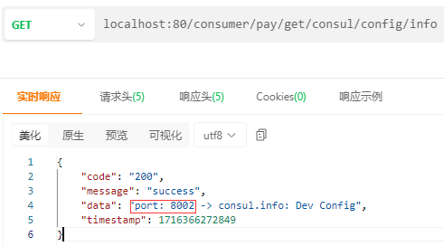

- 消费者获取 Consul 上所注册微服务的原理：

  ```java
     @Resource
      private DiscoveryClient discoveryClient;
      @GetMapping("/discovery/service")
      public ResultData discovery()
      {
          List<String> services = discoveryClient.getServices();
          for (String element : services) {
              System.out.println(element);
          }
  
          System.out.println("===================================");
  
          List<ServiceInstance> instances = discoveryClient.getInstances("cloud-provider-pay-service");
          for (ServiceInstance element : instances) {
              System.out.println(element.getServiceId()+"\t"+element.getHost()+"\t"+element.getPort()+"\t"+element.getUri());
          }
  
          return ResultData.success("success");
      }
  ```

  

### 四、负载均衡算法

默认有两种算法：

- 轮询算法

  ```java
  public class RoundRobinLoadBalancer implements ReactorServiceInstanceLoadBalancer {}
  
  /* 算法原理：
  实际调用服务器位置下标 = rest接口第几次请求数 % 服务器集群总数量
  (每次服务重启动后rest接口计数从1开始)
  **/
  ```

- 随机算法

  ```java
  public class RandomLoadBalancer implements ReactorServiceInstanceLoadBalancer {}
  ```

- 修改消费者的负载均衡算法

  ```java
  @Configuration
  @LoadBalancerClient(value = "cloud-provider-pay-service",configuration = RestTemplateConfig.class) //value值与consul里面微服务的名字一致
  public class RestTemplateConfig {
      @Bean
      @LoadBalanced
      public RestTemplate restTemplate()
      {
          return new RestTemplate();
      }
  
      @Bean
      ReactorLoadBalancer<ServiceInstance> randomLoadBalancer(Environment environment,
                                                              LoadBalancerClientFactory loadBalancerClientFactory) {
          String name = environment.getProperty(LoadBalancerClientFactory.PROPERTY_NAME);
  
          return new RandomLoadBalancer(loadBalancerClientFactory.getLazyProvider(name, ServiceInstanceListSupplier.class), name);
      }
  }
  ```


## OpenFeign

### 一、OpenFeign VS LoadBalancer

https://docs.spring.io/spring-cloud-openfeign/reference/spring-cloud-openfeign.html

OpenFeign：声明式 REST 客户端，默认支持负载均衡，并且使得客户端的编写更加容易。


### 二、基础配置

- 引入依赖

  ```xml
  <!--openfeign-->
  <dependency>
      <groupId>org.springframework.cloud</groupId>
      <artifactId>spring-cloud-starter-openfeign</artifactId>
  </dependency>
  ```

- 在通用模块中配置 OpenFeign 服务接口（该接口与相应服务端的微服务模块接口对应：方法名一致、接口路径一致）

  ```java
  @FeignClient(name = "cloud-provider-pay-service") // name为相应服务端的微服务模块名称
  public interface PayFeignApi {
  
      /***
       * 新增支付流水
       * @param payDTO
       * @return
       */
      @PostMapping("/pay/add")
      public ResultData addPay(@RequestBody PayDTO payDTO);
  
      /***
       * 获取支付流水
       * @param id
       * @return
       */
      @GetMapping("/pay/get/{id}")
      public ResultData getPayById(@PathVariable("id") Integer id);
  
      /***
       * 验证 OpenFeign 是否直接天生支持负载均衡（轮询算法）
       * @return
       */
      @GetMapping("/pay/consul/config/info")
      public ResultData getConfigInfoFromConsul();
  }
  ```

- 客户端（服务消费者）配置

  - 在主启动类上添加注解

    ```java
    @EnableFeignClients //启用feign客户端
    ```

  - 在controller中使用 FeignApi 进行服务调用

    ```java
    @RestController
    @RequestMapping("/consumer")
    public class OrderController {
    
        @Resource
        private PayFeignApi payFeignApi;
    
        @GetMapping("/pay/add") // 与contorller的api路径一致
        public ResultData addOrder(PayDTO payDTO){ // query参数会自动匹配
            return payFeignApi.addPay(payDTO);
        }
    
    
        @GetMapping("/pay/get/{id}")
        public ResultData getPayInfo(@PathVariable("id") Integer id){
            return payFeignApi.getPayById(id);
        }
    
    
        @GetMapping("/pay/get/consul/config/info")
        public ResultData getConsulConfigInfo(){
            return payFeignApi.getConfigInfoFromConsul();
        }
    
    }
    ```


### 三、高级特性

**1. 超时控制：**默认超时时间为60s，超时会报ReadTimeOut异常

- 全局配置：修改客户端（服务消费者）模块的配置文件

  ```yml
  openfeign:
  	client:
  		config:
  			default:
  				#连接超时时间 (ms)
      			connectTimeout: 3000
          		#读取超时时间
          		readTimeout: 3000
  ```

- 指定配置：会覆盖全局配置

  ```yml
  openfeign:
  	client:
  		config:
  			cloud-provider-pay-service: # 针对某个特定微服务
  				#连接超时时间 (ms)
      			connectTimeout: 5000
          		#读取超时时间
          		readTimeout: 5000
  ```

  

**2. 重试机制：**当请求失败时，会在一定间隔时间后自动重新发起请求。

在客户端（服务消费者）模块新增Feign配置类：

```java
@Configuration
public class OpenFeignConfig {
    @Bean
    public Retryer myRetryer()
    {
        //return Retryer.NEVER_RETRY; //Feign默认配置是不走重试策略的

        //最大请求次数为3(1+2)，初始间隔时间为100ms，重试间最大间隔时间为1s
        return new Retryer.Default(100,1,3);
    }
}
```


**3. 修改默认HttpClient：**OpenFeign默认使用JDK自带的HttpURLConnection发送HTTP请求，由于默认HttpURLConnection没有连接池，所以性能和效率比较低。

在客户端（服务消费者）模块进行如下配置：

- 引入 Apache HttpClient5 依赖

  ```xml
  <!-- httpclient5-->
  <dependency>
      <groupId>org.apache.httpcomponents.client5</groupId>
      <artifactId>httpclient5</artifactId>
      <version>5.3</version>
  </dependency>
  <!-- feign-hc5-->
  <dependency>
      <groupId>io.github.openfeign</groupId>
      <artifactId>feign-hc5</artifactId>
      <version>13.1</version>
  </dependency>
  ```

- 修改配置文件，开启 hc5

  ```yml
  openfeign:
  	httpclient:
  		hc5:
  			enabled: true
  ```

  

**4. 请求/响应压缩：**OpenFeign支持对请求和响应进行GZIP压缩，以减少通信过程中的性能损耗。

修改客户端（服务消费者）模块的配置文件：

```yml
openfeign:      
    compression:
    	request:
    		enabled: true
    		min-request-size: 2048 # 最小触发压缩的大小
    		mime-types: text/xml,application/xml,application/json # 触发压缩数据类型
    	response:
    		enabled: true
```

**5. 日志打印：**

- 修改配置类

  ```java
  @Configuration
  public class OpenFeignConfig {
      /***
       * Logger.Level:
       *   NONE, No logging (DEFAULT).
       *   BASIC, Log only the request method and URL and the response status code and execution time.
       *   HEADERS, Log the basic information along with request and response headers.
       *   FULL, Log the headers, body, and metadata for both requests and responses.
       * @return
       */
      @Bean
      Logger.Level feignLoggerLevel() {
          return Logger.Level.FULL;
      }
  }
  ```

- 修改配置文件：

  ```yml
  # feign日志以什么级别监控哪个接口（包名要对应）
  logging:
    level:
      com:
        kk:
          cloud:
            api:
              PayFeignApi: debug 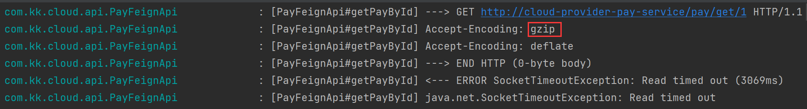
  ```


## CircuitBreaker

[Spring Cloud Circuit Breaker :: Spring Cloud Circuitbreaker](https://docs.spring.io/spring-cloud-circuitbreaker/reference/)

**CircuitBreaker 断路器**：为不同断路器的实现提供了一套接口和规范，主要的实现有 [**Resilience4J**](https://github.com/lmhmhl/Resilience4j-Guides-Chinese/blob/main/index.md) 和 Spring Retry。

- **Resilience4j** 是一个轻量级容错框架，提供了一组高阶函数（装饰器），包括断路器，限流器，重试，隔离，可以对任何的函数式接口，lambda表达式，或方法的引用进行增强，并且这些装饰器可以进行叠加，以保证项目整体的稳定性。

- **Resilience4J** 核心模块：

  - **resilience4j-circuitbreaker: Circuit breaking**

  - **resilience4j-ratelimiter: Rate limiting**

  - **resilience4j-bulkhead: Bulkheading**

  - resilience4j-retry: Automatic retrying (sync and async)

  - resilience4j-timelimiter: Timeout handling

  - resilience4j-cache: Result caching

### 一、Resilience4J - CircuitBreaker

#### 1.1 原理

[断路器原理](https://resilience4j.readme.io/docs/circuitbreaker)

- 断路器有三个普通状态：关闭 (CLOSED)、开启 (OPEN)、半开 (HALF_OPEN)，以及两个特殊状态：禁用 (DISABLED, 始终允许访问)、强制开启 (FORCED_OPEN, 始终拒绝访问)。

  - 当断路器关闭时，所有的请求都会通过断路器。
  - 如果失败率超过设定的阈值，断路器就会从关闭状态转换到打开状态，这时所有的请求都会被拒绝。
  - 当经过一段时间后，断路器会从打开状态转换到**半开状态**，这时仅有一定数量的请求会被放入，并重新计算失败率。如果失败率超过阈值，则变为打开状态，如果失败率低于阈值，则变为关闭状态。

  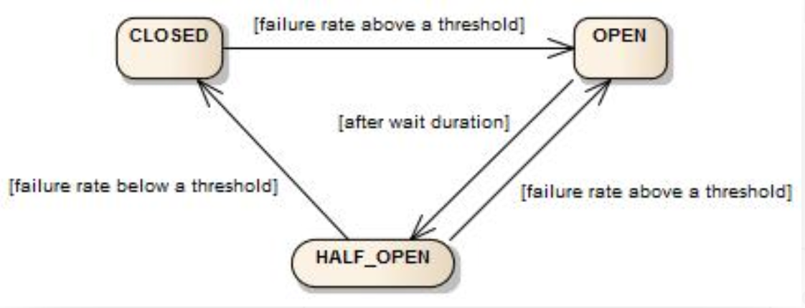

- 失败率计算：使用滑动窗口存储（循环数组）和统计调用的结果来判断断路器是否应该开启。

  - 基于计数的滑动窗口：统计最近N次调用的返回结果，**失败率**大于等阈值时，断路器开启
  - 基于时间的滑动窗口：统计最近N秒的调用返回结果，**慢速率调用**百分比大于等于阈值时，断路器开启


#### 1.2 服务熔断&降级案例

**COUNT_BASED**（基于计数的滑动窗口）：客户端（服务消费者）模块配置

- 引入依赖

  ```xml
  <!--resilience4j-circuitbreaker-->
  <dependency>
      <groupId>org.springframework.cloud</groupId>
      <artifactId>spring-cloud-starter-circuitbreaker-resilience4j</artifactId>
  </dependency>
  <!-- 由于断路保护等需要AOP实现，所以必须导入AOP包 -->
  <dependency>
      <groupId>org.springframework.boot</groupId>
      <artifactId>spring-boot-starter-aop</artifactId>
  </dependency>
  ```

- 修改配置文件

  ```yml
  spring:
  	cloud:
  		openfeign:
  			# 开启circuitbreaker和分组激活
              circuitbreaker:
              	enabled: true # 如果为 “true”, Feign客户端将与CircuitBreaker断路器包装在一起
              	group:        # 没开分组永远不用分组的配置。精确优先、分组次之(开了分组)、默认最后
                		enabled: true
  
  
  resilience4j:
    circuitbreaker:
      configs:
        default:
          failureRateThreshold: 50       # 设置50%的请求调用失败时打开断路器
          slidingWindowType: COUNT_BASED # 滑动窗口的类型
          slidingWindowSize: 6           # 滑动窗⼝的⼤⼩, COUNT_BASED表示6个请求，配置TIME_BASED表示6s
          minimumNumberOfCalls: 6        # 断路器计算失败率或慢调用率之前所需的最小样本(每个滑动窗口周期)。若调用记录小于6次，即使所有调用都失败，断路器也不会开启。
          automaticTransitionFromOpenToHalfOpenEnabled: true # 默认值为true。如果启用，断路器将自动从开启状态过渡到半开状态，并允许一些请求通过以测试服务是否恢复正常。
          waitDurationInOpenState: 5s    #从OPEN到HALF_OPEN状态需要等待的时间
          permittedNumberOfCallsInHalfOpenState: 2           # 半开状态允许的最大请求数，默认值为10
          recordExceptions:
              - java.lang.Exception
      instances:
        cloud-provider-pay-service: # 微服务模块名称
          baseConfig: default       # 使用上面的 default 配置
  ```

- 测试接口

  - 服务端

    ```java
    @RestController
    public class PayCircuitBreakerController {
    
        @GetMapping(value = "/pay/circuit/{id}")
        public String myCircuitBreaker(@PathVariable("id") Integer id)
        {
            if(id == -4) throw new RuntimeException("----circuit id 不能负数"); // 调用出错
            if(id == 9999){ // 慢调用
                try { TimeUnit.SECONDS.sleep(5); } catch (InterruptedException e) { e.printStackTrace(); }
            }
            return "Hello, circuit! inputId:  "+id+" \t " + IdUtil.simpleUUID(); // 调用成功
        }
    }
    ```

  - 客户端

    ```java
    @RestController
    public class OrderCircuitBreakerController {
    
        @Resource
        private PayFeignApi payFeignApi;
    
        @GetMapping(value = "/feign/pay/circuit/{id}")
        @CircuitBreaker(name = "cloud-provider-pay-service", fallbackMethod = "myCircuitFallback")
        public ResultData myCircuitBreaker(@PathVariable("id") Integer id)
        {
            return ResultData.success(payFeignApi.myCircuitBreaker(id));
        }
    
        // 服务降级后的处理方法
        public ResultData myCircuitFallback(Integer id,Throwable t) {
            return ResultData.fail(ReturnCodeEnum.RC500.getCode(), id + "系统繁忙，请稍后再试!");
        }
    }
    ```

  - 验证服务熔断&降级

    - 系统内部抛出异常，直接服务降级

      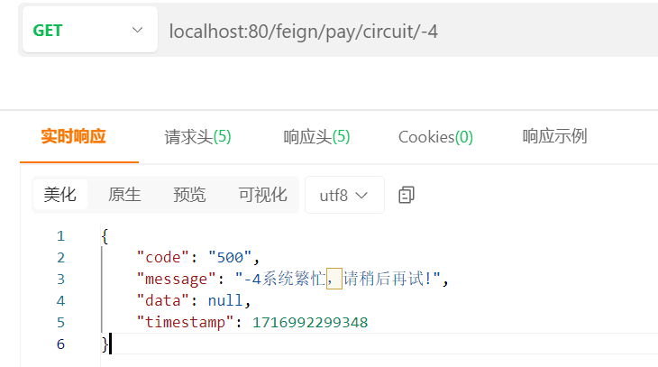

    - 失败率达到阈值，进行服务熔断后，再进行服务降级（此时即使所调用的接口正常工作，也需要等待 waitDurationInOpenState 设定的时间断路器进入半开状态后，才可以继续正常调用）

      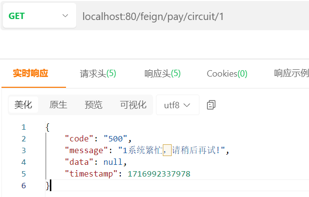


**TIME_BASED**（基于时间的滑动窗口）：客户端（服务消费者）模块配置

- 关闭 Feign 的自动重试配置

  ```java
  @Configuration
  public class OpenFeignConfig {
      @Bean
      public Retryer myRetryer()
      {
          return Retryer.NEVER_RETRY; //Feign默认配置是不走重试策略的
  
          //最大请求次数为3(1+2)，初始间隔时间为100ms，重试间最大间隔时间为1s
  //        return new Retryer.Default(100,1,3);
      }
  ```

- 修改配置文件

  ```yml
  resilience4j:
    timelimiter:
      configs:
        default:
          timeout-duration: 10s         # 注：timelimiter 默认限制超过1s就超时异常，配置了降级，就会走降级逻辑
    circuitbreaker:
      configs:
        default:
          failureRateThreshold: 50      # 设置50%的请求调用失败时打开断路器。
          slowCallDurationThreshold: 2s # 慢调用时间阈值，高于这个阈值的视为慢调用。
          slowCallRateThreshold: 30     # 慢调用百分比阈值，当慢调用比例高于该阈值，断路器打开，并开启服务降级
          slidingWindowType: TIME_BASED # 滑动窗口的类型
          slidingWindowSize: 2          # 滑动窗口的大小
          minimumNumberOfCalls: 2       # 断路器计算失败率或慢调用率之前所需的最小样本(每个滑动窗口周期)。
          permittedNumberOfCallsInHalfOpenState: 2 # 半开状态允许的最大请求数，默认值为10。
          waitDurationInOpenState: 5s   # 从OPEN到HALF_OPEN状态需要等待的时间
          recordExceptions:
            - java.lang.Exception
      instances:
        cloud-provider-pay-service:
          baseConfig: default
  ```

- 验证服务熔断&降级：多次以慢调用方式访问接口，当慢调用比率达到阈值时，会先进行服务熔断，再进行服务降级

  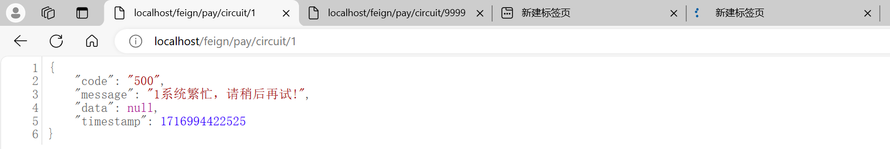


### 二、Resilience4J - BulkHead

**BulkHead（舱壁/隔壁）**：提供隔离机制。Resilience4j 提供了两种隔离的实现方式，可以**限制并发执行的数量**：

- **SemaphoreBulkhead**：使用信号量
- **FixedThreadPoolBulkhead**：使用有界队列和固定大小线程池


#### 2.1 SemaphoreBulkhead

**SemaphoreBulkhead** 原理：

- 当信号量有空闲时，进入系统的请求会直接获取信号量并开始业务处理
- 当信号量全被占用时，接下来的请求将会进入阻塞状态，SemaphoreBulkhead提供了一个阻塞计时器
  - 如果阻塞状态的请求在阻塞计时内无法获取到信号量则系统会拒绝这些请求
  - 若请求在阻塞计时内获取到了信号量，那将直接获取信号量并执行相应的业务处理

**案例**：

- 引入依赖

  ```xml
  <!--resilience4j-bulkhead-->
  <dependency>
      <groupId>io.github.resilience4j</groupId>
      <artifactId>resilience4j-bulkhead</artifactId>
  </dependency>
  ```

- 修改配置文件

  ```yaml
  # resilience4j bulkhead SEMAPHORE
  resilience4j:
    timelimiter:
      configs:
        default:
          timeout-duration: 20s
    bulkhead:
      configs:
        default:
          maxConcurrentCalls: 2 # 隔离允许并发线程执行的最大数量
          maxWaitDuration: 1s   # 当达到并发调用数量时，新的线程的阻塞时间，超过该时间会直接调用 fallback
      instances:
        cloud-provider-pay-service:
          baseConfig: default
  ```

- 测试

  - 服务端接口

    ```java
    @RestController
    public class PayCircuitBreakerController {
    
        //=========Resilience4j bulkhead 的例子
        @GetMapping(value = "/pay/bulkhead/{id}")
        public String myBulkhead(@PathVariable("id") Integer id)
        {
            if(id == -4) throw new RuntimeException("----bulkhead id 不能-4");
    
            if(id == 9999)
            {
                try { TimeUnit.SECONDS.sleep(5); } catch (InterruptedException e) { e.printStackTrace(); }
            }
    
            return "Hello, bulkhead! inputId:  "+id+" \t " + IdUtil.simpleUUID();
        }
    }
    ```

  - 客户端接口

    ```java
    @RestController
    public class OrderCircuitBreakerController {
        
        /**
         * BulkHead并发限制
         * @param id
         * @return
         */
        @GetMapping(value = "/feign/pay/bulkhead/{id}")
        @Bulkhead(name = "cloud-provider-pay-service",fallbackMethod = "myBulkheadFallback",type = Bulkhead.Type.SEMAPHORE)
        public String myBulkhead(@PathVariable("id") Integer id)
        {
            return payFeignApi.myBulkhead(id);
        }
        public String myBulkheadFallback(Throwable t)
        {
            return "myBulkheadFallback，隔板超出最大数量限制，系统繁忙，请稍后再试!";
        }
    }
    ```

  - 同时发送两次 id=9999 的请求，此时并发数以达到限制（maxConcurrentCalls），再正常调用接口 id=1 时，会直接服务降级：

    


#### 2.2 FixedThreadPoolBulkhead

**FixedThreadPoolBulkhead** 原理：

- 当线程池中存在空闲时，则此时进入系统的请求将直接进入线程池开启新线程或使用空闲线程来处理请求。

- 当线程池中无空闲时时，接下来的请求将进入等待队列：
  - 若等待队列仍然无剩余空间，接下来的请求将直接被拒绝；
  - 若队列中的请求等待线程池出现空闲时，将进入线程池进行业务处理。

（注：ThreadPoolBulkhead只对CompletableFuture方法有效，所以需要创建返回CompletableFuture类型的方法）

**案例**：

- 引入依赖

  ```xml
  <!--resilience4j-bulkhead-->
  <dependency>
      <groupId>io.github.resilience4j</groupId>
      <artifactId>resilience4j-bulkhead</artifactId>
  </dependency>
  ```

- 修改配置文件

  ```yaml
  spring:
  	cloud:
  		openfeign:
  			# 开启circuitbreaker和分组激活
              circuitbreaker:
              	enabled: true 
              	group:        
                		enabled: false # 演示 Bulkhead.Type.THREADPOOL 时设为false, 使新启线程和原来主线程脱离
                		
  # resilience4j bulkhead THREADPOOL
  resilience4j:
    timelimiter:
      configs:
        default:
          timeout-duration: 10s
    thread-pool-bulkhead:
      configs:
        default: # 可处理的最大请求数 = 最大线程池大小 + 等待队列容量
          core-thread-pool-size: 1  # 核心线程池大小
          max-thread-pool-size: 1   # 最大线程池大小
          queue-capacity: 1         # 等待队列容量
      instances:
        cloud-provider-pay-service:
          baseConfig: default
  ```

- 测试

  - 客户端接口

    ```java
    @RestController
    public class OrderCircuitBreakerController {
    
        @Resource
        private PayFeignApi payFeignApi;
    
        /**
         * BulkHead并发限制: 线程池 THREADPOOL
         * @param id
         * @return
         */
        @GetMapping(value = "/feign/pay/bulkhead/threadpoll/{id}")
        @Bulkhead(name = "cloud-provider-pay-service"",fallbackMethod = "myBulkheadPoolFallback",type = Bulkhead.Type.THREADPOOL)
        public CompletableFuture<String> myBulkheadTHREADPOOL(@PathVariable("id") Integer id)
        {
            System.out.println(Thread.currentThread().getName()+"\t"+"enter the method!!!");
            try { TimeUnit.SECONDS.sleep(3); } catch (InterruptedException e) { e.printStackTrace(); }
            System.out.println(Thread.currentThread().getName()+"\t"+"exist the method!!!");
    
            return CompletableFuture.supplyAsync(() -> payFeignApi.myBulkhead(id) + "\t" + " Bulkhead.Type.THREADPOOL");
        }
        
        public CompletableFuture<String> myBulkheadPoolFallback(Integer id,Throwable t)
        {
            return CompletableFuture.supplyAsync(() -> "Bulkhead.Type.THREADPOOL，系统繁忙，请稍后再试-----/(ㄒoㄒ)/~~");
        }
        
    }
    ```

  - 发送三次请求，则第三次请求会被服务降级

    


### 三、Resilience4J - RateLimiter

#### 3.1 限流算法

- **漏桶算法（Leaky Bucket）** ：一个固定容量的漏桶，按照设定常量固定速率处理客户端请求，如果客户端请求超出了桶的容量，则超出的请求会被丢弃。

  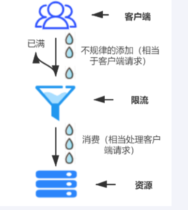

  - 缺点：漏桶的漏出速率是固定的参数，因此即使网络中不存在资源冲突（没有发生拥塞），处理请求的速率也不会改变（即不能使流突发（burst）到端口速率）。对于存在突发特性的流量来说缺乏效率。

- **令牌桶算法（Token Bucket）**：SpringCloud 默认使用该算法

  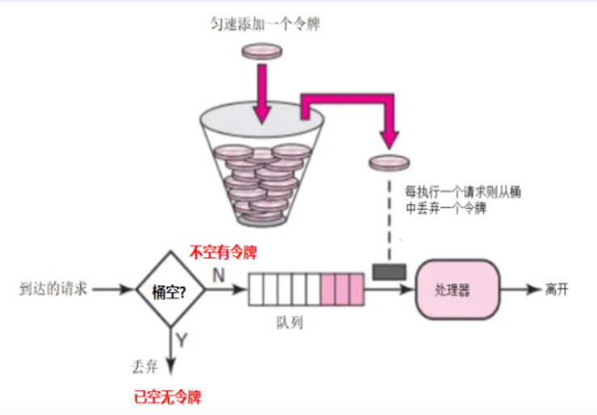

- **滚动时间窗（Tumbling Time Window）**：在一个时间段内，允许固定数量的请求进入，超过数量就拒绝或者排队，等下一个时间段进入。

  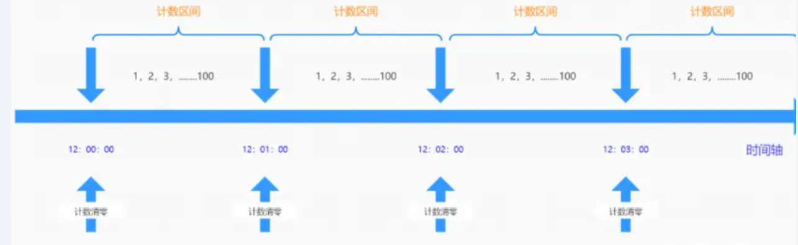

  - 缺点：在时间临界点左右的极短时间段内容易遭到攻击（假如设定1分钟最多可以请求100次某个接口，如12:00:00-12:00:59时间段内没有数据请求，但12:00:59-12:01:00时间段内突然并发100次请求，紧接着瞬间跨入下一个计数周期计数器清零；在12:01:00-12:01:01内又有100次请求。即**在时间临界点左右可能同时有2倍的峰值进行请求**，从而造成后台处理请求**加倍过载**，导致系统运营能力不足，甚至导致系统崩溃）。

- **滑动时间窗口（Sliding Time Window）**：划分固定时间片并且随着时间移动，通过这种方式可以避开计数器的临界点问题。

  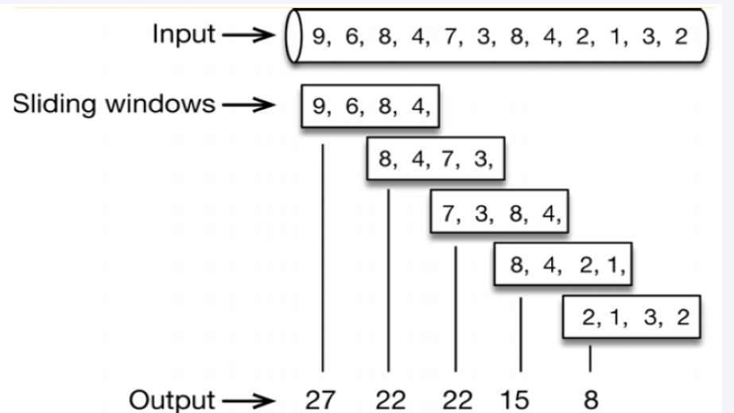

#### 3.2 限流案例

- 引入依赖

  ```xml
  <!--resilience4j-ratelimiter-->
  <dependency>
      <groupId>io.github.resilience4j</groupId>
      <artifactId>resilience4j-ratelimiter</artifactId>
  </dependency>
  ```

- 修改配置文件

  ```yaml
  # resilience4j ratelimiter
  resilience4j:
    ratelimiter:
      configs:
        default:
          limitForPeriod: 2        # 在一次刷新周期内，允许执行的最大请求数
          limitRefreshPeriod: 1s   # 限流器每隔limitRefreshPeriod刷新一次，将允许处理的最大请求数量重置为limitForPeriod
          timeout-duration: 1      # 线程等待权限的默认等待时间
      instances:
        cloud-provider-pay-service:
          baseConfig: default
  ```

- 测试

  - 服务端接口

    ```java
    @RestController
    public class PayCircuitBreakerController {
        //=========Resilience4j ratelimit 的例子
        @GetMapping(value = "/pay/ratelimit/{id}")
        public String myRatelimit(@PathVariable("id") Integer id)
        {
            return "Hello, myRatelimit 欢迎到来 inputId:  "+id+" \t " + IdUtil.simpleUUID();
        }
    }
    ```

  - 客户端接口

    ```java
    @RestController
    public class OrderCircuitBreakerController {
    
        @Resource
        private PayFeignApi payFeignApi;
    
    	 /**
         * RateLimit 限流
         * @param id
         * @return
         */
        @GetMapping(value = "/feign/pay/ratelimit/{id}")
        @RateLimiter(name = "cloud-provider-pay-service",fallbackMethod = "myRatelimitFallback")
        public String myRatelimit(@PathVariable("id") Integer id)
        {
            return payFeignApi.myRatelimit(id);
        }
        public String myRatelimitFallback(Integer id,Throwable t)
        {
            return "你被限流了，禁止访问/(ㄒoㄒ)/~~";
        }
    
    }
    ```

  - 连续刷新网页，可以看到限流处理

    


## Micrometer Tracing + Zipkin

### 一、Micrometer Tracing

[Micrometer Application Observability](https://micrometer.io/docs/tracing)

**Micrometer Tracing（分布式链路追踪）**：收集分布式请求数据，并将一次分布式请求还原成调用链路，进行日志记录、性能监控并将一次分布式请求的调用情况集中展示，及时发现出现高延时或错误的链路。

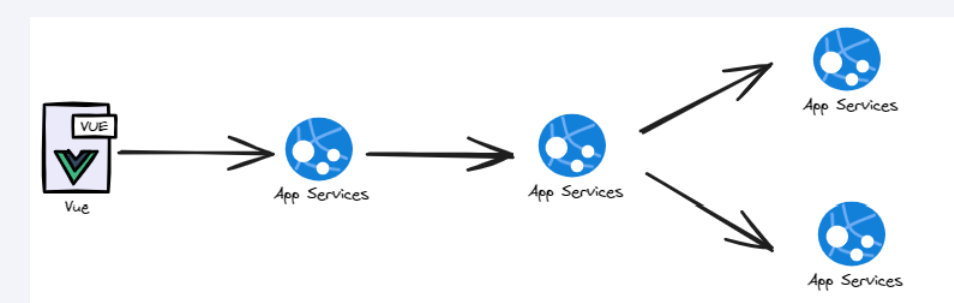

- 原理：一条链路通过Trace Id唯一标识，Span标识发起的请求信息，各span通过parent id 关联起来

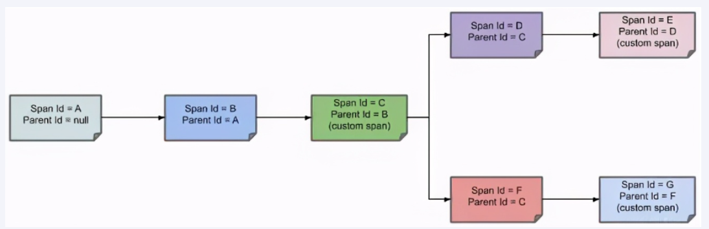


### 二、Zipkin

**Zipkin** 是一种分布式链路跟踪系统图形化的工具，是 Twitter 开源的分布式跟踪系统，能够收集微服务运行过程中的实时调用链路信息，并能够将这些调用链路信息展示到Web图形化界面上供开发人员分析，开发人员能够从ZipKin中分析出调用链路中的性能瓶颈，识别出存在问题的应用程序，进而定位问题和解决问题。

- [安装](https://zipkin.io/pages/quickstart.html)：下载 jar 包，运行成功后访问 http://127.0.0.1:9411/

  ```bash
  java -jar zipkin-server-3.4.0-exec.jar
  ```


### 三、分布式链路追踪案例

**服务端和客户端均引入链路追踪相关配置，因为服务端也可能会调用其他微服务接口。**

- 在父工程中，添加需要管理的依赖

  ```xml
  <properties>
      <micrometer-tracing.version>1.2.0</micrometer-tracing.version>
      <micrometer-observation.version>1.12.0</micrometer-observation.version>
      <feign-micrometer.version>12.5</feign-micrometer.version>
      <zipkin-reporter-brave.version>2.17.0</zipkin-reporter-brave.version>
  </properties>
  
  <dependencyManagement>
      <dependencies>
          <!--micrometer-tracing-bom导入链路追踪版本中心  1-->
          <dependency>
              <groupId>io.micrometer</groupId>
              <artifactId>micrometer-tracing-bom</artifactId>
              <version>${micrometer-tracing.version}</version>
              <type>pom</type>
              <scope>import</scope>
          </dependency>
          <!--micrometer-tracing指标追踪  2-->
          <dependency>
              <groupId>io.micrometer</groupId>
              <artifactId>micrometer-tracing</artifactId>
              <version>${micrometer-tracing.version}</version>
          </dependency>
          <!--micrometer-tracing-bridge-brave适配zipkin的桥接包 3-->
          <dependency>
              <groupId>io.micrometer</groupId>
              <artifactId>micrometer-tracing-bridge-brave</artifactId>
              <version>${micrometer-tracing.version}</version>
          </dependency>
          <!--micrometer-observation 4-->
          <dependency>
              <groupId>io.micrometer</groupId>
              <artifactId>micrometer-observation</artifactId>
              <version>${micrometer-observation.version}</version>
          </dependency>
          <!--feign-micrometer 5-->
          <dependency>
              <groupId>io.github.openfeign</groupId>
              <artifactId>feign-micrometer</artifactId>
              <version>${feign-micrometer.version}</version>
          </dependency>
          <!--zipkin-reporter-brave 6-->
          <dependency>
              <groupId>io.zipkin.reporter2</groupId>
              <artifactId>zipkin-reporter-brave</artifactId>
              <version>${zipkin-reporter-brave.version}</version>
          </dependency>
      </dependencies>
  </dependencyManagement>
  ```

- 服务端

  - 引入依赖

    ```xml
    <dependencies>
        <!--micrometer-tracing指标追踪  1-->
        <dependency>
            <groupId>io.micrometer</groupId>
            <artifactId>micrometer-tracing</artifactId>
        </dependency>
        <!--micrometer-tracing-bridge-brave适配zipkin的桥接包 2-->
        <dependency>
            <groupId>io.micrometer</groupId>
            <artifactId>micrometer-tracing-bridge-brave</artifactId>
        </dependency>
        <!--micrometer-observation 3-->
        <dependency>
            <groupId>io.micrometer</groupId>
            <artifactId>micrometer-observation</artifactId>
        </dependency>
        <!--feign-micrometer 4-->
        <dependency>
            <groupId>io.github.openfeign</groupId>
            <artifactId>feign-micrometer</artifactId>
        </dependency>
        <!--zipkin-reporter-brave 5-->
        <dependency>
            <groupId>io.zipkin.reporter2</groupId>
            <artifactId>zipkin-reporter-brave</artifactId>
        </dependency>
    </dependencies>
    ```

  - 修改配置文件

    ```yml
    # application.yml
    
    # ========================zipkin===================
    management:
      zipkin:
        tracing:
          endpoint: http://localhost:9411/api/v2/spans
      tracing:
        sampling:
          probability: 1.0 #采样率默认为0.1(0.1就是10次只能有一次被记录下来)，值越大收集越及时。
    ```

  - 测试接口

    ```java
    @RestController
    public class PayMicrometerController
    {
        /**
         * Micrometer(Sleuth)进行链路监控的例子
         * @param id
         * @return
         */
        @GetMapping(value = "/pay/micrometer/{id}")
        public String myMicrometer(@PathVariable("id") Integer id)
        {
            return "Hello, 欢迎到来myMicrometer inputId:  "+id+" \t    服务返回:" + IdUtil.simpleUUID();
        }
    }
    ```

- 客户端

  - 引入依赖（同客户端）

  - 修改配置文件

    ```yml
    # application.yml
    
    # ========================zipkin===================
    management:
      zipkin:
        tracing:
          endpoint: http://localhost:9411/api/v2/spans
      tracing:
        sampling:
          probability: 1.0 #采样率默认为0.1(0.1就是10次只能有一次被记录下来)，值越大收集越及时。
    ```

  - 测试接口

    ```java
    @RestController
    @Slf4j
    public class OrderMicrometerController
    {
        @Resource
        private PayFeignApi payFeignApi;
    
        @GetMapping(value = "/feign/micrometer/{id}")
        public String myMicrometer(@PathVariable("id") Integer id)
        {
            return payFeignApi.myMicrometer(id);
        }
    }
    ```

- 测试：启动zipkin，调用 localhost:80/feign/pay/micrometer/1 接口，访问 http://127.0.0.1:9411/ 查看链路追踪数据

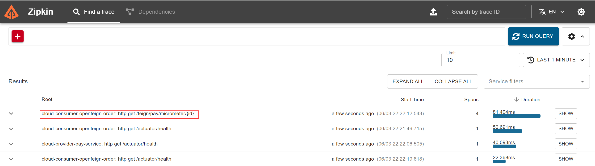

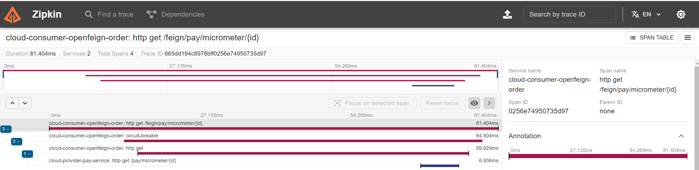


## Gateway

### 一、概述

[Spring Cloud Gateway](https://docs.spring.io/spring-cloud-gateway/reference/index.html) 是加在整个微服务最前沿的防火墙和代理器，隐藏微服务结点 IP 和端口信息，从而加强安全保护。


- **核心**：

  - **Route（路由）**：网关的基本构建模块，由 ID、目标 URI、断言集合和过滤器集合组成。若断言集合为真，则路由匹配。
  - **Predicate（断言）**：允许匹配 HTTP 请求中的任何内容。
  - **Filter（过滤器）**：可以在发送下游请求之前或之后修改请求和响应。

  

- **工作原理**：客户端向 Gateway 发出请求，网关在 Gateway Handler Mapping 中找到与请求相匹配的路由，将其发送到 Gateway Web Handler。Handler 再通过指定的过滤器链来将请求发送到我们实际的服务执行业务逻辑，然后返回。

  - 过滤器之间用虚线分开是因为过滤器可能会在发送代理请求之前(Pre)或之后(Post)执行业务逻辑。

    - 在“pre”类型的过滤器可以做参数校验、权限校验、流量监控、日志输出、协议转换等;

    - 在“post”类型的过滤器中可以做响应内容、响应头的修改，日志的输出，流量监控等有着非常重要的作用。

  

  

### 二、基础配置

**1. 新建 gateway 模块**：网关也是一个微服务，需要注册进 Consul

- 引入依赖

  ```xml
  <!--gateway-->
  <dependency>
      <groupId>org.springframework.cloud</groupId>
      <artifactId>spring-cloud-starter-gateway</artifactId>
  </dependency>
  <!--服务注册发现consul discovery-->
  <dependency>
      <groupId>org.springframework.cloud</groupId>
      <artifactId>spring-cloud-starter-consul-discovery</artifactId>
  </dependency>
  <!-- 指标监控健康检查的actuator,网关是响应式编程删除掉spring-boot-starter-web dependency-->
  <dependency>
      <groupId>org.springframework.boot</groupId>
      <artifactId>spring-boot-starter-actuator</artifactId>
  </dependency>
  ```

- 修改配置文件

  ```yml
  server:
    port: 9527
  
  spring:
    application:
      name: cloud-gateway #以微服务注册进consul或nacos服务列表内
    cloud:
      consul: #配置consul地址
        host: localhost
        port: 8500
        discovery:
          prefer-ip-address: true
          service-name: ${spring.application.name}
  ```

- 修改启动类

  ```java
  @SpringBootApplication
  @EnableDiscoveryClient //服务注册和发现
  public class GatewayApp {
      public static void main(String[] args) {
          SpringApplication.run(GatewayApp.class, args);
      }
  }
  ```

**2. 配置路由映射 **：

- 在服务端新增测试接口：

  ```java
  @RestController
  public class PayGateWayController
  {
      @Resource
      PayService payService;
  
      @GetMapping(value = "/pay/gateway/get/{id}")
      public ResultData<Pay> getById(@PathVariable("id") Integer id)
      {
          Pay pay = payService.getById(id);
          return ResultData.success(pay);
      }
  
      @GetMapping(value = "/pay/gateway/info")
      public ResultData<String> getGatewayInfo()
      {
          return ResultData.success("gateway info test："+ IdUtil.simpleUUID());
      }
  }
  ```

- 在 gateway 微服务模块中配置与接口相关的路由

  ```yml
  # gateway application.yml
  spring:
    application:
      name: cloud-gateway #以微服务注册进consul或nacos服务列表内
    cloud:
      gateway:
        routes:
          - id: pay_route1                  # 路由的ID，没有固定规则但要求唯一
            uri: http://localhost:8001      # 匹配成功后提供服务的路由地址
            predicates:
              - Path=/pay/gateway/get/**    # 断言，路径相匹配的进行路由
  
          - id: pay_route2
            uri: http://localhost:8001
            predicates:
              - Path=/pay/gateway/info/**
  ```

- 通过网关访问接口： localhost:9527/pay/gateway/get/1

  

**3. 客户端通过网关调用服务端接口**

- 在通用模块中配置 OpenFeign 服务接口

  ```java
  @FeignClient(value = "cloud-gateway") // 这里不能再写具体微服务的名称，否则网关会被绕开
  public interface PayFeignGatewayApi {
      /**
       * GateWay进行网关测试案例01
       * @param id
       * @return
       */
      @GetMapping(value = "/pay/gateway/get/{id}")
      public ResultData getById(@PathVariable("id") Integer id);
  
      /**
       * GateWay进行网关测试案例02
       * @return
       */
      @GetMapping(value = "/pay/gateway/info")
      public ResultData<String> getGatewayInfo();
  }
  ```

- 在客户端新增测试接口

  ```java
  @RestController
  public class OrderGateWayController
  {
      @Resource
      private PayFeignGatewayApi payFeignGatewayApi;
  
      @GetMapping(value = "/feign/pay/gateway/get/{id}")
      public ResultData getById(@PathVariable("id") Integer id)
      {
          return payFeignGatewayApi.getById(id);
      }
  
      @GetMapping(value = "/feign/pay/gateway/info")
      public ResultData<String> getGatewayInfo()
      {
          return payFeignGatewayApi.getGatewayInfo();
      }
  }
  ```

- 调用客户端的接口 localhost:80/feign/pay/gateway/get/1

  

**注：此时路由地址是写死的，需要配置动态获取微服务的uri**


**4. 动态获取微服务uri**

- 修改 gateway 微服务模块配置文件

  ```yml
  spring:
    application:
      name: cloud-gateway #以微服务注册进consul或nacos服务列表内
    cloud:
      gateway:
        routes:
          - id: pay_route1                        # 路由的ID，没有固定规则但要求唯一
            # uri: http://localhost:8001           # 匹配成功后提供服务的路由地址
            uri: lb://cloud-provider-pay-service  # lb代表负载均衡，后面跟微服务名
            predicates:
              - Path=/pay/gateway/get/**          # 断言，路径相匹配的进行路由
  
          - id: pay_route2
            # uri: http://localhost:8001
            uri: lb://cloud-provider-pay-service
            predicates:
              - Path=/pay/gateway/info/**
  ```


### 三、Predicate 断言


### 四、Filter 过滤器


