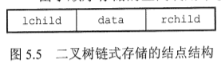
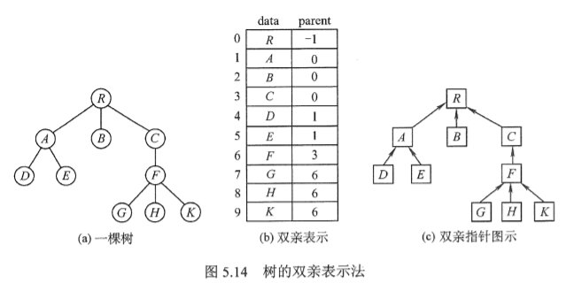
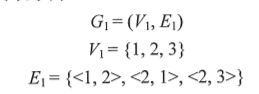
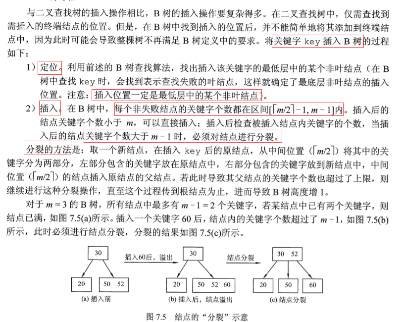
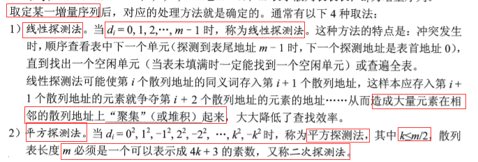
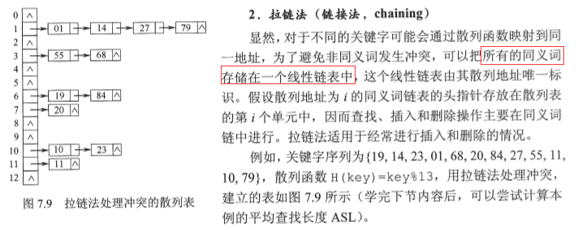
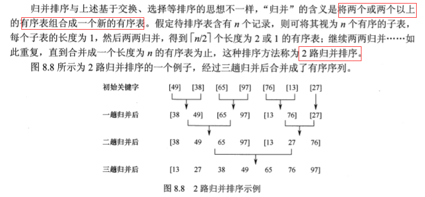

# 数据结构基础

C/C++中的&和*     https://blog.csdn.net/xiao__tian__/article/details/51814617

## 一、线性表

#### （一） 线性表的定义和基本操作

```
线性表是具有相同类型的n(n>=0)个数据元素的有限序列
特点：
元素个数有限
逻辑上的顺序性
抽象性，即讨论元素间的逻辑关系
```


#### （二） 线性表的实现

1. 顺序存储结构 (物理上用一组地址连续的存储单元依次存储数据元素)

   

   1.1 顺序表定义及实现

   ```c++
   //1.静态分配，即数组大小事先固定
   typedef struct {
       int data[MaxSize];
       int length; //元素个数（顺序表长度）
   }SeqList1;
   void Init_SL1(SeqList1& L){
       for(int i = 0; i < MaxSize; i++){
           L.data[i] = 0;
       }
       L.length = 0;
   }
   //2.动态分配
   typedef struct {
       int* data;
       int length;   //元素个数
       int capacity; //最大容量
   }SeqList2; //动态分配
   void Init_SL2(SeqList2& L){
       //L.data = (int*) malloc(InitSize*sizeof(int)); //c
       L.data = new int[InitSize]; // cpp
       L.length = 0;
       L.capacity = InitSize;
   }
   void Add_Capacity(SeqList2& L, int capacity){
       int* temp = L.data;
       L.capacity += capacity;
       L.data = new int[L.capacity];
       for(int i = 0; i < L.length; i++){
           L.data[i] = temp[i];
       }
       free(temp);
   }
   ```

   1.2 基本操作方法

   1.2.1 插入操作

   ```c++
   //注意：顺序表从1开始计数，因此插入或删除的位置i应满足1<=i<= L.length
   bool InsertElem(SeqList1& L, int i, int elem){
       if(i < 1 || i > L.length+1) return false;
       if(L.length >= MaxSize) return false;
       for(int j = L.length; j >= i; j--){
           L.data[j] = L.data[j-1];
       }
       L.data[i-1] = elem;
       L.length++;
       return true;
   }
   ```

   

   1.2.2 删除操作

   ```c++
   bool DeleteElem(SeqList1& L, int i, int& elem){
       if(i < 1 || i > L.length) return false;
       elem = L.data[i-1];
       for(int j = i; j < L.length; j++){
           L.data[j-1] = L.data[j];
       }
       L.length--;
       return true;
   }
   ```

   

   1.2.3 按值查找

   ```c++
   //返回元素在顺序表中的位置[1, L.length]，因此数组下标要加1
   int LocateElem(SeqList1& L, int elem){
       for(int i = 0; i < L.length; i++){
           if(L.data[i] == elem) return i+1;
       }
       cout << "Not Found!" << endl;
       return 0;
   }
   ```

   

2. 链式存储结构

   2.1 单链表定义及基本操作的实现

   ```c++
   typedef struct LNode{
       int data; //数据域
       struct LNode *next; //指针域
   }LNode, *LinkList; //LinkList为头指针
   bool Init_List(LinkList& L){
       //带有头节点
       L = (LinkList) malloc(sizeof (LNode));
       if(L == nullptr) return false;
       L->data = -1;
       L->next = nullptr;
       return true;
   }
   void printList(LinkList& L){
       LinkList temp = L;
       while (L->next != nullptr){
           cout << temp->data << " ";
           temp = temp->next;
       }
       free(temp);
       cout << endl;
   }
   ```

   

   2.1.1 头插法建立单链表 (时间复杂度：O(n)）

   ```c++
   bool Head_Ins(LinkList& L, int elem){
       LNode* node = (LNode*)(malloc(sizeof(LNode)));
       if(node == nullptr) return false;
       node->data = elem;
       
       node->next = L->next;
       L->next = node; //带头结点
       
       //node->next = L;
       //L = node; //不带头结点
       return true;
   }
   ```

   2.1.2 尾插法建立单链表 (时间复杂度：O(n)）

   ```c++
   LinkList Tail_Ins(LinkList& L){
       LNode* tail = L; //尾指针
       int elem;
       cin >> elem;
       while(elem != 9999){ //输入9999退出
           LNode* node = (LNode*)(malloc(sizeof(LNode)));
           node->data = elem;
           tail->next = node;
           tail = node;
           cin >> elem;
       }
       tail->next = nullptr;
       return L;
   }
   ```

   2.1.3 查找第i个结点 (第0个为头结点)   O(n)

   ```c++
   LNode* FindI_Node(LinkList& L, int i){
       if(i < 0) return nullptr;
       if(i == 0) return L;
       int j = 1;
       LNode* res = L->next;
       while(res && j < i){
           res = res->next;
           j++;
       }
       return res;
   }
   ```

   2.1.4 在第 i∈[1,n] 个位置插入结点  O(n)

   

   ```c++
   bool InsI_Node(LinkList& L, int i, int elem){
       if(i <= 0) return false;
       LNode* pre = FindI_Node(L, i-1); //先找到第i-1个结点，然后在后面插入新结点
       LNode* node = (LNode*) malloc(sizeof (LNode));
       node->data = elem;
       node->next = pre->next;
       pre->next = node;
       return true;
   }
   ```

   2.1.5 删除第 i∈[1,n] 个结点  O(n)

   ```c++
   bool DelI_Node(LinkList& L, int i){
       if(i <= 0) return false;
       LNode* pre = FindI_Node(L, i-1); //先找到第i-1个结点，然后删除后面的结点
       LNode* temp = pre->next;
       pre->next = temp->next;
       free(temp);
       return true;
   }
   ```

   

   2.2 双链表

   

   ```c++
   typedef struct DNode{
       int data; //数据域
       struct DNode *next, *pre; //指针域
   }DNode, *DList;
   ```

   2.2.1 插入结点

   方法一：先找到第i-1个结点p，将s插入在p之后

   

   ```c++
   bool InsI_Node(DList& L, int i, int elem){
       if(i <= 0) return false;
       DNode* p;
       //p = FindI_Node(L, i-1)......//找到第i-1个结点，并用p指向它,与单链表类似
       DNode* s = (DNode*) malloc(sizeof (DNode));
       s->data = elem;
       s->next = p->next;	//1
       p->next->pre = s;	//2
       s->pre = p;		    //3
       p->next = s;	    //4
       return true;
   }
   ```

   方法二：先找到第i个结点p，将s插入在p之前

   

   ```c++
   bool InsI_Node(DList& L, int i, int elem){
       if(i <= 0) return false;
       DNode* p;
       //p = FindI_Node(L, i)......//找到第i个结点，并用p指向它,与单链表类似
       DNode* s = (DNode*) malloc(sizeof (DNode));
       s->data = elem;
       s->pre = p->pre; //1
       p->pre->next = s;//2
       s->next = p;     //3
       p->pre = s;      //4
       return true;
   }
   ```

   2.2.2 删除第i个结点

   

   ```c++
   bool DelI_Node(DList& L, int i){
       if(i <= 0) return false;
       DNode* p;
       //p = FindI_Node(L, i-1)......//找到第i-1个结点，并用p指向它,与单链表类似
       DNode* q = p->next;
       p->next = q->next; //1
       q->next->pre = p;  //2
       free(q);
       return true;
   }
   ```

   2.3 循环链表

   2.3.1 循环单链表

   

   2.3.2 循环双链表

   

   2.4 静态链表

   

   ```c++
   typedef struct {
       int data; //数据域
       int cursor; //游标
   }SNode, SList[MAX_SIZE];  //预先分配一块连续的空间
   ```

3. 线性表的应用

   

## 二、栈、队列和数组

#### （一） 栈：后进先出(LIFO)


1. 栈的顺序存储结构

   1.1 顺序栈的实现和基本操作

   ```c++
   typedef struct {
       int data[MAX_SIZE];
       int top; //栈顶指针 0~MAX_SIZE-1; top=-1时代表栈空
   }SeqStack;
   //初始化
   void Init_Stack(SeqStack& s){
       s.top = -1;
   }
   //判栈空
   bool Is_Empty(SeqStack& s){
       return (s.top == -1) ? true : false;
   }
   //判栈满
   bool Is_Full(SeqStack& s){
       return (s.top == MAX_SIZE-1) ? true : false;
   }
   //进栈
   bool Push(SeqStack& s, int elem){
       if(Is_Full(s)) return false;
       s.data[++s.top] = elem; //栈顶指针先加一，再入栈
       return true;
   }
   //出栈
   bool Pop(SeqStack& s, int& elem){
       if(Is_Empty(s)) return false;
       elem = s.data[s.top--]; //先出栈，栈顶指针再减一
       return true;
   }
   //读栈顶元素
   bool Get_Top(SeqStack& s, int& elem){
       if(Is_Empty(s)) return false;
       elem = s.data[s.top];
       return true;
   }
   ```

   

   1.2 共享栈(双端栈)

   

   ```c++
   typedef struct {
       int data[MAX_SIZE];
       int top[2]; //初始：top[0]=-1; top[1]=MAX_SIZE
   }DStack;
   ```

   

2. 栈的链式存储结构

   

   ```c++
   typedef struct LNode{
       int data;
       struct LNode* next;
   }LNode, *LinkStack;
   //下面方法的前提是：栈没有头结点，top直接指向第一个元素
   //入栈
   bool Push(LinkStack top, int elem){
       LNode* node = (LNode*) malloc(sizeof (LNode));
       if(node == nullptr) return false;
       node->data = elem;
       node->next = top; //带头结点的话 node->next = top->next;
       top->next = node;
       return true;
   }
   //出栈
   bool Pop(LinkStack top, int& elem){
       if(top == nullptr) return false; //栈空
       LNode* temp = top; //暂存栈顶结点
       elem = temp->data;
       top = temp->next; //带头结点的话 top->next = temp->next;
       free(temp);
       return true;
   }
   ```

   

#### （二） 队列：先进先出(FIFO)


1. 队列的顺序存储结构

   1.1 顺序队列

   

   ```c++
   typedef struct{
       int data[MAX_SIZE];
       int front, rear;
   }SeqQueue;
   //初始化(队空条件) q.front = q.rear = 0
   //进队列：q.data[rear++] = elem  //先送至队尾，然后rear++ 
   //出队列：elem = q.data[front++] //先读队首元素，再front++
   //注意：q.rear == MAX_SIZE 不能作为队列满的条件，如上图(d)，这也是顺序队列的缺点，而下面的循环队列改进了这一缺点
   ```

   1.2 循环队列 (逻辑上视为一个环)

   

   ```c++
   typedef struct{
       int data[MAX_SIZE];
       int front, rear;
   }SeqQueue;
   //初始化
   void Init_Queue(SeqQueue& q){
       q.front = q.rear = 0;
   }
   //判队空
   bool Is_Empty(SeqQueue& q){
       return (q.front == q.rear) ? true : false;
   }
   //判队满
   bool Is_Full(SeqQueue& q){
       return ((q.rear+1)%MAX_SIZE == q.front) ? true : false;
   }
   //入队
   bool EnQueue(SeqQueue& q, int elem){
       if(Is_Full(q)) return false;
       q.data[q.rear] = elem;
       q.rear = (q.rear+1) % MAX_SIZE;
       return true;
   }
   //出队
   bool DeQueue(SeqQueue& q, int& elem){
       if(Is_Empty(q)) return false;
       elem = q.data[q.front];
       q.front = (q.front+1) % MAX_SIZE;
       return true;
   }
   //队列元素个数
   int Queue_Len(SeqQueue& q){
       return (q.rear + MAX_SIZE - q.front) % MAX_SIZE;
   }
   ```

   

2. 队列的链式存储结构

   

   ```c++
   typedef struct LNode{
       int data;
       struct LNode* next;
   }LNode;
   typedef struct {
       LNode *rear, *front;
   }LQueue;
   //通常将链式队列设计成带头结点的队列，操作更统一和方便
   //初始化
   void Init_Queue(LQueue& q){
       q.front = q.rear = (LNode*) malloc(sizeof (LNode));
       q.front->next = nullptr;
   }
   //判队空
   bool Is_Empty(LQueue& q){
       return (q.front == q.rear) ? true : false;
   }
   //入队
   bool EnQueue(LQueue& q, int elem){
       LNode* node = (LNode*) malloc(sizeof (LNode));
       if(node == nullptr) return false;
       node->data = elem;
       node->next = nullptr;
       q.rear->next = node; //插入到链尾
       q.rear = node; //后移队尾指针
       return true;
   }
   //出队
   bool DeQueue(LQueue& q, int& elem){
       if(Is_Empty(q)) return false;
       LNode* temp = q.front->next;
       elem = temp->data;
       q.front->next = temp->next;
       if(temp == q.rear) q.rear = q.front; //删除的是最后一个元素，则队尾指针应指向头结点
       free(temp);
       return true;
   }
   ```

3. 双端队列

   

   ```
   进队：前端进的元素排列在后端进的前面
   出队：无论是前端还是后端，先出的元素排在后出的元素前面
   ```

   3.1 输出受限的双端队列

   

   3.2 输入受限的双端队列

   

#### （三） 特殊矩阵的压缩存储 P109

1. 数组存储结构

   

2. 对称矩阵

   

3. 三角矩阵

   

4. 三对角矩阵

   

5. 稀疏矩阵

   

#### （四）广义表

1. 广义表概念


2. 存储结构 (顺序存储难以实现，一般采用链式结构)

   2.1 头尾链存储

   

   [共用体union] https://www.runoob.com/cprogramming/c-unions.html

   ```c++
   typedef enum {ATOM, LIST} ElemTag; // ATOM=0,原子;LIST=1,子表
   typedef struct GLNode{
       ElemTag tag;
       union { //原子结点和子表结点的联合部分
           int atom; //原子结点值域
           struct {struct GLNode *head, *tail;} ptr; //子表结点的指针域(指向表头/表尾)
       };
   }GLNode, *GList;
   ```

   2.2 扩展线性((同层次))链表存储

   

   ```c++
   typedef enum {ATOM, LIST} ElemTag; // ATOM=0,原子;LIST=1,子表
   typedef struct GLNode{
       ElemTag tag;
       union { //原子结点和子表结点的联合部分
           int atom; //原子结点值域
           struct GLNode *head; //表结点的表头指针
       };
       struct GLNode *next; //指向下一个元素节点
   }GLNode, *GList;
   ```

2. m元多项式的表示 P120

   

3. 广义表的递归算法

   

#### （五）栈和队列的应用


## 三、串

#### （一）基本概念

```
串(string, 字符串)：由零个或多个字符组成的有限序列，一般记为：
                   s(串名) = 'a1a2...an'(串值，必须用单引号) 
串长n：串中字符的数目
主串：包含字串的串
子串：串中任意多个连续的字符组成的子序列
空串：零个字符的串 '' 
空格串：由若干空格组成 '  '
```

#### （二）存储结构&基本操作

1. 定长顺序存储

   ```c++
   typedef struct{
       char ch[MAX_LEN];
       int length;
   }SeqString;
   ```

   

2. 堆分配存储(动态分配)

   ```c++
   typedef struct{
       char *ch;
       int length;
   }HeapString;
   ```

   

3. 块链存储

   ```c++
   typedef struct{
       char ch[BLOCK_SIZE];
       int length;
   }Block;
   typedef struct{
       Block *head, *tail;
       int length;
   }BString
   ```

   

4. 基本操作

   

#### （三）模式匹配算法

> 串的模式匹配：子串(模式串)的定位操作

1. 暴力匹配算法

   

   ```c++
   int Index(SeqString S, SeqString T){  
       int i = j = 1;
       while(i <= S.length && j <= T.length){
           if(S.ch[i] == T.ch[j]){
               ++i; ++j;
           }else{ //只要匹配失败，i和j都要回溯
               i = i - j + 2; 
               /* 此次比较起始，子串第1位与主串第i-j+1位比较；
                  再+1，即为下次主串与子串起始比较位置，i应该回溯到                该位置
               */
               j = 1;
           }
       }
       if(j > T.length) return i-T.length; //匹配到了，i回退子串的长度
       else return 0;
   }
   ```

   ```
   时间复杂度分析：(主串长度为n，子串长度为m)，则最多比较n-m+1个子串
   最坏时间复杂度：每个子串都匹配到最后一个字符时，才匹配失败
                  O((n-m+1)m) = O(n*m)   (n>>m)
   最好时间复杂度：每个子串都匹配到第一个字符时，就匹配失败
                  O(n-m+1) = O(n) (n>>m)
   ```

   

2. KMP算法：当出现不匹配情况时，无需回溯 i 指针，而是利用已得到的"部分匹配"的结果将子串(模式)向右滑动尽可能远的距离，再进行比较

   

   P121

   http://data.biancheng.net/view/180.html  ？？？？？？？？？？？之后看

3. KMP算法改进

   

## 四、树与二叉树

#### （一） 树的概念和性质


```
1. 结点的度：树中一个结点的孩子个数    
   树的度：树中结点的最大度数m，该树称为m叉树
2. 分支结点：度大于0的结点；   叶子节点：度为0的结点(即没有子女结点)
3. 结点的层次：从根结点开始定义，根节点为第一层
   结点的深度：从根结点开始自顶向下逐层累加
   结点的高度：从叶结点开始自底向上逐层累加
   树的高度(或深度)：树中结点的最大层数
4. 有序树：树中结点的各子树从左到右是有次序的，不能互换；否则是无序树
5. 路径：由两个结点之间所经过的结点序列构成
   路径长度：路径上所经过的边的个数
   注意：树中的分支是有向的(从双亲指向孩子，即从上向下)，所以同一双亲    的两个孩子之间不存在路径
6. 森林：m(m>=0)棵互不相交的树的集合
```


#### （二） 二叉树

1. 二叉树的定义及其主要特征

   ```
   二叉树：每个结点至多有两棵子树(即不存在度大于2的结点)，并且有左右        之分，次序不能任意颠倒。
   
   二叉树与度为2的有序树的区别：
   1. 度为2的有序树至少有3个结点，但二叉树可为空；
   2. 二叉树结点的孩子数无论是否是两个，都有左右之分；而度为2的有序树    孩子结点次序是相对于另一个孩子而言的，若孩子只有一个，则不必区    分左右。
   ```

   

   ```
   特殊的二叉树：
   1. 满二叉树：高度为h，且含有(2^h-1)个结点二叉树
   2. 完全二叉树：高度为h、有n个结点的二叉树，且仅当每个结点都与高      度为h的满二叉树中编号为1~n的结点一一对应
   3. 二叉排序树：左子树上所有结点的关键字均小于根结点的关键字;
                 右子树上的所有结点的关键字均大于根结点的关键字;
                 左子树和右子树又各是一棵二叉排序树。
   4. 平衡二叉树：树上任一结点的左子树和右子树的深度之差不超过1
   ```

   

   > 二叉树的性质

   

2. 二叉树的顺序存储结构和链式存储结构

   2.1 顺序存储结构

   ```
   用一组地址连续的存储单元依次自上而下、自左至右存储完全二叉树上的结点元素。(对于一般的二叉树，空间利用率较低)
   ```

   

   2.2 链式存储结构

   

   ```c++
   typdef struct BTNode{
       int data;
       struct BTNode *lchild, *rchild;
   }BTNode, *BTree;
   //结论：含有n个结点的二叉链表中，有n+1个空指针
   //因为：叶节点有2个空指针，度为1的结点有一个空指针，即空指针总数 = 2*n0 + n1 = n0 + (n2+1) + n1 = n + 1
   ```

   

3. 二叉树的遍历

   3.1 先序遍历：根结点 -> 左子树 -> 右子树

   ```c++
   void PreOrder(BTree root){
       if(root != nullptr){
           visit(root);            //访问根结点
           //即 cout << root->data
           PreOrder(root->lchild); //递归遍历左子树
           PreOrder(root->rchild); //递归遍历右子树
       }
   }
   //迭代法
   void PreOrder(BTree root){
       Init_Stack(S); 
       BTree p = root;   
       while(p || !IsEmpty(S)){ //仍有结点或栈非空，一直循环
           if(p){
               visit(p);      //访问当前结点
               Push(S, p);       
               p = p->lchild; //左
           }else{
   		   Pop(S, p);
               p = p->rchild; //右
           }
       }
   }
   ```

   3.2 中序遍历： 左子树 -> 根结点 -> 右子树

   ```c++
   void InOrder(BTree root){
       if(root != nullptr){
           PreOrder(root->lchild); //递归遍历左子树
           visit(root);            //访问根结点
           PreOrder(root->rchild); //递归遍历右子树
       }
   }
   //迭代法
   void InOrder(BTree root){
       Init_Stack(S); 
       BTree p = root;   
       while(p || !IsEmpty(S)){ //仍有结点或栈非空，一直循环
           if(p){
               Push(S, p);     
               p = p->lchild;  //左
           }else{
   		   Pop(S, p);
               visit(p);       //访问出栈结点
               p = p->rchild;  //右
           }
       }
   }
   ```

   3.3 后序遍历： 左子树 -> 右子树 -> 根结点

   ```c++
   void PostOrder(BTree root){
       if(root != nullptr){
           PreOrder(root->lchild); //递归遍历左子树
           PreOrder(root->rchild); //递归遍历右子树
           visit(root);            //访问根结点
       }
   }
   //迭代法
   void PostOrder(BTree root){
       Init_Stack(S); 
       BTree p = root; BTree r = nullptr;  
       while(p || !IsEmpty(S)){ //仍有结点或栈非空，一直循环
           if(p){
               Push(S, p);     
               p = p->lchild;  //左
           }else{
               GetTop(p);
               if(p->rchild && p->rchild != r){ //若右子树存在且未被访问过
                  p = p->rchild;//右
               }else{
                  Pop(S, p);
                  visit(p);     //访问出栈结点
                  r = p;        //记录最近访问过的结点
                  p = nullptr;  //每次重置p指针
               }
           }
       }
   }
   ```

   

   3.4 层次遍历

   

   ```c++
   void LevelOrder(BTree root){
       Init_Queue(q);
       BTree p;
       EnQueue(q, root); //根节点入队
       while(!IsEmpty(q)){
           DeQueue(q, p); //头结点出队，并赋给临时指针p
           visit(p);      //访问出队结点
           if(p->lchild != nullptr)   //左子树不为空
               EnQueue(q, p->lchild); //左子树根结点入队
           if(p->rchild != nullptr)
               EnQueue(q, p->rchild);
       }
   }
   ```

   3.5 由遍历序列构造二叉树   【之后实现】

   注意：只知道二叉树的先序序列和后序序列，无法唯一确定一棵二叉树

   > 先序+中序

   

   > 后序+中序

   

   > 层序+中序

   

4. 线索二叉树的基本概念和构造

   ```
   线索二叉树：利用原本的空指针(n个节点有n+1个空指针域)存放指向其前驱或后继的指针，这样可加快查找结点前驱和后继的速度。
   ```

   

   ```c++
   typedef struct ThreadNode{
       int data;
       struct ThreadNode *lchild, *rchild;
       int ltag, rtag; //前驱, 后继指针（也称为线索）
   }ThreadNode, *ThreadTree;
   ```

   > 中序线索二叉树

   

   ```c++
   //通过中序遍历建立线索二叉树
   void CreateInThread(ThreadTree root){
       ThreadTree pre = nullptr; //刚访问过的结点，起始为空
       if(T != nullptr){
           InThread(root, pre);
           //处理最后一个结点 ???
           pre->rchild = nullptr;
           pre->rtag = 1;
       }    
   }
   // p为当前结点，pre为刚访问过的结点
   void InThread(ThreadTree &p, ThreadTree &pre){
       if(p != nullptr){
           InThread(p->lchild, pre); //左
           
           //线索化当前节点
           if(p->lchild == nullptr){
               p->lchild = pre;
               p->ltag = 1;
           }
           if(p->rchild == nullptr){
               pre->rchild = p;
               pre->rtag = 1;
           }
           pre = p; //标记当前结点为刚访问的结点
           
           InThread(p->rchild, pre); //右
       }
   }
   //中序线索二叉树的遍历(先找到最左下结点，然后按后继进行遍历)
   void InOrder(ThreadNode* root){
   	for(ThreadNode *p = FirstNode(root); p != nullptr; p=NextNode(p))
           visit(p);
   }
   ThreadNode *FirstNode(ThreadNode *p){
       while(p->ltag == 0) p = p->lchild; //最左下结点(不一定是叶子结点)
       return p;
   }
   ThreadNode *NextNode(ThreadNode *p){
   	if(p->rtag == 0){
           return FirstNode(p); //是右子树，继续先找到最左下结点
       }else{
           return p->rchild; //rtag=1，直接返回后继线索
       }
   }
   ```

   

   > 先序和后序线索二叉树

   

   

   

#### （三） 树、森林

1. 树的存储结构

   1.1 双亲表示法

   

   ```c++
   typedef struct{
       int data;
       int parent; //双亲位置域
   }PTNode;
   typedef struct{
       PTNode nodes[MAX_TREE_SIZE];
       int n; //结点数
   }PTree;
   ```

   1.2 孩子表示法：每个结点的孩子结点用单链表链接

   

   

   1.3 孩子兄弟表示法

   

   ```c++
   typedef struct CSNode{
   	int data;
       struct CSNode *fchild, *nchild;
       //fchild: 指向当前结点的第一个孩子节点，左指针
       //nsibling: 指向下一个兄弟节点，右指针
   }CSNode, *CSTree;
   ```

   

2. 树、森林与二叉树的转换

   2.1 树 <-> 二叉树

   

   2.2 森林 <-> 二叉树

   

3. 树和森林的遍历

   
   
   
   
   ```
   图5.17(上图)
   先序遍历森林：ABCD EF GHI
   中序遍历森林：BCDA FE HIG
   ```
   
   
   
   

#### （四） 树与二叉树的应用

1. 二叉排序树(BST)

   ```
   二叉排序树(二叉查找树)：要么是空树，要么具有以下特征：
   1）若左子树非空，则左子树所有结点的值均小于根结点的值
   2）若右子树非空，则右子树所有结点的值均大于根结点的值
   3）左右子树分别也是Binary Sort Tree
   二叉排序树的中序遍历是一个递增的有序序列
   ```

   ```c++
   //查找
   BSTNode *BST_Search(BTree T, int key){
       while(T != nullptr && key != T->data){
           if(key < T->data) T = T->lchild;
           else T = T->rchild;
       }
       return T;
   }
   //插入
   bool BST_Insert(BTree &T, int elem){
       if(T == nullptr){
           T = (BTree)malloc(sizeof(BSTNode));
           T->data = elem;
           T->lchild = T->rchild = nullptr;
           return true;
       }els if(T->data == elem){ //存在相同的值，插入失败
           return false;
       }else if(T->data > elem){
           return BST_Insert(T->lchild, elem);
       }else{
   	    return BST_Insert(T->rchild, elem);
       }
   }
   //构造
   void Creat_BST(BTree &T, int arr[], int n){
       T = NULL;
       for(int i = 0; i < n; i++)
           BST_Insert(T, arr[i]);
   }
   ```

   > 二叉排序树删除(要考虑三种情况)

   

2. 平衡二叉树(Balanced Binary Tree)

   ```
   平衡二叉树：任意节点的左右子树高度差(平衡因子)的绝对值不超过1，平衡因子的值只可能是-1，0或1
   ```

   

   > 平衡二叉排序树的插入：即每次向二叉排序树插入结点，必须保证平衡，调整的规律有以下4种情况：(【调整均针对最小不平衡子树】)

   

   > > LL平衡旋转（右单旋转）：因在结点A左孩子(L)左子树(L)插入新结点使A的平衡因子增至2，需要一次向右旋转操作

   

   > > RR平衡旋转（左单旋转）：因在结点A右孩子(R)右子树(R)插入新结点使A的平衡因子增至2，需要一次向左旋转操作

   

   > > LR平衡旋转（先左后右双旋转）：因在结点A左孩子(L)右子树(R)插入新结点使A的平衡因子增至2，需要先左后右双旋转

   

   > >RL平衡旋转（先右后左双旋转）：因在结点A右孩子(R)左子树(L)插入新结点使A的平衡因子增至2，需要先右后左双旋转

   

3. 哈夫曼树和哈夫曼编码

   ```
   结点的权(w)：树中的结点被赋予一个表示某种意义的数值
   结点的带权路径长度：根到任意结点的路径长度(经过的边数)*该结点的权值
   树的带权路径长度(WPL)：所有叶节点的带权路径长度之和
   哈夫曼树：WPL最小的二叉树，也称为最优二叉树
   ```

   

   > 构造哈夫曼树

   

   

   > 哈夫曼编码

   

4. 并查集：每个子集用一颗树表示，所有树构成全集和的森林


```c++
//并查集结构
int UFSets[MAX_SIZE]; //双亲指针数组
//初始化
void Init(int S[]){
    for(int i = 0; i < MAX_SIZE; i++) 
        S[i] = -1;  //即全为根节点
}
//在并查集S中查找并返回包含元素x的树的根
void Findx(int S[], int x){
	while(S[x] >= 0) x = S[x]; //循环寻找x的根
    return x;
}
//求两个不相交子集合的并集
void Union(int S[], int root1, int root2){
    S[root2] = root1; //将根root2连接到root1下
}
```


## 五、图

#### （一） 图的概念

```
图G = (V, E) ：
V(G)表示G中顶点的有限非空集，|V|表示顶点个数
E(G)表示G中顶点之间的关系(边)集合，E = {(u,v)| u,v ∈ V}，|E|表示边数
注意：图不能是空图，即至少有一个顶点，但可以没有边
```

1. 有向图

   ```
   有向边(弧)是顶点的有序对<v, w>(称为v到w的弧 或 v邻接到w；v称为弧尾，w称为弧头)
   ```

   

2. 无向图

   ```
   无向边是顶点的无序对，记为<v, w>(<w,v>，二者等价)，w和v互为邻接点
   ```

   

3. 简单图、多重图

   

4. 完全图(也称简单完全图)

   

5. 子图

   

6. 连通、连通图和连通分量

   ```
   在无向图中：
   若从v到w有路径存在，则称v和w是连通的；
   若图中任意两个顶点都是连通的，则称图为连通图；否则称为非连通图；
   无向图中的极大连通子图(包含该子图的所有边)称为连通分量。
   图有n个顶点，若边数小于n-1，那么此图必是非连通图；
   若有n个顶点的图是非连通图，最多可以有：即n-1个顶点构成完全图，剩下一个顶点与其他顶点之间不存在边。
   ```

   

7. 强连通图、强连通分量

   ```
   在有向图中：
   若一对顶点v和w，从v到w和w到v之间都有路径，称这两个顶点是强连通的；
   若图中任意一对顶点都是强连通的，则该图为强连通图；
   有向图中的极大强连通子图称为强连通分量。
   有向图有n个顶点，若是强连通图，则最少需要n条边(构成一个环路)。
   ```

   

8. 生成树、生成森林

   ```
   连通图的生成树：包含图中全部顶点的一个极小连通子图（若图有n个顶点，则它的生成树含有n-1条边）；
   非连通图中，各连通分量的生成树构成了该图的生成森林；
   ```

   

9. 顶点的度、入度和出度

   ```
   无向图中：
     顶点v的度：指依附于顶点v的边数，记为TD(v)；
     若该无向图有n个顶点、e条边，则 所有顶点的度之和 = 2e (因为每条边   和两个顶点相关联)。
   有向图中：
     顶点v的度TD(v) = 出度 + 入度；
     入度：以顶点v为终点的有向边数，记为ID(v)；
     出度：以顶点v为起点的有向边数，记为OD(v)；
     若该有向图具有n个顶点、e条边，则n个顶点的入度之和 = 出度之和 = e  （因为每条有向边都有一个起点和终点）
   ```

   

10. 边的权和网

    ```
    在图中，每条边可标上具有某种含义的数值，该数值称为该边的权值；
    带有权值的图称为带权图，也称为网。
    ```

    

11. 稠密图、稀疏图

    

    

12. 路径、路径长度和回路

    ```
    路径：指vp到vq之间的顶点序列：vp,v1,v2,...,vq；
    路径长度：路径上边的数目；
    回路或环：路径首尾顶点相同；
    若一个图有n个顶点，且有大于n-1条边，则该图一定有环。
    ```

    

13. 简单路径、简单回路

    ```
    简单路径：顶点不重复出现的路径
    简单回路：除首尾顶点外，其余顶点不重复的回路
    ```

    

14. 距离

    ```
    若存在u到v的最短路径。则该路径的长度称为u到v的距离
    若u到v不存在路径，则距离为无穷(∞)
    ```

    

15. 有向树

    

    

#### （二） 图的存储及基本操作

1. 邻接矩阵法

   ```
   用一个一维数组存储图中顶点的信息；
   用一个二维数组(邻接矩阵)存储顶点之间的邻接关系。
   ```

   

   ```c++
   #define MAX_VERTEX_NUM 100 //顶点数目最值
   typedef struct{
   	int Vex[MAX_VERTEX_NUM]; //顶点表
       int Edge[MAX_VERTEX_NUM][MAX_VERTEX_NUM]; //邻接矩阵，边表
       int vexNum, arcNum; //当前顶点数和弧数
   }Graph;
   ```

   

2. 邻接表法（适用于稀疏图）

   

   ```
   邻接表存在两种结点：顶点表结点和边表结点
   ```

   

   ```c++
   #define MAX_VERTEX_NUM 
   typedef struct ArcNode{   //边表结点
       int adjvex;           //该弧指向的顶点信息
       struct ArcNode *next; //指向下一条弧
       //int weight;         //边权值，带权图(网)
   }ArcNode;
   typedef struct VexNode{ //顶点表结点
       int data;           //顶点信息
       ArcNode *first;     //指向第一条该顶点的边表结点
   }VexNode, VList[MAX_VERTEX_NUM];
   typdef struct{
       VList vertices;     //邻接表
       int vexNum, arcNum; //顶点数和边数
   }Graph;
   ```

   

3. 十字链表（针对有向图）

   

4. 邻接多重表（针对无向图）

   

5. 图的基本操作

   

#### （三） 图的遍历

1. 广度优先搜索（BFS，Breadth-First-Search）

   

   

2. 深度优先搜索（DFS，Depth-First-Search）

   

    

#### （四） 图的基本应用及其复杂度分析

1. 最小（代价）生成树

   

   

   1.1 Prim算法 

   

   1.2 Kruskal算法

   

2. 最短路径（针对带权图）

   2.1 Dijkstra(迪杰斯特拉)算法（求单源最短路径）

   ```
   S[]：记录已求得的最短路径的顶点
   dist[]：记录从源点v0到其他各顶点当前的最短路径长度，初态:若从v0到         vi有弧，则dist[i]为弧上的权值;否则置dist[i]为∞。
   path[]: path[i]表示从源点到顶点i之间的最短路径的前驱结点。在算法         结束时，可根据其值追溯得到源点v到顶点v;的最短路径。
   ```

   

   

   2.2 Floyd(弗洛伊德)算法（求每对顶点间的最短路径）

   

   

   

   

3. 有向无环图描述表达式

   

4. 拓扑排序

   

   

5. 关键路径  P248

   

   

## 六、查找

#### （一） 查找的基本概念


#### （二） 顺序查找

1. 一般线性表的顺序查找

   

2. 有序表的顺序查找

   

#### （三） 二分查找

```c++
//迭代
int Binary_Search(SeqList& L, int key){
    int low = 0, high = L.length-1, mid;
    while(low <= high){
        mid = (high - low)/2 + low;  //取中间位置
        if(L[mid] == key) return mid;
        else if(L[mid] < key) low = mid + 1; //后半部分查找
        else high = mid - 1; //前半部分查找
    }
    return -1; //查找失败
}
//递归
int main(){
    int ret = Binary_Search(L, 0, L.length-1, key);
}
int Binary_Search(SeqList& L, int low, int high, int key){
    while(low <= high){
        mid = (high - low)/2 + low;  //取中间位置
        if(L[mid] == key) return mid;
        else if(L[mid] < key) 
            return Binary_Search(L, mid+1, high, key); //后半部分
        else 
            return Binary_Search(L, low, mid-1, key);//前半部分
    }
    return -1; //查找失败
}
```


#### （四）分块查找


#### （五） B/B+树

1. B树 (又称 多路平衡二叉树)

   

   

   1.1 B树的高度 (不包括外部结点，即叶节点)

   

   1.2 B树的查找

   

   1.3 B树的插入

   

   1.4 B树的删除 P286 ？？？

   

2. B+树 (主要用于数据库)  P287

   

   

#### （五） 散列（Hash）表及其查找

1. 基本概念

   

2. 散列函数的构造方法

   

   2.1 直接定址法

   

   2.2 除留余数法

   

   2.3 数字分析法

   

   2.4 平方取中法

   

   

3. 处理冲突的方法

   3.1 开放定址法

   

   3.2 链接法

   

4. 散列查找

   

   

#### （六） 查找算法的分析及应用


## 七、内部排序

[十大排序算法](https://mp.weixin.qq.com/s/vn3KiV-ez79FmbZ36SX9lg)

#### （一） 排序的基本概念


#### （二） 插入排序


1. 直接插入排序

   

   ```c++
   void Insert_Sort(int A[], int n){
       for(int i = 1; i < n; i++){
           int temp = A[i]; //记录要插入的数据
           int j = i;
           //从已经排序的序列最右边的开始比较，找到比其小的数
           while(j > 0 && temp < A[j-1]){
               A[j] = A[j-1]; //元素后移
               j--;
           }
           if(j != i) A[j] = temp; //存在比其小的数，插入
       }
   }
   ```

   

2. 折半插入排序

   ```c++
   //1.先折半查找找到待插入位置 2.再移动元素
   void Binary_Insert_Sort(int A[], int n){
       for(int i = 1; i < n; i++){
           int temp = A[i];
           int low = 0; int high = i-1; //折半查找范围
           while(low <= high){
               mid = (high - low)/2 + low;
               if(A[mid] > temp) high = mid - 1;
               else low = mid + 1;
           } //二分查找执行完毕，high+1为要插入的位置
           for(int j = i-1; j > high; j--) A[j+1] = A[j];
           A[high+1] = A[0];
       }
   }
   ```

   

3. 希尔（shell）排序 （又称 缩小增量排序）

   

   ```c++
   void ShellSort(int A[], int n){
       for(int dk = n/2; dk >= 1; dk=dk/2){
           for(int i = dk; i < n; i++){
               if(A[i] < A[i-dk]){//A[i]需要插入到原有序子表
                   int temp = A[i];
                   for(int j = i-dk; j>0&&A[j]>temp; j-=dk)
                       A[j+dk] = A[j];
                   A[j+dk] = temp;
               } 
           }
       }
   }
   ```

   

#### （三） 交换排序

1. 冒泡排序

   ```c++
   void Bubble_Sort(int A[], int n){
       for(int i = 0; i < n-1; i++){  // n-1趟冒泡排序
           bool flag = true; //标明本趟冒泡排序是否发生交换
           for(int j = n-1; j > i; j--){ //一趟冒泡排序
               if(A[j-1] > A[j]){
                   int temp = A[i];
                   A[i] = A[j];
                   A[j] = temp;
                   flag = false;
               }
           }
           if(flag) break; //本趟遍历没有发生交换，说明已经排序完毕
       }
   }
   ```

   

2. 快速排序

   

   ```c++
   void Quick_Sort(int A[], int low, int high){
       if(low < high){
           int pivot_pos = Partition(A, low, high); //一次划分，返回枢轴(pivot)的下标
           //递归对两个子表进行同样的操作
           Quick_Sort(A, low, pivot_pos-1); //左子表
           Quick_Sort(A, pivot_pos+1, high);//右子表
       }
   }
   int Patition(int A[], int low, int high){
       int pivot = A[low]; //枢轴的元素，移到左端
       while(low < high){
           while(low < high && A[high] > pivot) high--;
           A[low] = A[high]; //右侧第一个小于枢轴的元素，移到左端
           while(low < high && A[low] < pivot) low++;
           A[high] = A[low]; //左侧第一个大于枢轴的元素，移到右端
       }
       A[low] = pivot; // 存放枢轴元素，此时low==high
       return low; //返回枢轴下标
   }
   ```

   

#### （四） 选择排序


1. 简单选择排序

   

   ```c++
   void Select_Sort(int A[], int n){
       for(int i = 0; i < n-1; i++){ //共n-1趟
           int min = i;
           for(int j = i+1; j < n; j++)
               if(A[j] < A[min]) min = j; //更新最小元素下标
           if(min != i) swap(A[i], A[min]);
       }
   }
   ```

   

2. 堆排序

   

   

   ```c++
   void BUildMaxHeap(int A[], int len){
       for(int i = len/2; i > 0; i--){ //调整len/2 ~ 1(非叶节点)
           HeadAdjust(A, i, len);
       }
   }
   //调整以第k个元素为根的子树，两个孩子结点下标为2k和2k+1
   void HeapAdjust(int A[], int k, int len){ 
       A[0] = A[k];  //A[0]为哨兵，无实际意义
       for(int i = 2*k; i <= len; i*=2){
           //选取两个子节点中较大的一个
           if((i+1) < len && A[i] < A[i+1]) i++;
           
           if(A[0] >= A[i]) break; //根节点值较大，调整结束
           else{
               A[k] = A[i]; //更改根节点值
               k = i; //修改k值，继续向下调整(i = 2*k)
           }
       }
       A[k] = A[0]; //将原根结点值A[0]放入最终第k位置
   }
   void HeapSort(int A[], int len){
   	BuildMaxHeap(A, len);
       for(int i = len; i > 1; i--){ //共n-1趟
           Swap(A[i], A[1]); //输出堆顶元素(即和堆底元素交换)
           HeadAdjust(A, 1, i-1); //将剩余i-1个元素重新调整成堆
       }
   }
   ```

   

#### （五） 归并排序



```c++
int *temp = (int *) malloc((n+1)*sizeof(int)); 
void Merge(int A[], int low, int mid, int high){
    //A的两段 low~mid 和 mid+1~high均有序
    int i, j, k;
    for(k = low; k <= high; k++) t[k] = A[k];
    for(i=low, j=mid+1, k=i; i<=mid&&j<=high; k++){
        if(temp[i] > temp[j]) 
            A[k] = temp[j++];
        else 
            A[k] = temp[i++];
    }
    while(i <= mid) A[k++] = temp[i++];  //左表有剩余
    while(j <= high) A[k++] = temp[j++]; //右表有剩余
}
void MergeSort(int A[], int low, int high){
    if(low < high){
        int mid = (high - low)/2 + low;
        MergeSort(A, low, mid);      //左子列递归排序
        MergeSort(A, mid+1, high);   //右子列递归排序
        Merge(A, low, mid, high);    //二路归并
    }
}
```


#### （六） 基数排序  P336


#### （七） 各种内部排序算法的比较


#### （八） 内部排序算法的应用


## 八、外部排序      P305（严）

```
外部排序：指大文件的排序，即待排序的记录存储在外存储器上，排序过程需要多次内、外存之间的交换。
```

