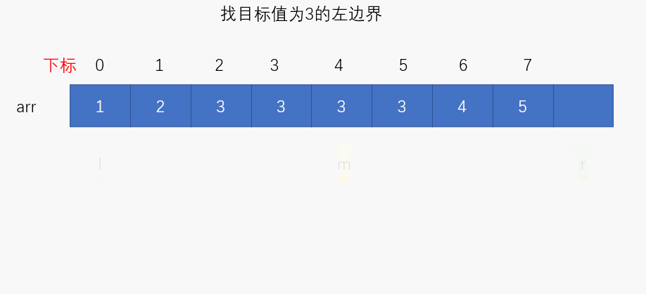
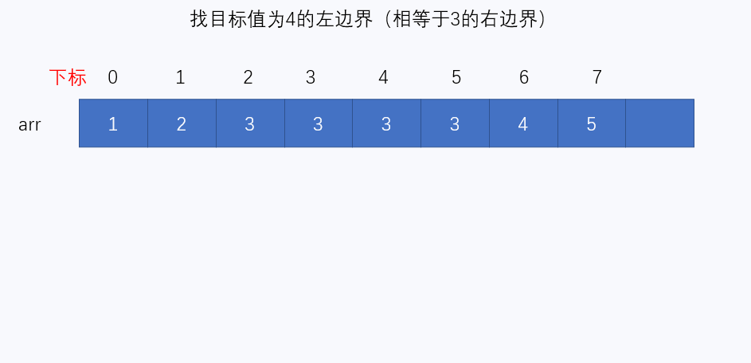

# 牛客网-剑指Offer

`tag`：

## 基础数学

**EASY**

- [**JZ15** **二进制中1的个数**](https://www.nowcoder.com/practice/8ee967e43c2c4ec193b040ea7fbb10b8) `**位运算**`
- [**JZ65** **不用加减乘除做加法**](https://www.nowcoder.com/practice/59ac416b4b944300b617d4f7f111b215)
- 

**MEDIUM**

- 

**HARD**

- 

## 数组

**EASY**

- [**JZ3** **数组中重复的数字**](https://www.nowcoder.com/practice/6fe361ede7e54db1b84adc81d09d8524)

- [**JZ11** **旋转数组的最小数字**](https://www.nowcoder.com/practice/9f3231a991af4f55b95579b44b7a01ba)  `**二分查找**`

- [**JZ17** **打印从1到最大的n位数**](https://www.nowcoder.com/practice/4436c93e568c48f6b28ff436173b997f)

- [**JZ39** **数组中出现次数超过一半的数字**](https://www.nowcoder.com/practice/e8a1b01a2df14cb2b228b30ee6a92163) `**哈希**`

- [**JZ53** **数字在升序数组中出现的次数**](https://www.nowcoder.com/practice/70610bf967994b22bb1c26f9ae901fa2) `**二分查找**`

  

  

- [**JZ61** **扑克牌顺子**](https://www.nowcoder.com/practice/762836f4d43d43ca9deb273b3de8e1f4)

- 

**MEDIUM**

- 

**HARD**

- 

## 字符串

**EASY**

- [**JZ5** **替换空格**](https://www.nowcoder.com/practice/0e26e5551f2b489b9f58bc83aa4b6c68)
- [**JZ50** **第一个只出现一次的字符**](https://www.nowcoder.com/practice/1c82e8cf713b4bbeb2a5b31cf5b0417c)
- 

**MEDIUM**

- 

**HARD**

- 

## 链表

**EASY**

- [**JZ6** **从尾到头打印链表**](https://www.nowcoder.com/practice/d0267f7f55b3412ba93bd35cfa8e8035)
- [**JZ18** **删除链表的节点**](https://www.nowcoder.com/practice/f9f78ca89ad643c99701a7142bd59f5d)
- [**JZ22** **链表中倒数最后k个结点**](https://www.nowcoder.com/practice/886370fe658f41b498d40fb34ae76ff9)
- [**JZ24** **反转链表**](https://www.nowcoder.com/practice/75e878df47f24fdc9dc3e400ec6058ca)
- [**JZ25** **合并两个排序的链表**](https://www.nowcoder.com/practice/d8b6b4358f774294a89de2a6ac4d9337)
- [**JZ52** **两个链表的第一个公共结点**](https://www.nowcoder.com/practice/6ab1d9a29e88450685099d45c9e31e46) `**双指针**`
- 

**MEDIUM**

- 

**HARD**

- 

## 队列/栈

**EASY**

- [**JZ9** **用两个栈实现队列**](https://www.nowcoder.com/practice/54275ddae22f475981afa2244dd448c6)
- [**JZ30** **包含min函数的栈**](https://www.nowcoder.com/practice/4c776177d2c04c2494f2555c9fcc1e49)
- 

**MEDIUM**

- 

**HARD**

- 

## 二叉树

**EASY**

- [**JZ27** **二叉树的镜像**](https://www.nowcoder.com/practice/a9d0ecbacef9410ca97463e4a5c83be7)
- [**JZ28** **对称的二叉树**](https://www.nowcoder.com/practice/ff05d44dfdb04e1d83bdbdab320efbcb)
- [**JZ32** **从上往下打印二叉树**](https://www.nowcoder.com/practice/7fe2212963db4790b57431d9ed259701)
- [**JZ55** **二叉树的深度**](https://www.nowcoder.com/practice/435fb86331474282a3499955f0a41e8b)
- 

**MEDIUM**

- 

**HARD**

- 

## 动态规划

**EASY**

- [**JZ42** **连续子数组的最大和**](https://www.nowcoder.com/practice/459bd355da1549fa8a49e350bf3df484) `**贪心**`
- [**JZ63** **买卖股票的最好时机(一)**](https://www.nowcoder.com/practice/64b4262d4e6d4f6181cd45446a5821ec)
- 

**MEDIUM**

- 

**HARD**

- 
