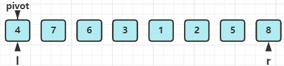
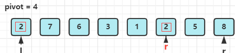
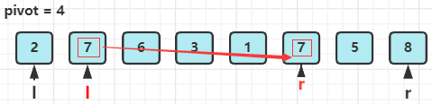
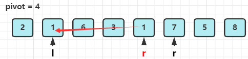
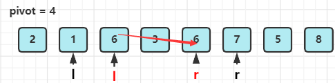
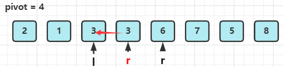
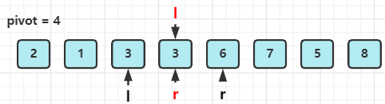
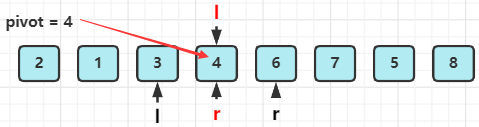

# 牛客网-华为机试

<tt>tag</tt>

## 基础数学

[**HJ7** **取近似值**](https://www.nowcoder.com/practice/3ab09737afb645cc82c35d56a5ce802a)

```java
import java.util.*;

public class Main {
    public static void main(String[] args) {
        Scanner sc = new Scanner(System.in);
        double a = sc.nextDouble();
        int b = (int)a;//浮点数强转为int会直接舍弃小数部分
        System.out.println((a - b) < 0.5
                           ? b 
                           : b + 1);
    }
} 

```

```java
//TOP3
import java.io.*;
public class Main {
        public static void main(String[] args) throws IOException{
            BufferedReader br = new BufferedReader(new InputStreamReader(System.in));
            String str = br.readLine();
            int index = str.indexOf(".");
            int a = Integer.parseInt(str.substring(0,index));
            //只看小数点后一位
            int b = Integer.parseInt(str.substring(index+1,index+2));
            if(b >= 5){
                System.out.println(a+1);
            }else{
                System.out.println(a);
            }
        }
} 
```

[**HJ22** **汽水瓶**](https://www.nowcoder.com/practice/fe298c55694f4ed39e256170ff2c205f)

```java
import java.util.*;
import java.io.*;

public class Main {
    
    public static void main(String[] args) {
        Scanner sc = new Scanner(System.in);
        String in = sc.nextLine();
        while(Integer.parseInt(in) != 0) {
            int empty = Integer.parseInt(in);
            int res = 0;
            while(empty >= 3) {
                int a = empty / 3; //换了a瓶汽水，相当于多了a个空瓶
                res += a;
                empty = a + empty % 3;
            }
            if(empty == 2)  res += 1;
            
            System.out.println(res);
            in = sc.nextLine();
        }
        sc.close();
    }
}
```

[**HJ37** **统计每个月兔子的总数**](https://www.nowcoder.com/practice/1221ec77125d4370833fd3ad5ba72395)

```java
import java.io.*;

public class Main {
    
    public static void main(String[] args) throws IOException{
        BufferedReader r = new BufferedReader(
                            new InputStreamReader(
                                System.in));
        String str = "";
        while((str = r.readLine()) != null) {
            int month = Integer.parseInt(str);
            int rabbits = rabbits(month);
            System.out.println(rabbits);
        }
    }
    private static int rabbits(int n) {
        if(n < 3) return 1;
        return rabbits(n-1) + rabbits(n-2);
    }
}
//非递归 TOP2
public class Main {
        public static void main(String[] args) throws IOException{
            BufferedReader br = new BufferedReader(new InputStreamReader(System.in));
            String str;
            while((str = br.readLine()) != null){
                // 第三个月起，每月都生一只
                int N = Integer.parseInt(str);
                // 第一个月初始化
                // 一月龄兔子总数
                int oneMonth = 1;
                // 二月龄兔子总数
                int twoMonth = 0;
                // 三月龄及以上兔子总数
                int threeMonth = 0;
                // 下个月将繁殖的兔子数量
                int addVal = 0;
                // 第二个月开始递推, i表示第i个月
                for(int i = 2; i <= N; i++) {
                    // 三月龄及以上兔子总数 = 二月龄兔子总数 + 原本三月龄及以上兔子总数
                    threeMonth += twoMonth;
                    // 二月龄兔子总数 = 上个月的一月龄兔子总数
                    twoMonth = oneMonth;
                    // 一月龄（即这个月出生）兔子总数 = 上个月将繁殖的兔子数量
                    oneMonth = addVal;
                    // 下个月将出生的兔子 = 下个月成为三月龄及以上的兔子数量
                    addVal = twoMonth + threeMonth;
                }
                System.out.println(oneMonth + twoMonth + threeMonth);
           }
       }
}
```


## 位运算

[**HJ15** **求int型正整数在内存中存储时1的个数**](https://www.nowcoder.com/practice/440f16e490a0404786865e99c6ad91c9)

```java
import java.util.*;

public class Main {
    public static void main(String[] args) {
        int numOf1 = 0;
        Scanner sc = new Scanner(System.in);
        int a = sc.nextInt();
        while(a != 0) {
            if(a % 2 == 1) numOf1++;
            a = a >>> 1; //正数 >> / >>>都可，负数必须用 >>>
        }
        System.out.println(numOf1);
//解法2：
//         String str = Integer.toBinaryString(a);
//         System.out.println(str.replace("0", "").length());
    }
}
```

[Java >> and >>> bitwise shift operators](https://www.cnblogs.com/PrimerPlus/p/13214011.html)

```java
//TOP1 解答
import java.io.InputStream;
  
public class Main {
    public static void main(String[] args) throws Exception {
        InputStream stream = System.in;
        int l ;
        byte[] bytes = new byte[1024]; //缓冲区
        while ((l = stream.read(bytes)) > 0) {
            String numStr = new String(bytes, 0, l - 1);
            int num = Integer.parseInt(numStr);
            char [] numChars = Integer.toBinaryString(num).toCharArray();
            int countNum = 0;
            for (int i = 0;i < numChars.length; i++){
                if (numChars[i] == '1'){
                    countNum = countNum + 1;
                }
            }
            System.out.println(countNum);
        }
    }
}
```


## 排序

[**HJ101** **输入整型数组和排序标识，对其元素按照升序或降序进行排序**](https://www.nowcoder.com/practice/dd0c6b26c9e541f5b935047ff4156309)

```java
public class Main {
    public static void main(String[] args) throws IOException{
        BufferedReader r = new BufferedReader(
                                new InputStreamReader(
                                    System.in));
        String count;
        while((count = r.readLine()) != null) {
            int cnt = Integer.parseInt(count);         //元素个数
            String[] in = r.readLine().split(" ");     //数组
            int flag = Integer.parseInt(r.readLine()); //标志
            int[] num = new int[in.length];
            for(int i = 0; i < in.length; i++)
                num[i] = Integer.parseInt(in[i]);
            //排序
            //0.Java提供的sort方法底层使用 快排+归并
            //Arrays.sort(num);
            //1.快速排序，平均效率最高
            //quickSort(num, 0, num.length-1);
            //2.归并排序
            //temp = new int[num.length]; //初始化辅助数组
            //mergeSort(num, 0, num.length-1);
            //3.冒泡排序
            //bubbleSort(num, num.length);
            //4.选择排序
            //selectSort(num, num.length);
            //5.插入排序
            //insertSort(num, num.length);
            
            StringBuilder s = new StringBuilder();
            if(flag == 0) { //升序
                for(int i = 0; i < num.length; i++)
                    s.append(num[i]).append(" ");
            } else { //降序
                for(int i = num.length - 1; i >= 0; i--)
                    s.append(num[i]).append(" ");
            }
            System.out.println(s.substring(0, s.length() - 1));
        }
    }
	......
}
```

[[参考] 十大经典排序算法动画与解析，看我就够了！](https://mp.weixin.qq.com/s/vn3KiV-ez79FmbZ36SX9lg)

### 1.快速排序

| 平均时间复杂度 | 最好时间复杂度 | 最坏时间复杂度 | 空间复杂度 | 是否稳定 |
| -------------- | -------------- | -------------- | ---------- | -------- |
| O(N*logN)      | O(N*logN)      | O(N^2)         | O(logN)    | 不稳定   |

```java
//1.快速排序
public static void quickSort(int[] num, int l, int r) {
    if(l >= r) return;
    int p = partition(num, l, r);
    quickSort(num, l, p - 1);
    quickSort(num, p + 1, r);
}
private static int partition(int[] num, int l, int r) {
    int pivot = num[l]; //用数组的首个元素作为枢轴，划分一次数组
    while(l < r) {
        while(l < r && num[r] > pivot) r--;  //找到右边第一个比pivot小的元素
        num[l] = num[r]; //移到左端
        while(l < r && num[l] <= pivot) l++; //找到左边第一个比pivot大的元素
        num[r] = num[l]; //移到右端
    }
    //循环结束，此时l == r
    //并且0~l-1范围的元素均小于pivot，l+1~length-1范围的元素均大于pivot
    num[l] = pivot;
    return l;
}
```

快排过程：

1. 初始状态

   

2. 第一次partition (由于pivot记录了最左侧元素值，因此必须从最右侧先开始找)

   - a.找到右边第一个比pivot小的元素，并移到 l 下标处

     

   - b.然后，找到左边第一个比pivot大的元素，并移动到 r 下标处

     

   - 此时 l < r，重复a，b步骤

     

     

   - l 仍小于 r，继续a，b步骤

     

     

   - 如上图，l == r 时，退出循环，并将pivot值赋给 l 下标处

     

     最后返回pivot的下标 l 。可以发现，0~l-1范围的元素均小于pivot，l+1~length-1范围的元素均大于pivot

3.  用 p 接收返回值 pivot的下标 l ，递归调用quickSort 对 l ~ p-1 和 p+1~r再次排序。

### 2.归并排序

| 平均时间复杂度 | 最好时间复杂度 | 最坏时间复杂度 | 空间复杂度 | 是否稳定 |
| -------------- | -------------- | -------------- | ---------- | -------- |
| O(N*logN)      | O(N*logN)      | O(N*logN)      | O(N)       | 稳定     |


```java
//归并排序
private static int[] temp; //辅助数组
public static void mergeSort(int[] num, int low, int high) {
    if(low >= high) return;

    int mid = (high - low) / 2 + low;
    mergeSort(num, low, mid);
    mergeSort(num, mid + 1, high);

    merge(num, low, mid, high);
}
private static void merge(int[] num, int low, int mid, int high) {
    int i, j, k;
    //按元素对应的下标，将num中的[low,high]范围内的元素复制到temp辅助数组中，方便比较和选择元素
    for(k = low; k <= high; k++) temp[k] = num[k];
    //将temp[low,mid] 和 temp[mid+1,high]看作两个有序数组，对它们进行归并排序
    for(i = low, j = mid+1, k = i; i <= mid && j <= high; k++) {
        if(temp[i] > temp[j]) {
            num[k] = temp[j++]; 
        } else {
            num[k] = temp[i++];
        }
    }
    while(i <= mid) num[k++] = temp[i++];
    while(j <= high) num[k++] = temp[j++];
}
```

### 3.冒泡排序

| 平均时间复杂度 | 最好时间复杂度 | 最坏时间复杂度 | 空间复杂度 | 是否稳定 |
| -------------- | -------------- | -------------- | ---------- | -------- |
| O(N^2)         | O(N)           | O(N^2)         | O(1)       | 稳定     |


```java
    //冒泡排序
    public static void bubbleSort(int[] num, int n) {
        for(int cnt = 0; cnt < n-1; cnt++) { //共n-1趟冒泡排序
            boolean flag = false; //标记本趟冒泡排序是否发生交换
            //这里 循环结束条件为 i > cnt，是因为n趟冒泡排序后，数组的前n个元素一定有序
            for(int i = n - 1; i > cnt; i--) {
                if(num[i] < num[i-1]) {
                    int temp = num[i];
                    num[i] = num[i-1];
                    num[i-1] = temp;
                    flag = true;
                }
            }
            //若本趟冒泡排序没发生交换，说明数组已有序，结束遍历
            if(flag == false) break;
        }
    }
```

### 4.选择排序

| 平均时间复杂度 | 最好时间复杂度 | 最坏时间复杂度 | 空间复杂度 | 是否稳定 |
| -------------- | -------------- | -------------- | ---------- | -------- |
| O(N^2)         | O(N^2)         | O(N^2)         | O(1)       | 不稳定   |


```java
//选择排序
public static void selectSort(int[] num, int n) {
    for(int i = 0; i < n-1; i++) { //共n-1趟选择排序
        int min = i;
        for(int j = i + 1; j < n; j++) //一趟选择排序，找出最小元素下标
            min = (num[j] < num[min]) ? j : min;
        //交换 i 和 min下标对应的元素
        if(min != i) {
            int temp = num[i];
            num[i] = num[min];
            num[min] = temp;
        }
    }
}
```

### 5.插入排序

| 平均时间复杂度 | 最好时间复杂度 | 最坏时间复杂度 | 空间复杂度 | 是否稳定 |
| -------------- | -------------- | -------------- | ---------- | -------- |
| O(N^2)         | O(N)           | O(N^2)         | O(1)       | 稳定     |


```java
//插入排序
public static void insertSort(int[] num, int n) {
    //将前i个元素看作有序的
    for(int i = 1; i < n; i++) { //从第二个元素开始查找要插入的位置
        int temp = num[i];
        int j = i;
        while(j > 0 && temp < num[j-1]) {
            num[j] = num[j-1];
            j--;
        }
        if(j != i) num[j] = temp;
    }
}
```

### 6.希尔排序

| 平均时间复杂度 | 最好时间复杂度 | 最坏时间复杂度 | 空间复杂度 | 是否稳定 |
| -------------- | -------------- | -------------- | ---------- | -------- |
| O(N*logN)      | O(N*logN)）    | O(N*(logN)^2） | O(1)       | 不稳定   |


### 7.堆排序

| 平均时间复杂度 | 最好时间复杂度 | 最坏时间复杂度 | 空间复杂度 | 是否稳定 |
| -------------- | -------------- | -------------- | ---------- | -------- |
| O(N*logN)      | O(N*logN)      | O(N*logN)      | O(1)       | 不稳定   |


### 8.计数排序

| 平均时间复杂度 | 最好时间复杂度 | 最坏时间复杂度 | 空间复杂度 | 是否稳定 |
| -------------- | -------------- | -------------- | ---------- | -------- |
| O(N + k)       | O(N + k)       | O(N + k)       | O(k)       | 稳定     |


### 9.桶排序

| 平均时间复杂度 | 最好时间复杂度 | 最坏时间复杂度 | 空间复杂度 | 是否稳定 |
| -------------- | -------------- | -------------- | ---------- | -------- |
| O(N + k)       | O(N + k)       | O(N^2)         | O(N + k)   | 稳定     |


### 10.基数排序

| 平均时间复杂度 | 最好时间复杂度 | 最坏时间复杂度 | 空间复杂度 | 是否稳定 |
| -------------- | -------------- | -------------- | ---------- | -------- |
| O(N * k)       | O(N * k)       | O(N * k)       | O(N + k)   | 稳定     |


## 字符串

[**HJ11** **数字颠倒**](https://www.nowcoder.com/practice/ae809795fca34687a48b172186e3dafe)

```java
public class Main{
    
    public static void main(String[] args) throws IOException{
        BufferedReader r = new BufferedReader(
                            new InputStreamReader(
                                System.in));
        String str = "";
        while((str = r.readLine()) != null) {
            char[] arr = str.toCharArray();
            StringBuilder s = new StringBuilder();
            for(int i = arr.length - 1; i >= 0; i--)
                s.append(arr[i]);
            System.out.println(s.substring(0, s.length()));
        }
        //简洁一点的写法
//         char[] arr = r.readLine().toCharArray();
//         for(int i = arr.length - 1; i >= 0; i--) 
//             System.out.print(arr[i]);
        
        //TOP2
//         String str = r.readLine();
//         int num = Integer.parseInt(str);
//         int a = 0;
//         do{
//             a = num % 10;
//             num = num / 10;
//             System.out.print(a);
//         }while(num > 0);  //用do-while可同时处理num=0的情况
    }
}
```

[**HJ12** **字符串反转**](https://www.nowcoder.com/practice/e45e078701ab4e4cb49393ae30f1bb04)

```java
import java.util.*;
import java.io.*;

public class Main {
    
    public static void main(String[] args) throws IOException{
        BufferedReader r = new BufferedReader(
                            new InputStreamReader(
                                System.in));
        char[] arr = r.readLine().toCharArray();
        for(int i = arr.length - 1; i >= 0; i--)
            System.out.print(arr[i]);
        
        //TOP1
        System.out.println(new StringBuffer(r.readLine()).reverse());
        //System.out.println(new StringBuffer(r.readLine()).reverse());
    }
}
```

[**HJ31** **单词倒排**](https://www.nowcoder.com/practice/81544a4989df4109b33c2d65037c5836)

```java
import java.util.*;
import java.io.*;

public class Main {
    
    public static void main(String[] args) throws IOException {
        BufferedReader r = new BufferedReader(
                            new InputStreamReader(
                                System.in));
        String str = r.readLine();
        String[] arr = str.split("[^a-zA-Z]");
//         for(int i = arr.length - 1; i >= 0; i--)
//             System.out.print(arr[i] + " ");
        StringBuilder s = new StringBuilder();
        for(int i = arr.length-1; i >= 0; i--)
            s.append(arr[i]).append(" ");
        System.out.println(s.substring(0, s.length()));
    }
}
```

```java
//TOP1  ？？？？？？？？？？？
import java.io.*;
public class Main{
    public static void main(String[] args) throws Exception {
        InputStream in = System.in;
        int available = in.available();
        char[] arr = new char[available];
        int off_word = 0;
        int off_end = arr.length;
        char c;
        for(int i = 0; i < available; i++) {
            c = (char) in.read();
            if((c >= 'a' && c <= 'z') || (c >= 'A' && c <= 'Z')) {
                arr[off_word++] = c;
            } else if(off_word > 0) {
                System.arraycopy(arr, 0, arr, off_end - off_word, off_word);
                off_end -= off_word + 1;
                off_word = 0;
                arr[off_end] = ' ';
            }
        }
        System.out.println(String.valueOf(arr, off_end + 1, arr.length - off_end - 1));
    }
}
```

[**HJ35** **蛇形矩阵**](https://www.nowcoder.com/practice/649b210ef44446e3b1cd1be6fa4cab5e)

```java
import java.io.*;

public class Main {
    //这样直接print打印效率没有使用StringBuilder高
    public static void main(String[] args) throws IOException{
        BufferedReader r = new BufferedReader(
                            new InputStreamReader(
                                System.in));
        String str = "";
        while((str = r.readLine()) != null) {
            int n = Integer.parseInt(str);
            for(int i = 1; i <= n; i++) { //共n层，i为第i层
                int first = i*(i-1)/2 + 1;
                int incre = i+1;
                System.out.print(first + " ");
                for(int j = n - i + 1; j > 1; j--) { //第i层共有j个数字
                    first += incre;
                    System.out.print(first + " ");
                    incre++;
                }
                System.out.println();
            }
        }
        r.close();
    }
}
```

```java
//Top1
import java.io.*;
public class Main{
    public static void main(String[] args)throws IOException{
        BufferedReader br = new BufferedReader(new InputStreamReader(System.in));
        String str;
        while((str = br.readLine())!=null){
            int num = Integer.parseInt(str);
            StringBuilder sb = new StringBuilder();
            for(int i = 1; i <= num; i++){
                int start = (i - 1) * i / 2 + 1;
                int step = i + 1;
                for(int j = 1; j <= num - i + 1; j++){
                    sb.append(start).append(" ");
                    start += step;
                    step ++ ;
                }
                sb.setCharAt(sb.length()-1,'\n');
            }
            sb.deleteCharAt(sb.length()-1);
            System.out.println(sb.toString());
        }
    }
}
```

[**HJ50** **四则运算**](**HJ50** **四则运算**)

```java

```

