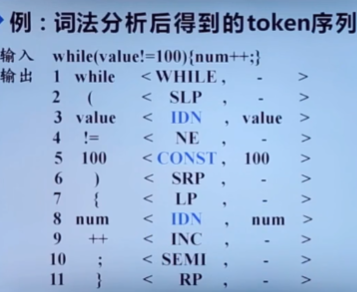
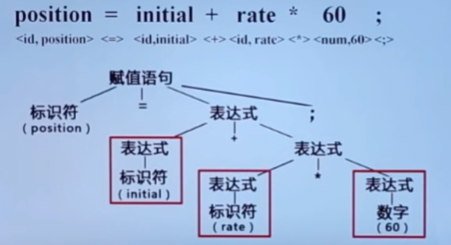

# 编译原理

## 前端

前端是编译器的分析部分，与源语言相关。

### 词法分析

**词法分析器(`Lexer`)**：从左到右逐行扫描源程序的字符，识别出各个单词，确定单词的类型并转换成统一的**机内表示**—**词法单元(token：<种别码，属性值>)**形式。

[编译原理-词法分析](./编译原理-词法分析.md)

### 语法分析

**语法分析器(`Parser`)**：从词法分析器输出的`token`序列中**识别出各类短语**，并构造 **语法分析树** (`parse tree`，描述句子的语法结构)。

- 赋值语句

[编译原理-语法分析](./编译原理-语法分析.md)

### 语义分析

**语义分析器(`Semantic Analyser`)**：

- 收集标识符的**属性信息**（种属Kind、类型Type、存储长度和位置、值、作用域、参数和返回信息），并放到**符号表(`Symbol Table`，存放标识符属性信息的数据结构)**中。
- 语义检查：是否由语法错误（如变量未定义就使用、重复定义某个变量等）。

[编译原理-语义分析](./编译原理-语义分析.md)

### 中间代码生成

抽象语法树 (`Abstract Syntax Tree`，AST)

## 中间代码(IR)优化

## 后端

后端是编译器的综合部分，与目标语言相关。

[LLVM](https://www.jianshu.com/p/1367dad95445)

### 目标代码生成

### 目标代码优化