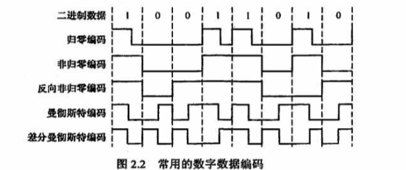
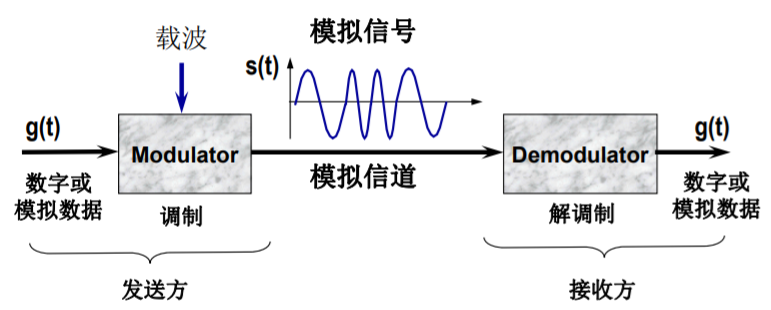
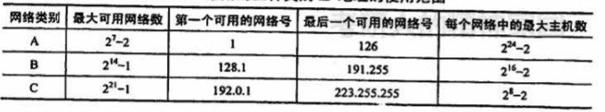
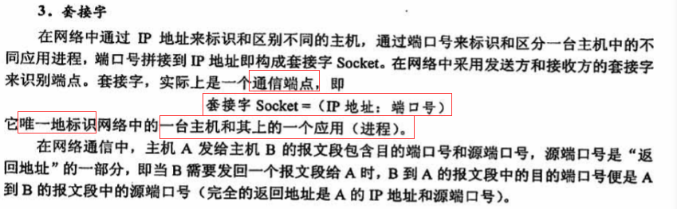
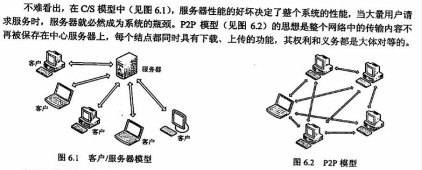
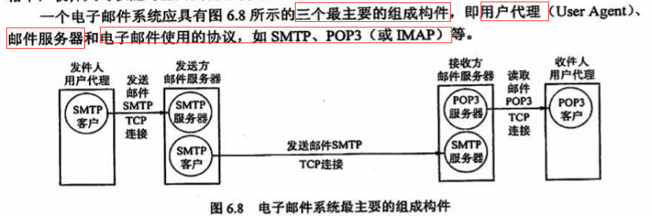

# 计算机网络

## 一、计算机网络体系结构

#### (一) 计算机网络概述

1. 计算机网络的概念、组成与功能；

   ```
   概念：指把若干台地理位置不同且具有独立功能的计算机，通过通信设备和线路相互连接起来，以实
   现数据传输和资源共享的一种计算机系统。
   组成：P15
   1）从组成部分来看：由硬件、软件、协议组成。
   2）从工作方式来看：分为边缘部分和核心部分。
   3）从功能组成来看：由通信子网和资源子网组成。
   功能：数据通信；资源共享；分布式处理；提高可靠性；负载均衡。
   ```

2. 计算机网络的分类；

   ```
   按分布范围分类：
     广域网(WLAN)；城域网(MAN,5~50km)；局域网(LAN,几十米~几千米)；个人区域网(PAN,10m)。
   按传播技术分类：广播式网络；点对点网络。
   按拓朴结构(通信子网)分类：总线型；星型；环形；网状。
   按使用者分类：公用网；专用网
   按交换技术分类：电路交换网络；报文交换网络(存储转发)；分组交换网络(包交换)
   按传输介质分类：
     有线网络：双绞线网络、同轴电缆网络
     无线网络：蓝牙、微波、无线电
   ```

3. 计算机网络与互联网的发展历史；

4. 计算机网络的标准化工作及相关组织。

####  (二) 计算机网络体系结构与参考模型　

   1. 计算机网络分层结构；

         ```
         分层的好处：
         • 各层之间是独立的。
         • 灵活性好。
         • 结构上可分割开。
         • 易于实现和维护。
         • 能促进标准化工作。
         层数多少要适当：
         • 若层数太少，就会使每一层的协议太复杂。
         • 层数太多又会在描述和综合各层功能的系统工程任务时遇到较多的困难
         
         计算机网络的体系结构：各层和协议的集合。
         一个特定系统所使用的一组协议（每一层一个协议）称为协议栈(protocol stack)。
         ```

   2. 计算机网络协议、接口、服务等概念；

         ```
         协议:在两个实体间控制数据交换而建立的规则、标准或约定的集合即网络协议(network protocol)
         网络协议组成要素：
            语法：数据格式、编码和信号电平等；(确定通信双方“如何讲”)
            语义：用于协调同步和差错处理的控制信息；(确定通信双方“讲什么”)
            定时(同步)：速度匹配和排序等。(确定通信双方“讲话的次序”)
         ```

   3. ISO/OSI参考模型和TCP/IP模型。


```
物理层：传输单位是比特，传输原始比特流，定义数据终端设备与数据通信设备的物理与逻辑连接方法。
数据链路层：传输单位是帧，将网络层传来的IP数据报组装成帧。
           功能：成帧、差错控制、流量控制、传输管理等。
网络层：传输单位是数据报。任务：把网络层的协议数据单元(分组)从源端传递到目的端。
	   功能：对分组进行路由选择、流量控制、拥塞控制、差错控制、网际互联等
运输层：传输单位是报文段(TCP)或用户数据报(UDP)，负责主机中[两个进程间]的通信。
	   功能：为端到端连接提供提供可靠的传输服务、流量控制、差错控制、数据传输管理
会话层：允许不同主机上的各个进程之间进行会话。利用传输层提供的端到端的服务，向表示层提供它的        增值服务。这种服务主要为表示层实体或用户进程建立连接并在连接上有序地传输数据,这就是会        话，也称建立同步(SYN).
表示层：主要处理在两个通信系统中交换信息的表示方式。不同机器采用的编码和表示方法不同，使用的        数据结构也不同。为了使不同表示方法的数据和信息之间能互相交换，表示层采用抽象的标准方        法定义数据结构，并采用标准的编码形式。数据压缩、加密和解密也是表示层可提供的数据表示        变换功能。
应用层：是用户与网络的界面，是最复杂的一层，使用的协议也最多。用于文件传送的FTP、用于电子邮		   件的SMTP、用于万维网的HTTP等。
```

## 二、物理层

#### (一) 通信基础　　

1. 信道、信号、带宽、码元、波特、速率、信源与信宿等基本概念；

   ```
   信道：传送信号的介质
   信源：产生和发送数据的源头
   信宿：接收数据的终点
   信号：数据的电子或电磁编码
   带宽：指信号具有的频带宽度(HZ/KHZ)，也指数字信道所能传送的“最高数据率”(bit/s、b/s)
         Kb/s(10^3b/s)、Mb/s(10^6b/s)。计算机中，K=2^10, M=2^20
         信道带宽：数据在信道上的传输速率。在时间轴上信号的宽度随带宽的增大而变窄。
   时延：指数据（一个报文或分组）从网络（或链路）的一端传送到另一端所需要的总时间。
   	 由4部分构成:
   	 发送(传输)时延：节点将分组的所有比特推向链路所需的时间。= 分组长度/信道带宽
   	 传播时延：电磁波在信道(链路)中传播所需的时间。= 信道长度/v(电磁波在信道中)
   	 处理时延：数据在交换结点为存储转发而进行的一些必要的处理所花费的时间。如：分析分组               的首部、从分组中提取数据部分、进行差错检验或查找适当的路由等。
   	 排队时延：分组在进入路由器后要先在[输入队列]中排队等待处理。路由器确定转发端口后，				还要在[输出队列]中排队等待转发，这就产生了排队时延。
   时延带宽积：指发送端发送的第一个比特即将到达终点时，发送端已经发出了多少个比特。
         时延带宽积=传播时延×信道带宽。
         又称以比特为单位的链路长度，表示管道(信道)可容纳的比特数量。
   往返时延(Round-Trip Time,RTT)：从发送端发送数据开始，到发送端收到来自接收端的确认，共       经历的时延。
   吞吐量(Throughput)：指单位时间内通过某个网络（或信道、接口）的数据量。吞吐量受网络带宽       或网络额定速率的限制。
   速率：指连接到计算机网络上的主机在数字信道上传送数据的速率，也称数据传输速率、数据率或比 	  特率，单位为b/s（比特/秒，bps)，最高数据传输速率成为带宽。
   信道利用率：指出某一信道有百分之多少的时间是有数据通过的
              信道利用率=有数据通过时间/(有+无)数据通过时间。
   码元：时间轴上一个信号的编码单元。
   波特率：信号传输速率B，指每秒传输的码元数，单位为波特(Baud)。B=1/T
   	   数据传输速率R，每秒传输二进制信息的位数，单位为bps。 R=1/T*log2N(以2为底)
   	   N为对一个码元编码采样的离散状态个数；log2N为每个码元的bit数。
   ```

2. 奈奎斯特定理与香农定理；

   ```
   理想信道：无噪声与外界干扰，传输能力有限。二进制信号通过带宽有限的理想信道时，会产生失真。当输入信号带宽一定时，信道带宽越小，失真越大。任何实际的信道都不是理想的，在传输信号时会产生各种失真以及带来多种干扰。
   
   奈奎斯特定理(奈氏准则)：对于一个带宽为W Hz的理想信道，其最大码元传输速率为2W Baud。
       即 理想信道的最高码元传输速率B = 2W Baud
       推论：如果被传输的信号包含了N个离散信号状态，则带宽为W Hz的理想信道最大数据发送速率     为：R=2W * log2 N (bps)
       
   香农定理：信道的极限数据传输速率 C 可表达为：C =W log2(1+S/N) bps 
       W为信道的带宽(HZ)；S为信道内所传信号的平均功率；N为信道内部的高斯噪声功率。
       S/N为信噪比。
   ```

   

3. 编码与调制；

   ```
   编码：用数字信号承载数字或模拟数据
   调制：用模拟信号承载数字或模拟数据
   ```

   

   ```
   归零编码(RZ)：高电平代表1、低电平代表0(或者相反)，每个时钟周期的中间均跳变到低电平（归零)，接收方根据该跳变调整本方的时钟基准，这就为传输双方提供了自同步机制。由于归零需要占用一部分带宽，因此传输效率受到了一定的影响。
   
   非归零编码(NRZ)：与RZ编码的区别是不用归零，一个周期可以全部用来传输数据。但NRZ编码无法传递时钟信号，双方难以同步，因此若想传输高速同步数据，则需要都带有时钟线。
   
   反向非归零编码（NRZI)：与NRZ编码的区别是用信号的翻转代表0、信号保持不变代表1.翻转的信号本身可以作为一种通知机制。这种编码方式集成了前两种编码的优点，既能传输时钟信号，又能尽量不损失系统带宽。USB 2.0通信的编码方式就是NRZI编码。
   
   曼彻斯特编码(Manchester Encoding)：将一个码元分成两个相等的间隔，前一个间隔为高电平而后一个间隔为低电平表示码元 1;码元0的表示方法则正好相反。当然，也可采用相反的规定。该编码的特点是，在每个码元的中间出现电平跳变，位中间的跳变既作为时钟信号（可用于同步)，又作为数据信号，但它所占的频带宽度是原始基带宽度的两倍。以太网使用的编码方式就是曼彻斯特编码。
   
   差分曼彻斯特编码：常用于局域网传输，其规则是:若码元为1，则前半个码元的电平与上一码元的后半个码元的电平相同;若码元为0，则情形相反。该编码的特点是，在每个码元的中间都有一次电平的跳转，可以实现自同步，且抗干扰性较好。
   ```

   

   

4. 电路交换、报文交换与分组交换；

   

   ```
   数据交换技术：指网络中间节点（通信子网中各个节点）所提供的数据交换功能。
   交换：按照某种方式动态地分配传输线路的资源。
   电路交换：面向连接。三个阶段：建立连接、通信、释放连接。
            优点：通信实时性强，使用于交互式会话类通信。
            缺点：对具有间隙性突发通信不适应，线路利用率低；通信子网的节点交换设备不能存储			 数据，不能改变数据内容，并且不具备差错控制能力。
   报文交换：对数据块的大小没有任何限制，意味着中间节点必须使用硬盘来缓存大量的数据，并且一          个数据块可能会长时间霸占路由器之间的线路，影响其他数据的传输。
   分组交换：1.把较长的报文划分成较短的、固定长度的数据段；2.每一个数据段前面添加上首部构成          分组；3.分组交换网以“分组”作为数据传输单元，依次把各分组发送到接收端；4.接收端          收到分组后剥去首部还原成报文。
          分组首部：含有地址等控制信息。结点交换机根据收到的分组的首部中的地址信息，把分              组转发到下一个结点交换机————存储转发。
          结点交换机处理分组的过程：1.把收到的分组先放入缓存（暂时存储）；2.查找转发表，              找出到某个目的地址应从哪个端口转发；3.把分组送到适当的端口转发出去。
          优点：
              高效 动态分配传输带宽，对通信链路是逐段占用。
              灵活 以分组为传送单位和查找路由。
              迅速 不必先建立连接就能向其他主机发送分组；充分使用链路的带宽。
              可靠 完善的网络协议；自适应的路由选择协议使网络有很好的生存性。
          缺点：分组在各结点存储转发时需要排队，这就会造成一定的时延；分组必须携带的首部造              成一定开销。
          - 分组交换分为两类：数据报(Datagram)交换、虚电路交换
          数据报交换：需要预先建立连接，当发送端有一个较长的报文要发送时，首先将报文分解成              若干个较小的数据单元，每个数据单元都要附加一个分组头并封装成分组，然后将各                个分组发送出去。
          虚电路交换：数据传输是面向连接的(基于共享电路，而不是电路交换那样独占线路，是逻辑上            的相连的电路)。也分成三个阶段：建立连接、数据传输和拆除连接。
   计算机网络通常是采用分组交换的，偶尔会用电路交换，但绝对不会是报文交换。
   ```


#### (二) 传输介质　　

1. 双绞线、同轴电缆、光纤与无线传输介质；

   ```
   双绞线
   同轴电缆
   光纤
   无线传输介质
   ```

2. 物理层接口的特性

   ```
   网络中的硬件设备和传输介质的种类繁多，通信方式也各不相同。物理层应尽可能屏蔽这些差异，让数据链路层感觉不到这些差异，使数据链路层只需考虑如何完成本层的协议和服务。
   物理层的主要任务————确定与传输媒体的接口有关的一些特性:
   1）机械特性:指明接口所用接线器的形状和尺寸、引脚数目和排列、固定和锁定装置等。
   2) 电气特性:指明在接口电缆的各条线上出现的电压的范围。
   3）功能特性:指明某条线上出现的某一电平的电压表示何种意义。
   4）过程特性:或称规程特性。指明对于不同功能的各种可能事件的出现顺序
   ```

#### (三) 物理层设备　　

1. 中继器；　

   ```
   随着信号的传播，信号能量会逐渐减少，这就是信号的衰减。为了补偿衰减，要经常对数字信号和模拟信号进行中继转发。
   模拟信号的中继：需要采用信号放大器(只是放大信号)来增强模拟信号。
   数字信号的中继：采用中继器(信号被整形成最初的信号然后再放大)波形再生。
   ```

2. 集线器。

   ```
   集线器实质上是一个多端口的中继器。
   它在网络中只起信号放大和转发作用，目的是扩大网络的传输范围，而不具备信号的定向传送能力(信号传输的方向是固定的)，是一个标准的共享式设备。
   ```
   

## 三、数据链路层

#### (一) 数据链路层的功能

```
数据链路层在物理层提供服务的基础上向网络层提供服务。
主要作用：加强物理层传输原始比特流的功能，将物理层提供的可能出错的物理连接改造为逻辑上无差错   的数据链路，使之对网络层表现为一条无差错的链路。
主要功能：
  为网络层提供服务：
  链路管理：
  帧定界、帧同步与透明传输：
  流量控制：
  差错控制：
```

#### (二) 组帧　　

```
将比特率组合成帧的原因：为了在出错时只重发出错的帧，不必重发全部数据。
组帧主要解决：帧定界、帧同步与透明传输。
数据链路层从网络层获得到分组，然后将分组(packet)封装到帧(frame)以便传输，每一帧包含一个帧头、一个有效载荷(用于存放分组)，以及一个帧尾。
```


```
组帧的四种方法：
字符计数法
含字节填充的分界符法（面向字符的同步传输）
含位填充的分界标志法（面向位流的同步传输）
物理层编码违例法
```

#### (三) 差错控制

1. 检错编码；

   ```
   采用冗余编码技术，核心思想：在有效数据（信息位）被发送前，先按某种关系附加一定的冗余位，构成一个符合某一规则的码字后再发送。
   
   奇偶校验码：
   循环冗余码(CRC)：
   ```

2. 纠错编码。

   ```
   
   ```

#### (四) 流量控制与可靠传输机制　　

1. 流量控制、可靠传输与滑动窗口机制；

   ```
   流量控制：对链路上的帧的发送速率的控制，以使接收方有足够的缓冲空间来接收每个帧。
       基本方式：
        停止-等待协议：发送方每发送一帧，都要等待接收方的应答信号，之后才能发送下一帧;接收        方每接收一帧，都要反馈一个应答信号，表示可接收下一帧，如果接收方不反馈应答信号，        那么发送方必须一直等待。每次只允许发送一帧，然后就陷入等待接收方确认信息的过程          中，因而传输效率很低。
        滑动窗口协议：
        发送方维持一组连续的允许发送的帧的序号，称为发送窗口(WT)。发送窗口的大小代表在还未          收到对方确认信息的情况下发送方最多还可以发送多少个数据帧
        接收方也维持一组连续的允许接收帧的序号，称为接收窗口(WR)。接收窗口是为了控制可以接          收哪些数据帧和不可以接收哪些帧。在接收方，只有收到的数据帧的序号落入接收窗口内          时，才允许将该数据帧收下。若接收到的数据帧落在接收窗口之外，则一律将其丢弃。
            接收方的窗口总是保持最初始的大小。
        窗口的最大尺寸受帧序号字段长度的限制，因为一个窗口内，帧序号不能相重复。
        当用 n 个比特进行编号时，若接收窗口的大小为1，则只有在发送窗口的大小WT <= 2^n-1        时，滑动窗口协议才能正确运行。
   ```

   

   

2. 后退N帧协议(GBN)；P90

   

3. 选择重传协议(SR)。

   

#### (五) 介质访问控制　　

1. 信道划分介质访问控制：频分多路复用、时分多路复用、波分多路复用、码分多路复用的概念和基本原理；

   ```
   
   ```

2. 随机访问介质访问控制：ALOHA协议，CSMA协议，CSMA/CD协议，CSMA/CA协议；

   ```
   随机访问介质访问控制核心思想：胜利者通过争用获得信道,从而获得信息的发送权。因此，随机访问介质访问控制协议又称争用型协议。
   
   ALOHA协议：站点可以不进行任何检测就发送数据。如果在一段时间内未收到确认，就认为在传输过程中发生了冲突。
   CSMA协议：每个站点在发送前都先侦听一下共用信道，发现信道空闲后再发送。
   CSMA/CD协议：载波侦听多路访问/碰撞检测协议。“先听后发，边听边发，冲突停发，随机重发”。
     站A在发送帧后至多经过时间2τ(端到端传播时延的2倍）就能知道所发送的帧有没有发生碰撞。
     把以太网端到端往返时间2τ称为争用期(又称冲突窗口或碰撞窗口)。
     采用CSMA/CD协议的以太网只能进行半双工通信。
     
     为了确保发送站在发送数据的同时能检测到可能存在的碰撞，需要在发送完帧之前就能收到自己发   送出去的数据，即帧的传输时延至少要两倍于信号在总线中的传播时延，所以CSMA/CD总线网中的   【所有数据帧都必须要大于一个最小帧长】。任何站点收到帧长小于最小帧长的帧时，就把它当作   无效帧立即丢弃。最小帧长的计算公式为：最小帧长=总线传播时延×数据传输速率×2
   ```

   

   

   ```
   CSMA/CA协议：广泛应用于无线局域网。CA(碰撞避免 Collision Avoidance) P106
   CSMA/CD协议已成功应用于使用有线连接的局域网，但在无线局域网环境下，却不能简单地搬用CSMA/CD协议，特别是碰撞检测部分。主要有两个原因:
   1)接收信号的强度往往会远小于发送信号的强度，且在无线介质上信号强度的动态变化范围很大，因此若要实现碰撞检测，则硬件上的花费就会过大。
   2）在无线通信中，并非所有的站点都能够听见对方，即存在“隐蔽站”问题。
   
   “碰撞避免”并不是指协议可以完全避免碰撞，而是指协议的设计要尽量降低碰撞发生的概率。
   ```

   

   

3. 轮询访问介质访问控制：令牌传递协议。

   ```
   令牌传递协议：主要用于令牌环局域网中。适合负载很高(指多个结点在同一时刻发送数据概率很大的信道)的广播信道。
   ```

   

#### (六) 局域网(LAN)　　 P117

1. 局域网的基本概念与体系结构；

2. 以太网与IEEE 802.3；

   

3. IEEE 802.11；

4. 令牌环网的基本原理。

#### (七) 广域网 P128

1. 广域网的基本概念；

   

2. PPP协议；(Point-to-Point Protocol)

   ```
   PPP：使用串行线路通信的面向字节的协议，应用在直接连接的两个链路上。
   ```

3. HDLC协议。

#### (八) 数据链路层设备

1. 网桥的概念及其基本原理；　P135	

   

   

   

2. 局域网交换机及其工作原理。

   

   

   

## 四、网络层(IP: 网际协议)


#### (一) 网络层的功能

1. 异构网络互联；

   

2. 路由与转发；

   ```
   路由器主要完成两个功能:一是路由选择（确定哪一条路径)，二是分组转发（当一个分组到达时所采取的动作)。前者是根据特定的路由选择协议构造出路由表，同时经常或定期地和相邻路由器交换路由信息而不断地更新和维护路由表。后者处理通过路由器的数据流，关键操作是转发表查询、转发及相关的队列管理和任务调度等。
   
   1)路由选择。指按照复杂的分布式算法，根据从各相邻路由器所得到的关于整个网络拓扑的变化情况，动态地改变所选择的路由。
   2)分组转发。指路由器根据转发表将用户的P数据报从合适的端口转发出去。
   ```

3. 拥塞控制。

   ```
   拥塞：在通信子网中，因出现过量的分组而引起网络性能下降的现象。
   判断网络是否出现拥塞：随着网络负载增加，
       网络吞吐量明显小于正常吞吐量，则可能进入"轻度拥塞状态"
       网络吞吐量反而下降，则可能已进入拥塞状态
       网络吞吐量下降至0，则可能已进入死锁状态
   拥塞控制：确保子网能够承受所达到的流量。
   ```

   

   

#### (二) 路由算法

1. 静态路由与动态路由；

   

2. 距离-向量路由算法；

   

3. 链路状态路由算法；

   

   

   

   

4. 层次路由。

   

#### (三) IPv4　　

1. IPv4分组；

   

   

   

   ```
   一个数据链路层数据报能承载的最大数据量称为最大传送单元(MTU)。以太网的MTU为1500B，而许多广域网的MTU不超过576B。
   当IP数据报的总长度大于链路MTU时,就需要将IP数据报中的数据分装在两个或多个较小的P数据报中，这些较小的数据报称为片。
   ```

   

   ```
   网络层的路由器执行的分组转发算法如下:
   1)从数据报的首部提取目的主机的P地址D，得出目的网络地址N.
   2）若网络N与此路由器直接相连，则把数据报直接交付给目的主机D，这称为路由器的直接交付，
   否则是间接交付，执行步骤3)。
   3）若路由表中有目的地址为D的特定主机路由（对特定的目的主机指明一个特定的路由，通常是为了控制或测试网络，或出于安全考虑才采用的)，则把数据报传送给路由表中所指明的下一跳路由器，
   否则，执行步骤4)。
   4)若路由表中有到达网络N的路由，则把数据报传送给路由表指明的下一跳路由器，
   否则，执行步骤5)。
   5）若路由表中有一个默认路由，则把数据报传送给路由表中所指明的默认路由器，
   否则,执行步骤6)。
   6)报告转发分组出错。
   
   ```

   

2. IPv4地址与NAT；

   ```
   IP地址={网络号，主机号}。
   网络号标志主机(或路由器)所连接到的网络，在整个因特网范围必须唯一。
   主机号标志该主机(或路由器)，在网络号指明的网络范围内必须唯一。
   ```

   

   

   

   

   ```
   NAT(网络地址转换)，将专用网络地址(如Intranet)转换为公用地址(如Internet)。
   NAT大大节省了IP地址的消耗；并且隐藏了内部网络结构，降低了内网受到攻击的风险。
   ```

   

3. 子网划分与子网掩码、CIDR；

   

   

   ```
   子网掩码：表达对原网络中主机号的借位，告诉主机或路由器进行了子网划分。
   子网掩码是一个与P地址相对应的、长32bit 的二进制串，它由一串1和跟随的一串0组成。其中，1对应于P地址中的网络号及子网号，而0对应于主机号。
   计算机只需将IP地址和其对应的子网掩码逐位“与”(逻辑AND运算)，就可得出相应子网的网络地址。
   
   A、B、C类地址的默认子网掩码(未进行子网划分)分别为255.0.0.0、255.255.0.0、255.255.255.0.
   ```

   

   ```
   CIDR：无分类域间路由选择。在变长子网掩码的基础上提出的一种消除传统A、B、C类网络划分，并且可以在软件的支持下实现超网构造的一种IP地址的划分方法。
   ```

   

   

4. ARP协议、DHCP协议与ICMP协议；

   ```
   IP地址是网络层使用的地址，它是分层次等级的。
   硬件地址是数据链路层使用的地址〈如MAC地址)，它是平面式的。
   在网络层及网络层之上使用IP地址，IP地址放在IP数据报的首部,而MAC地址放在MAC帧的首部。通过数据封装，把P数据报分组封装为MAC帧后，[数据链路层看不见数据报分组中的IP地址]。
   ```

   

   

   ```
   ARP：地址解析协议，工作在网络层。
   ```

   

   ```
   工作原理：主机A欲向本局域网上的某台主机B发送P数据报时，
      先在其ARP高速缓存中查看有无主机B的IP地址。如有，就可查出其对应的硬件地址，再将此硬件地址写入MAC帧，然后通过局域网将该MAC帧发往此硬件地址。
      如果没有，那么就通过使用目的MAC地址为FF-FF-FF-FF-FF-FF的帧来封装并广播ARP请求分组，使同一个局域网里的所有主机收到ARP请求。主机B收到该ARP请求后，向主机A发出响应ARP分组，分组中包含主机B的IP与MAC地址的映射关系，主机A在收到后将此映射写入ARP缓存，然后按查询到的硬件地址发送MAC帧。
      ARP由于“看到了”P地址，所以它工作在网络层，而NAT路由器由于“看到了”端口，所以它工作在传输层。
   ```

   ```
   DHCP：动态主机配置协议，常用于给主机动态地分配地址，它提供了即插即用的联网机制，这种机制允许一台计算机加入新的网络和获取IP地址而不用手工参与。DHCP是应用层协议，它是基于UDP的。
   ```

   

   ```
   ICMP：网际控制报文协议，来让主机或路由器报告差错和异常情况，提高IP数据报交付成功的机会。ICMP报文作为IP层数据报的数据，加上数据报的首部，组成IP数据报发送出去。ICMP是IP层协议。
   
   ICMP报文的种类有两种，即ICMP差错报告报文和ICMP询问报文。
   ICMP差错报告报文用于目标主机或到目标主机路径上的路由器向源主机报告差错和异常情况。
       共有以下5种类型:
       1)终点不可达。当路由器或主机不能交付数据报时，就向源点发送终点不可达报文。
       2）源点抑制。当路由器或主机由于拥塞而丢弃数据报时，就向源点发送源点抑制报文，使
       源点知道应当把数据报的发送速率放慢。
       3)时间超过。当路由器收到生存时间（TTL)为零的数据报时，除丢弃该数据报外，还要向
       源点发送时间超过报文。当终点在预先规定的时间内不能收到一个数据报的全部数据报片时，就     把已收到的数据报片都丢弃，并向源点发送时间超过报文。
   	4)参数问题。当路由器或目的主机收到的数据报的首部中有的字段的值不正确时，就丢弃该数	  据报，并向源点发送参数问题报文。
   	5）改变路由（重定向)。路由器把改变路由报文发送给主机，让主机知道下次应将数据报发送	  给另外的路由器（可通过更好的路由)。
   ICMP询问报文有4种类型:回送请求和回答报文、时间戳请求和回答报文、掩码地址请求和回答报文、路由器询问和通告报文，最常用的是前两类。
   ```

   

   

#### (四) IPv6

1. IPv6的主要特点；

   

2. IPv6地址　　

   

   

#### (五) 路由协议

1. 自治系统；

   

2. 域内路由与域间路由；

   

3. RIP路由协议；

   ```
   路由信息协议（Routing Information Protocol，RIP)是内部网关协议（IGP)，是一种分布式的基于距离向量的路由选择协议，最大优点是简单。
   ```

   

   

   

   

4. OSPF路由协议；P192

   

5. BGP路由协议。

   

   


####  (六) IP组播

1. 组播的概念； 

   

2. IP组播地址。

   ```
   组播使用D类地址格式。D类地址的前四位是1110，
   因此D类地址范围是224.0.0.0~239.255.255.255。每个D类IP地址标志一个组播组。
   
   组播数据报和一般的IP数据报的区别是，前者使用D类IP地址作为目的地址，并且首部中的协议字段值是2，表明使用IGMP。需要注意的是:
   1)组播数据报也是“尽最大努力交付"，不提供可靠交付。
   2)组播地址只能用于目的地址，而不能用于源地址。
   3)对组播数据报不产生ICMP差错报文。因此，若在PNG命令后面键入组播地址，将永远不会收到响应
   4)并非所有的D类地址都可作为组播地址
   ```

#### (七) 移动IP P205

1. 移动IP的概念； 

   

2. 移动IP的通信过程。

   

#### (八) 网络层设备： 

1. 路由器的组成和功能； 

   

   

2. 路由表与路由转发。

   

## 五、传输层

#### (一) 传输层提供的服务

1. 传输层的功能；

   

   ```
   1）传输层提供应用进程之间的逻辑通信（即端到端的通信)。与网络层的区别是，网络层提供的是主机之间的逻辑通信。
   2）复用和分用。复用是指发送方不同的应用进程都可使用同一个传输层协议传送数据;分用是指接收方的传输层在剥去报文的首部后能够把这些数据正确交付到目的应用进程。
   3)传输层还要对收到的报文进行差错检测（首部和数据部分)。而网络层只检查P数据报的首部，不检验数据部分是否出错。
   4)提供两种不同的传输协议，即面向连接的TCP和无连接的UDP。而网络层无法同时实现两种协议（即在网络层要么只提供面向连接的服务，如虚电路;要么只提供无连接服务，如数据报，而不可能在网络层同时存在这两种方式)。
   ```

2. 传输层寻址与端口；

   ```
   端口作用：端口能够让应用层的各种应用进程将其数据通过端口向下交付给传输层，以及让传输层知道应当将其报文段中的数据向上通过端口交付给应用层相应的进程。
   端口是传输层服务访问点(TSAP)，它在传输层的作用类似于IP地址在网络层的作用或MAC地址在数据链路层的作用，只不过IP地址和MAC地址标识的是主机，而端口标识的是主机中的应用进程。
   端口号：应用进程通过端口号进行标识，端口号长度为16bit，能够表示65536 (2^16)个不同的端口号。
   端口号只具有本地意义，即端口号只标识本计算机应用层中的各进程，在因特网中不同计算机的相同端口号是没有联系的。
   ```

   

   

3. 无连接服务与面向连接服务。

   

#### (二) UDP协议

1. UDP数据报；

   

2. UDP校验。

   

   

   

   

####  (三) TCP协议

   1. TCP报文段；

      

      

      

   2. TCP连接管理；

      

      

      

      ```
      TCP连接⽤于保证可靠性和流量控制维护的某些状态信息，这些信息的组合，包括Socket、序列号和窗⼝⼤⼩。
      
      「两次握⼿」：⽆法防⽌历史连接的建⽴，会造成双⽅资源的浪费，也⽆法可靠的同步双⽅序列号；
      「四次握⼿」：三次握⼿就已经理论上最少可靠连接建⽴，所以不需要使⽤更多的通信次数。
      
      为什么要"三次握手"？(有三个原因)
      1.避免历史连接请求初始化连接，防⽌旧的重复连接初始化造成混乱。(主要原因)
      【客户端连续发送多次 SYN 建⽴连接的报⽂，在⽹络拥堵情况下，可能出现⼀个旧SYN报⽂⽐最新的SYN报⽂早到达了服务端。】
      如果是两次握⼿连接，就不能判断当前连接是否是历史连接，三次握⼿则可以在客户端（发送⽅）准备发送第三次报⽂时，客户端因有⾜够的上下⽂来判断当前连接是否是历史连接：
      ```

      

      ```
      2.同步双方初始序列号。
      TCP 协议的通信双⽅，都必须维护⼀个序列号，序列号是可靠传输的⼀个关键因素，它的作⽤：
      - 接收⽅可以去除重复的数据；
      - 接收⽅可以根据数据包的序列号按序接收；
      - 可以标识发送出去的数据包中，哪些是已经被对⽅收到的；
      以当客户端发送携带初始序列号的 SYN 报⽂的时候，需要服务端回⼀个 ACK 应答报⽂，表示客户端的 SYN 报⽂已被服务端成功接收；当服务端发送初始序列号给客户端的时候，依然也要得到客户端的应答回应，这样⼀来⼀回，才能确保双⽅的初始序列号能被可靠的同步。
      ⽽两次握⼿只保证了⼀⽅的初始序列号能被对⽅成功接收，没办法保证双⽅的初始序列号都能被确认接收。
      ```

      

      ```
      3.避免浪费资源。
      如果只有两次握⼿，当客户端的 SYN 请求连接在⽹络中阻塞，客户端没有接收到 ACK 报⽂，就会重新发送SYN，【由于没有第三次握⼿，服务器不清楚客户端是否收到了⾃⼰发送的建⽴连接的 ACK 确认信号，所以每收到⼀个 SYN 就只能先主动建⽴⼀个连接】，即两次握⼿会造成消息滞留情况下，服务器重复接受⽆⽤的连接请求 SYN 报⽂，⽽造成重复分配资源。
      ```

      

      ```
      为什么客户端和服务端的初始序列号 ISN 是不相同的？
      - 如果⼀个已经失效的连接被重⽤了，但是该旧连接的历史报⽂还残留在⽹络中，如果序列号相同，那么就⽆法分辨出该报⽂是不是历史报⽂，如果历史报⽂被新的连接接收了，则会产⽣数据错乱。
      所以，每次建⽴连接前重新初始化⼀个序列号主要是为了【通信双⽅能够根据序号将不属于本连接的报⽂段丢弃。】
      - 另⼀⽅⾯是为了安全性，防⽌⿊客伪造的相同序列号的 TCP 报⽂被对⽅接收。
      ```

      

      ```
      四次挥手：
      - 关闭连接时，客户端向服务端发送 FIN 时，仅仅表示客户端[不再发送数据了但是还能接收数据]
      - 服务器收到客户端的 FIN 报⽂时，先回⼀个 ACK 应答报⽂，⽽服务端可能还有数据需要处理和发送，等服务端不再发送数据时，才发送 FIN 报⽂给客户端来表示同意现在关闭连接。
      由于服务端通常需要等待完成数据的发送和处理，所以服务端的 ACK 和 FIN ⼀般都会分开发送，
      从⽽⽐三次握⼿导致多了⼀次。
      
      MSL(Maximum Segment Lifetime，报⽂最⼤⽣存时间)，超过这个时间报⽂将被丢弃
      TTL(Time To Live)，是 IP 数据报可以经过的最⼤路由数，每经过⼀个处理他的路由器此值就减 1，当此值为 0 则数据报将被丢弃，同时发送 ICMP 报⽂通知源主机。
      MSL与TTL的区别： MSL的单位是时间，⽽TTL是经过路由跳数。所以【MSL应该要⼤于等于TTL消耗为 0 的时间】，以确保报⽂已被⾃然消亡。
      
      TIME_WAIT 等待2倍 MSL，⽐较合理的解释是： ⽹络中可能存在来⾃发送⽅的数据包，当这些发送⽅的数据包被接收⽅处理后⼜会向对⽅发送响应，所以⼀来⼀回需要等待 2 倍的时间。
      
      主动发起关闭连接的⼀⽅，才会有 TIME-WAIT 状态。为什么要有该状态？
      - 防⽌具有相同「四元组」的「旧」数据包被收到；
      - 保证被动关闭连接的⼀⽅能被正确的关闭，即保证最后的 ACK 能让被动关闭⽅接收，从⽽帮助其正常关闭；
      ```

      

      

   3. TCP可靠传输；

      

      ```
      引起重传：
      - 超时：TCP每发送一个报文段，就对这个报文段设置一次计时器。计时器设置的重传时间到期但还未收到确认时，就要重传这一报文段。
      - 冗余ACK：超时触发重传存在的一个问题是超时周期往往太长。冗余ACK就是再次确认某个报文段的ACK，而发送方先前已经收到过该报文段的确认。规定若收到3个冗余ACK时，就可认为报文段已丢失，立即进行重传(快速重传)。
      ```

      

   4. TCP流量控制与拥塞控制。

      >流量控制：消除发送方(发送速率太快）使接收方缓存区溢出的可能性。使用滑动窗口协议


```
发送窗口实际大小 = min(rwnd, cwnd)

传输层和数据链路层的流量控制的区别是:
- 传输层定义端到端用户之间的流量控制，数据链路层定义两个中间的相邻结点的流量控制。
- 数据链路层的滑动窗口协议的窗口大小不能动态变化，传输层的则可以动态变化。
```

> 拥塞控制：防止过多的数据注入网络，保证网络中的路由器或链路不至过载


```
拥塞控制四种算法：慢开始、拥塞避免、快重传、快恢复
1.慢开始：发送方置cwnd=1，每一个传输轮次(RTT)将cwnd*2，直到增大到慢开始门限ssthresh(阈值)，然后改用拥塞避免算法。
2.拥塞避免算法：让cwnd缓慢增大，即每一个传输轮次(RTT)将cwnd+1
根据cwnd大小执行不同算法：
当cwnd < ssthresh时，使用慢开始算法。
当cwnd > ssthresh时，停止使用慢开始算法而改用拥塞避免算法。
当cwnd = ssthresh时，既可使用慢开始算法，又可使用拥塞避免算法（通常做法)。

网络拥塞的处理：
无论在慢开始阶段还是在拥塞避免阶段，只要发送方判断网络出现拥塞（未按时收到确认)，就要把慢开始门限ssthresh设置为出现[拥塞时的发送方的cwnd值的一半](但不能小于2)，然后把拥塞窗口cwnd重新设置为1，执行慢开始算法。
这样做的目的是迅速减少主机发送到网络中的分组数，使得发生拥塞的路由器有足够时间把队列中积压的分组处理完。
```


```
3.快重传：当发送方连续收到三个重复的ACK报文时，直接重传对方尚未收到的报文段，而不必等待那个报文段设置的重传计时器超时。
4.快恢复：当发送方连续收到三个冗余ACK（即重复确认）时，把慢开始门限ssthresh设置为此时发送方cwnd的一半(这是为了预防网络发生拥塞)，然后开始执行拥塞避免算法。
```


## 六、应用层

#### (一) 网络应用模型

1. 客户/服务器模型；

   

   

2. P2P模型。

   

   

#### (二) DNS系统  P257

1. 层次域名空间； 

   

2. 域名服务器；

   

   

3. 域名解析过程。P259

   ```
   正向解析：域名->IP          反向解析：IP->域名
   
   递归查询
   递归与迭代相结合
   ```

   

#### (三) FTP：　

1. FTP协议的工作原理；　

   

   

2. 控制连接与数据连接。

   

   

#### (四) 电子邮件

1. 电子邮件系统的组成结构；

   

   ```
   用户代理(UA)：用户与电子邮件系统的接口。用户代理向用户提供一个很友好的接口来发送和接收邮件，用户代理至少应当具有撰写、显示和邮件处理的功能。通常情况下，用户代理就是一个运行在PC上的程序.(电子邮件客户端软件)，常见的有Outlook和Foxmail等。
   邮件服务器：邮件服务器:它的功能是发送和接收邮件，同时还要向发信人报告邮件传送的情况(已交付被拒绝、丢失等)。邮件服务器采用客户/服务器方式工作，但它必须能够同时充当客户和服务器。
   邮件发送协议和读取协议：
     - 邮件发送协议用于用户代理向邮件服务器发送邮件或在邮件服务器之间发送邮件，如SMTP;
     - 邮件读取协议用于用户代理从邮件服务器读取邮件，如 POP3。
   
   ```

   

2. 电子邮件格式与MIME；

   

3. SMTP协议与POP3协议。 P271

   

#### (五) WWW： 

1. WWW的概念与组成结构；

   ```
   万维网(World Wide Web，www)是一个分布式、联机式的信息存储空间，在这个空间中:一样有用的事物称为一样“资源”，并由一个全域 “统一资源定位符”(URL) 标识。这些资源通过超文本传输协议（HTTP）传送给使用者，而后者通过单击链接来获取资源。
   ```

   

   

   

2. HTTP协议。

   

   

```
HTTP特点： P277
HTTP使用TCP作为运输层协议，保证了数据的可靠传输。HTTP不必考虑数据在传输过程中被丢弃后又怎样被重传。但是，HTTP本身是无连接的(务必注意)。也就是说，虽然HTTP使用了TCP连接，但通信的双方在交换HTTP报文之前不需要先建立HTTP连接。

HTTP是无状态的。也就是说，同一个客户第二次访问同一个服务器上的页面时，服务器的响应与第一次被访问时的相同。因为服务器并不记得曾经访问过的这个客户，也不记得为该客户曾经服务过多少次。
HTTP的无状态特性简化了服务器的设计，使服务器更容易支持大量并发的HTTP请求。在实际应用中，通常使用Cookie加数据库的方式来跟踪用户的活动(如记录用户最近浏览的商品等)。Cookie 的工作原理:当用户浏览某个使用Cookie的网站时，该网站服务器就为用户产生一个唯一的识别码，如“123456"接着在给用户的响应报文中添加一个Set-cookie的首部行"Setcookie: 123456"。用户收到响应后，就在它管理的特定Cookie文件中添加这个服务器的主机名和Cookie识别码，当用户继续浏览这个网站时，会取出这个网站的识别码，并放入请求报文的Cookie首部行“Cookie: 123456"，服务器根据请求报文中的Cookie识别码就能从数据库中查询到该用户的活动记录，进而执行一些个性化的工作，如根据用户的历史浏览记录向其推荐新产品等。

HTTP既可以使用非持久连接，也可以使用持久连接（HTTP/1.1支持)。
- 对于非持久连接，每个网页元素对象（如JPEG图形、Flash等）的传输都需要单独建立一个TCP 连接，也就是说，请求一个万维网文档所需的时间是该文档的传输时间(与文档大小成正比)加上两倍往返时间RTT(一个RTT用于TCP连接，另一个RTT用于请求和接收文档)。每个对象引用都导致2×RTT的开销，此外每次建立新的TCP连接都要分配缓存和变量，使万维网服务器的负担很重。
- 所谓持久连接，是指万维网服务器在发送响应后仍然保持这条连接，使同一个客户（浏览器)和该服务器可以继续在这条连接上传送后续的HTTP请求和响应报文。
```


